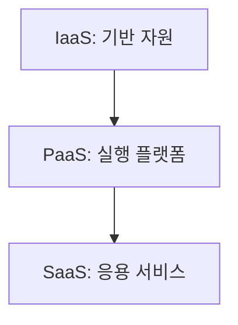
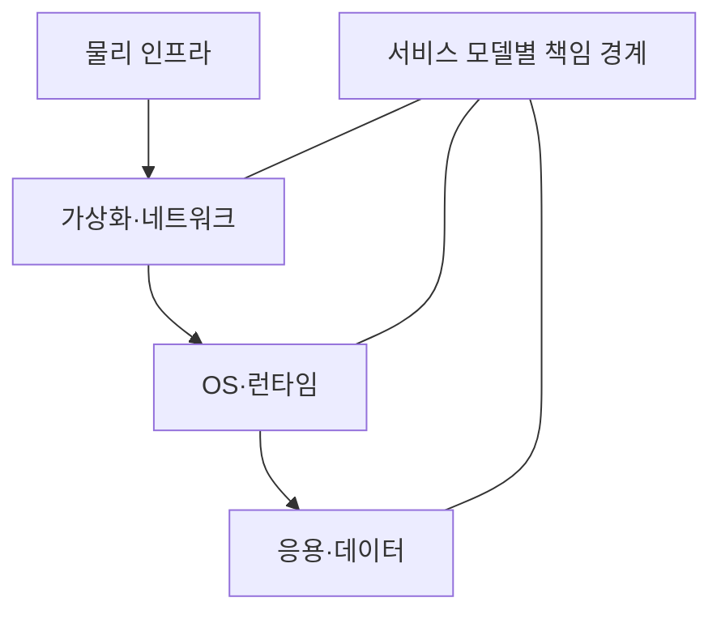
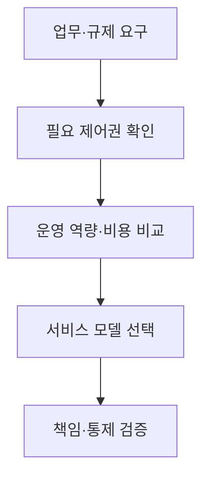

## 지식 로드맵 내 현재 위치

컴퓨터 시스템 및 네트워크 → 클라우드 컴퓨팅 → 클라우드 서비스 모델

## 30초 인출

- 본질: 클라우드 서비스 모델은 서비스 제공자와 이용자 사이의 관리 책임 범위를 구분
- 메커니즘: IaaS·PaaS·SaaS로 갈수록 제공자가 관리하는 기술 계층이 확대

핵심 용어

- **클라우드 서비스 모델(Cloud Service Model)**: 제공자와 이용자 사이의 자원·관리 책임을 구분하는 클라우드 제공 방식
- **IaaS (Infrastructure as a Service)**: 가상 컴퓨팅·저장·네트워크 기반을 제공하는 서비스 모델
- **PaaS (Platform as a Service)**: 응용 프로그램 개발·실행 플랫폼을 제공하는 서비스 모델
- **SaaS (Software as a Service)**: 이용자가 응용 프로그램을 서비스로 사용하는 모델
- **공동 책임 모델(Shared Responsibility Model)**: 보안·운영 책임을 제공자와 이용자 사이에 나누는 원칙

---
## 1교시 예상문제 (10점)

> 클라우드 컴퓨팅 서비스 모델의 개념과 차이를 설명하시오. (예상)

---
## 1교시 10점 답안

### Ⅰ. 정의·목적

| 구분 | 핵심 |
|---|---|
| 정의 | **클라우드 서비스 모델**은 제공자와 이용자 사이의 자원·관리 책임을 구분하는 제공 방식 |
| 목적 | 필요한 기술 계층을 서비스로 이용하고 책임 범위를 명확히 함 |

### Ⅱ. 관리 책임

| 계층 | IaaS | PaaS | SaaS |
|---|---|---|---|
| 응용 프로그램 | 이용자 | 이용자 | 제공자 |
| 데이터·계정·접근 설정 | 이용자 | 이용자 | 이용자 |
| 런타임·운영체제 | 이용자 | 제공자 | 제공자 |
| 기반 인프라 | 제공자 | 제공자 | 제공자 |

### Ⅲ. 선택 기준

서비스 모델이 상위화될수록 이용자의 기반 운영 부담은 줄지만, 제품 구성·제어 범위는 서비스 조건에 좌우

> 제언: 책임 분담표와 데이터 반출·연계 조건을 함께 검토해 모델을 선택

---
## 2~4교시 예상문제 (25점)

> 클라우드 컴퓨팅 서비스 모델의 구조와 책임 범위를 설명하고, 업무 요구에 따른 선택·관리 방안을 제시하시오. (예상)

---
## 2~4교시 25점 답안

### Ⅰ. 정의·목적

| 구분 | 핵심 |
|---|---|
| 정의 | **클라우드 서비스 모델**은 제공자와 이용자 사이의 자원·관리 책임을 구분하는 제공 방식 |
| 목적 | 필요한 기술 계층을 서비스로 이용하고 책임 범위를 명확히 함 |

### Ⅱ. 모델별 제공 범위

| 모델 | 제공자 관리 | 이용자 관리 |
|---|---|---|
| IaaS | 기반 컴퓨팅·저장·네트워크 | OS·미들웨어·응용·데이터 |
| PaaS | 기반 인프라·실행 플랫폼 | 응용·데이터·접근 설정 |
| SaaS | 응용과 하부 서비스 | 계정·접근·데이터 이용 |

### Ⅲ. 선택 판단

| 판단축 | 고려 |
|---|---|
| 제어권 | OS·런타임 등 직접 운영 필요성 |
| 운영 역량 | 패치·배포·관측을 수행할 조직 역량 |
| 이식성 | 데이터 형식·API·서비스 종속성 |
| 보안 책임 | 계정·데이터·구성 통제의 분담 |

### Ⅳ. 관리 한계와 대응

| 한계 | 대응 |
|---|---|
| 모델 명칭만으로 책임 경계가 완전히 정해지지 않음 | 계약·서비스 문서의 통제 분담 확인 |
| 상위 관리 대행으로 설정·데이터 위험이 사라지지 않음 | 계정·접근·데이터 보호 통제 유지 |
| 특정 API·데이터 구조 종속 | 반출·대체 가능성과 통합 경로 평가 |

### Ⅴ. 기술사적 제언

| 한계 | 해결 방안 |
|---|---|
| 서비스 편의와 통제·이식성 요구가 충돌 | 업무 중요도별 모델을 선택하고 책임 매트릭스·출구 조건을 계약과 설계에 반영 |

## 검증 출처

- [NIST SP 800-145](https://csrc.nist.gov/pubs/sp/800/145/final): 클라우드 서비스 모델 정의
- [AWS Shared Responsibility Model](https://aws.amazon.com/compliance/shared-responsibility-model/): 제공자·이용자 책임 예시
