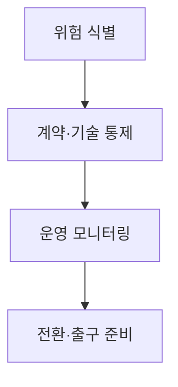
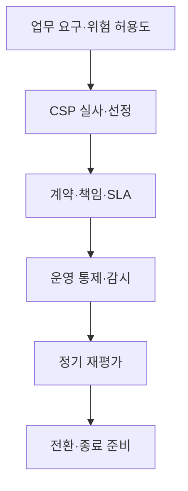
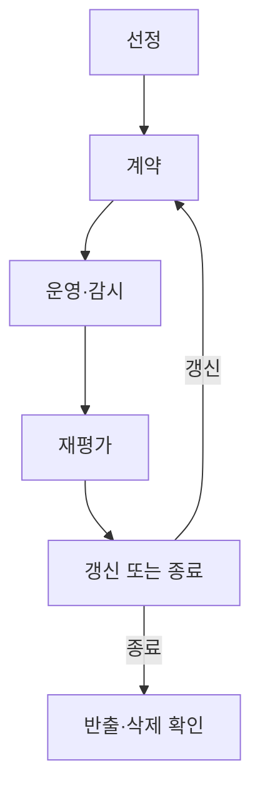

## 지식 로드맵 내 현재 위치

컴퓨터 시스템 및 네트워크 → 클라우드 거버넌스 → CSP 리스크 관리

## 30초 인출

- 본질: CSP 리스크 관리는 클라우드 제공자 의존에서 생기는 운영·보안·계약·출구 위험을 통제하는 활동
- 메커니즘: 선정·계약·운영·전환 전 과정에 책임과 검증 기준을 두고 점검

핵심 용어

- **CSP (Cloud Service Provider)**: 클라우드 서비스를 제공·운영하는 사업자
- **CSP 리스크 관리(CSP Risk Management)**: 제공자·서비스 의존에서 생기는 위험을 식별·평가·대응하는 관리 활동
- **공동 책임 모델(Shared Responsibility Model)**: 제공자와 이용자가 보안·운영 통제를 분담하는 원칙
- **출구 전략(Exit Strategy)**: 서비스 종료·전환 시 데이터와 업무를 다른 환경으로 옮기는 계획
- **데이터 주권(Data Sovereignty)**: 데이터의 저장·처리가 관할권·법률과 맺는 관계

---
## 1교시 예상문제 (10점)

> 클라우드 서비스 제공자 리스크 관리의 개념과 주요 통제를 설명하시오. (예상)

---
## 1교시 10점 답안

### Ⅰ. 정의·목적

| 구분 | 핵심 |
|---|---|
| 정의 | **CSP 리스크 관리**는 제공자·서비스 의존에서 생기는 위험을 식별·평가·대응하는 활동 |
| 목적 | 서비스 연속성·정보 보호·전환 가능성 확보 |

### Ⅱ. 위험과 통제

| 위험 | 통제 |
|---|---|
| 운영·가용성 | 장애 범위·복구 책임·관측 정보 확인 |
| 보안·접근 | 공동 책임 경계·계정·로그 점검 |
| 계약·종속 | 서비스 변경·비용·데이터 반출 조건 검토 |

### Ⅲ. 관리 원칙

CSP의 통제는 내부 업무 연속성·데이터 책임을 대신하지 않으므로 이용자 측 통제도 유지

> 제언: 도입 전에 책임 분담과 종료·전환 조건을 함께 검토

---
## 2~4교시 예상문제 (25점)

> 클라우드 서비스 제공자 리스크를 분류하고 선정부터 종료까지의 통제 방안을 제시하시오. (예상)

---
## 2~4교시 25점 답안

### Ⅰ. 정의·목적

| 구분 | 핵심 |
|---|---|
| 정의 | **CSP 리스크 관리**는 제공자·서비스 의존에서 생기는 위험을 식별·평가·대응하는 활동 |
| 목적 | 서비스 연속성·정보 보호·전환 가능성 확보 |

### Ⅱ. 위험 분류

| 영역 | 위험 예 |
|---|---|
| 운영 | 장애·성능·지원 범위 |
| 보안 | 계정·구성·데이터 접근 |
| 계약·재무 | 서비스 변경·요금·계약 종료 |
| 법·데이터 | 관할권·위치·반출 의무 |

### Ⅲ. 수명주기 통제

| 단계 | 주요 확인 |
|---|---|
| 선정 | 서비스 적합성·운영역량·보증자료 |
| 계약 | 책임·감사·통지·복구·반출 조항 |
| 운영 | 구성·계정·로그·장애·변경 감시 |
| 종료 | 데이터 반출·삭제·서비스 전환 검증 |

### Ⅳ. 관리 한계와 대응

| 한계 | 대응 |
|---|---|
| SLA 크레딧만으로 업무 손실을 보전하기 어려움 | 자체 복구목표와 기술적 복구수단 수립 |
| 인증·보증자료가 이용자 통제를 대체하지 않음 | 계정·워크로드 설정·데이터 보호 점검 |
| 출구 전략이 계약서에만 머물 수 있음 | 반출 형식·시간·비용을 실제 시험 |

### Ⅴ. 기술사적 제언

| 한계 | 해결 방안 |
|---|---|
| CSP 중단 시 업무·데이터 이동이 계획보다 늦어질 수 있음 | 중요 업무부터 반출·복구 시나리오를 시험하고 전환 소요·손실 허용도를 갱신 |

## 검증 출처

- [NIST SP 800-161 Rev.1](https://csrc.nist.gov/pubs/sp/800/161/r1/upd1/final): 공급망 위험 관리
- [NIST SP 800-146](https://csrc.nist.gov/pubs/sp/800/146/final): 클라우드 컴퓨팅 보안·프라이버시 고려사항
