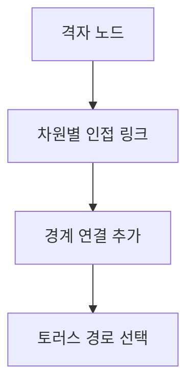
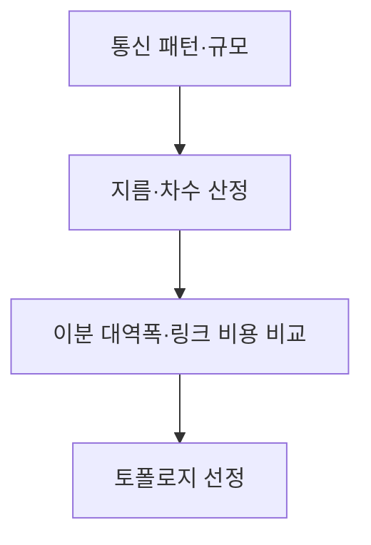

## 지식 로드맵 내 현재 위치

컴퓨터 시스템 및 네트워크 → 병렬 컴퓨터 구조 → 토러스 토폴로지

## 30초 인출

- 본질: 토러스는 메시의 각 차원 끝 노드를 랩어라운드 링크로 연결한 상호연결 토폴로지
- 메커니즘: 경계 간 우회 경로를 추가해 경로 선택지를 늘리지만 배선·라우팅 복잡도도 증가

핵심 용어

- **토러스(Torus)**: 격자 각 차원의 양 끝 노드를 순환 연결한 네트워크 토폴로지
- **랩어라운드 링크(Wrap-around Link)**: 격자 경계의 노드들을 이어 주는 링크
- **메시(Mesh)**: 노드를 격자 형태로 연결하되 경계 끝은 연결하지 않은 토폴로지
- **네트워크 지름(Diameter)**: 두 노드 사이 최단 경로 길이 중 최댓값

---
## 1교시 예상문제 (10점)

> 토러스 토폴로지의 개념과 메시와의 구조 차이를 설명하시오. (예상)

---
## 1교시 10점 답안

### Ⅰ. 정의·목적

| 구분 | 핵심 |
|---|---|
| 정의 | **토러스**는 메시의 각 차원 끝 노드를 랩어라운드 링크로 연결한 상호연결 토폴로지 |
| 목적 | 경계 노드 간 추가 경로를 제공해 병렬 노드 통신을 지원 |

### Ⅱ. 구조 비교

| 구조 | 경계 연결 | 특성 |
|---|---|---|
| 메시 | 없음 | 구현 단순, 경계별 차수 차이 |
| 토러스 | 차원별 끝 노드 연결 | 경로 선택·연결 수 증가 |

### Ⅲ. 적용 요점

토러스의 지름은 차원 수와 각 차원 크기에 따라 달라지며, 모든 크기에서 정확히 절반이 된다고 일반화할 수 없음

> 제언: 노드 규모·배선 비용·통신 패턴을 함께 비교해 토폴로지를 선택

---
## 2~4교시 예상문제 (25점)

> 토러스 토폴로지의 구조·성능 특성을 설명하고 메시와 비교해 적용 시 고려사항을 제시하시오. (예상)

---
## 2~4교시 25점 답안

### Ⅰ. 정의·목적

| 구분 | 핵심 |
|---|---|
| 정의 | **토러스**는 메시의 각 차원 끝 노드를 랩어라운드 링크로 연결한 상호연결 토폴로지 |
| 목적 | 경계 노드 간 추가 경로를 제공해 병렬 노드 통신을 지원 |

### Ⅱ. 연결 구조

| 특성 | 메시 | 토러스 |
|---|---|---|
| 경계 | 열린 격자 | 반대쪽 경계 연결 |
| 경로 | 경계 사이 우회 | 랩어라운드 경로 추가 |
| 구현 | 배선이 비교적 단순 | 추가 링크와 라우팅 필요 |

### Ⅲ. 경로·성능 지표

| 지표 | 설계 의미 |
|---|---|
| 지름 | 최악의 최소 홉 경로 |
| 차수 | 노드별 연결 수 |
| 이분 대역폭 | 분할 네트워크 사이 총 연결 용량 |
| 링크 길이·배선 | 물리 구현 비용·복잡도 |

### Ⅳ. 적용 한계와 대응

| 한계 | 대응 |
|---|---|
| 랩어라운드 배선의 물리 비용·복잡도 | 캐비닛·보드 배치와 링크 길이 함께 설계 |
| 순환 경로가 라우팅 의존성에 영향 | 교착 회피 라우팅·가상 채널 검증 |
| 일부 통신 패턴에서 링크 혼잡 | 실제 통신행렬로 혼잡·대체 경로 시험 |

### Ⅴ. 기술사적 제언

| 한계 | 해결 방안 |
|---|---|
| 토폴로지 명칭만으로 성능을 단정할 수 없음 | 목표 통신 패턴 기반 시뮬레이션·부하시험으로 링크 비용과 지름을 함께 평가 |

## 검증 출처

- [Google TPU system architecture](https://cloud.google.com/tpu/docs/system-architecture-tpu-vm): TPU 인터커넥트 설계 참고
- [NIST SP 800-82 Rev.3](https://csrc.nist.gov/pubs/sp/800/82/r3/final): OT 네트워크 구성의 분할·보호
