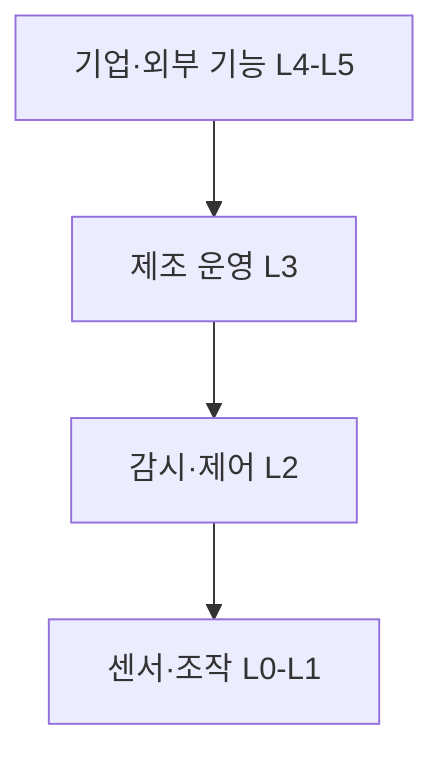
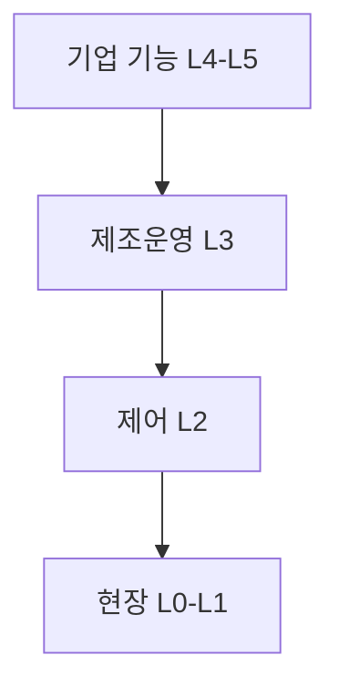
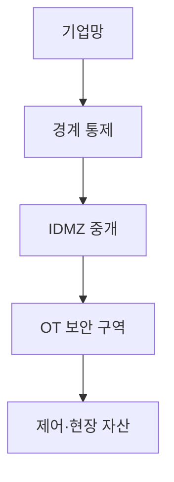

## 지식 로드맵 내 현재 위치

컴퓨터 시스템 및 네트워크 → 산업 제어 시스템 → 퍼듀 참조 모델

## 30초 인출

- 본질: 퍼듀 참조 모델은 산업 운영과 기업 정보 기능을 계층으로 구분해 설명하는 구조
- 메커니즘: 계층 간 통신을 명시하고 보안 구역·경계 통제로 OT와 기업망의 위험을 낮춤

핵심 용어

- **퍼듀 참조 모델(Purdue Reference Model)**: 산업 제어·운영·기업 기능을 계층화해 설명하는 참조 구조
- **OT (Operational Technology)**: 물리 공정·설비를 감시하거나 제어하는 운영 기술
- **ICS (Industrial Control System)**: 산업 공정 제어·감시에 사용하는 시스템의 총칭
- **IDMZ (Industrial Demilitarized Zone)**: OT와 기업망 사이의 통신을 중개·통제하도록 구성하는 산업 보안 구역
- **ISA-95**: 기업 기능과 제조 운영 관리의 통합을 다루는 표준 계열

---
## 1교시 예상문제 (10점)

> 퍼듀 참조 모델의 개념과 계층 구성을 설명하시오. (예상)

---
## 1교시 10점 답안

### Ⅰ. 정의·목적

| 구분 | 핵심 |
|---|---|
| 정의 | **퍼듀 참조 모델**은 산업 운영과 기업 정보 기능을 계층으로 구분해 설명하는 구조 |
| 목적 | 기능·통신 경계를 파악하고 산업망의 분할·보안 설계를 지원 |

### Ⅱ. 기능 계층

| 구간 | 대표 기능 |
|---|---|
| Level 0–1 | 물리 공정·센서·액추에이터 |
| Level 2 | 공정 감시·제어 |
| Level 3 | 제조 운영 관리 |
| Level 4–5 | 기업·외부 정보 기능 |

### Ⅲ. 경계 보호

계층 구분은 보안 자체가 아니며, 필요한 통신만 방화벽·중개 구역·접근통제로 제한

> 제언: 실제 자산·통신 흐름에 맞춰 계층과 보안 구역을 별도로 설계

---
## 2~4교시 예상문제 (25점)

> 퍼듀 참조 모델의 계층과 산업망 분할 원리를 설명하고, IT·OT 간 통신을 안전하게 통제하는 방안을 제시하시오. (예상)

---
## 2~4교시 25점 답안

### Ⅰ. 정의·목적

| 구분 | 핵심 |
|---|---|
| 정의 | **퍼듀 참조 모델**은 산업 운영과 기업 정보 기능을 계층으로 구분해 설명하는 구조 |
| 목적 | 기능·통신 경계를 파악하고 산업망의 분할·보안 설계를 지원 |

### Ⅱ. 계층과 기능

| 계층 범위 | 기능 예 |
|---|---|
| L0–L1 | 물리 공정·현장 계측·조작 |
| L2 | 감시·제어 시스템 |
| L3 | 제조 운영 관리 |
| L4–L5 | 기업 계획·외부 연계 |

### Ⅲ. 보안 구역과 통신

| 통제 지점 | 적용 |
|---|---|
| OT 내부 | 기능·중요도에 따라 구역 분리 |
| IT-OT 경계 | 필요한 트래픽만 중개·검사 |
| IDMZ | 점프 서버·중개 서비스 등 통제된 교환 지점 |
| 원격 접근 | 인증·승인·기록·시간 제한 |

### Ⅳ. 한계와 대응

| 한계 | 대응 |
|---|---|
| 계층 모델을 고정된 보안 경계로 오인 | 자산·통신흐름 분석으로 실제 구역·경계 정의 |
| 모든 통신을 차단하면 운영 연계 저하 | 업무 목적·프로토콜·방향 기준 허용목록 적용 |
| 평면망·원격접속이 계층 구분을 무력화 | 구역 간 필수 통신과 원격접속 경로를 점검 |

### Ⅴ. 기술사적 제언

| 한계 | 해결 방안 |
|---|---|
| 퍼듀 계층만으로 현대 ICS·클라우드 연결의 보안을 완성하기 어려움 | ISA-95 기능모델과 위험기반 보안 구역·통신 통제를 함께 설계 |

## 검증 출처

- [ISA-95 Standard](https://www.isa.org/standards-and-publications/isa-standards/isa-95-standard): 기업·제조 기능 계층
- [NIST SP 800-82 Rev.3](https://csrc.nist.gov/pubs/sp/800/82/r3/final): OT 보안·네트워크 분할
