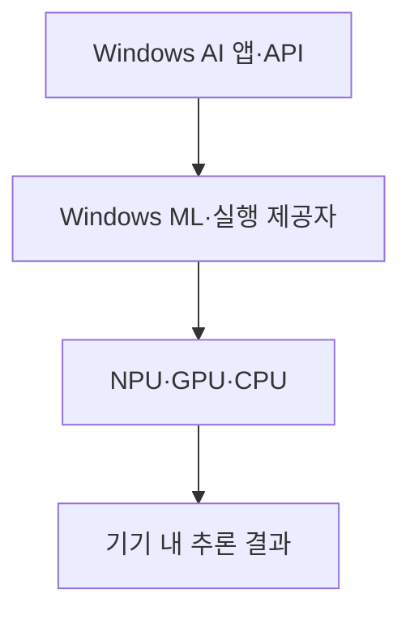
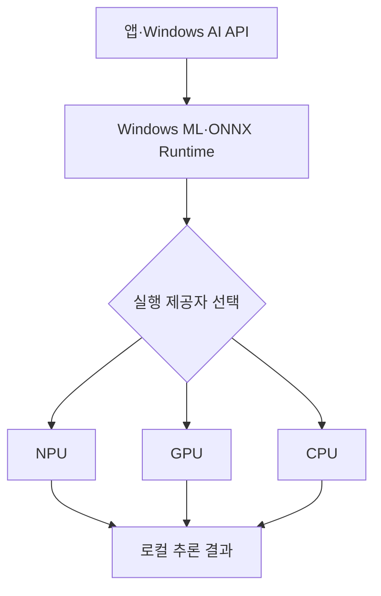
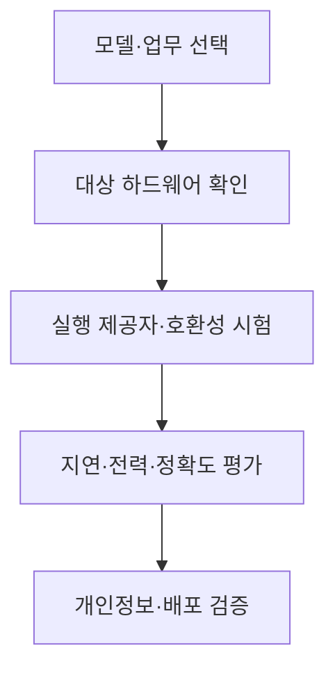

## 지식 로드맵 내 현재 위치

컴퓨터 시스템 및 네트워크 → 온디바이스 AI → Copilot+ PC NPU

## 30초 인출

- 본질: Copilot+ PC는 로컬 AI 기능을 겨냥해 Microsoft가 정의한 Windows PC 범주로, 40+ TOPS NPU를 포함
- 메커니즘: NPU·GPU·CPU 중 실행 제공자를 활용해 기기에서 모델 추론을 수행하며 기능 지원은 모델·장치·Windows 버전에 따라 다름

핵심 용어

- **NPU (Neural Processing Unit)**: 신경망 연산을 가속하도록 설계된 프로세서
- **TOPS (Tera Operations Per Second)**: 초당 1조 회 연산을 뜻하는 처리량 단위
- **Copilot+ PC**: 40+ TOPS NPU 등 정해진 하드웨어 요구를 갖춘 Windows PC 범주
- **Windows ML**: ONNX Runtime 기반으로 Windows 기기의 CPU·GPU·NPU 실행 제공자를 사용하는 추론 프레임워크
- **DirectML (Direct Machine Learning)**: Direct3D 12 기반의 기계학습 가속 API로, 지원되지만 신규 Windows ONNX 기능 개발은 Windows ML 중심

---
## 1교시 예상문제 (10점)

> Copilot+ PC NPU의 개념과 주요 역할을 설명하시오. (예상)

---
## 1교시 10점 답안

### Ⅰ. 정의·목적

| 구분 | 핵심 |
|---|---|
| 정의 | **Copilot+ PC NPU**는 Copilot+ PC 범주의 40+ TOPS 요구에 포함되는 신경망 연산 가속기 |
| 목적 | 지원되는 AI 추론 작업을 기기에서 가속 |

### Ⅱ. 실행 경로

| 구성 | 역할 |
|---|---|
| AI 모델·API | 추론 작업과 호출 인터페이스 |
| 실행 프레임워크 | 모델 실행·하드웨어 선택 |
| NPU | 지원되는 신경망 연산 가속 |

### Ⅲ. 적용 조건

40+ TOPS는 제품 범주 조건이며 실제 성능·지원 기능은 모델·드라이버·앱·장치에 따라 달라짐

> 제언: 배포 전 대상 장치에서 모델 호환성·성능·개인정보 처리를 시험

---
## 2~4교시 예상문제 (25점)

> Copilot+ PC의 NPU·소프트웨어 실행 구조를 설명하고, 온디바이스 AI 도입 시 고려사항을 제시하시오. (예상)

---
## 2~4교시 25점 답안

### Ⅰ. 정의·목적

| 구분 | 핵심 |
|---|---|
| 정의 | **Copilot+ PC NPU**는 Copilot+ PC 범주의 40+ TOPS 요구에 포함되는 신경망 연산 가속기 |
| 목적 | 지원되는 AI 추론 작업을 기기에서 가속 |

### Ⅱ. AI 추론 구조

| 계층 | 역할 |
|---|---|
| 응용·Windows AI API | AI 기능 요청 |
| 런타임 | 모델 실행과 제공자 선택 |
| 실행 제공자 | 장치별 하드웨어 연계 |
| CPU·GPU·NPU | 모델 추론 처리 |

### Ⅲ. 요구·제약 비교

| 항목 | 고려사항 |
|---|---|
| NPU 처리량 | Copilot+ PC 범주에 40+ TOPS 요구 |
| 모델 지원 | 연산자·정밀도·런타임 호환성 확인 |
| 전력·지연 | 실제 장치에서 지속 성능 측정 |
| 개인정보 | 로컬 처리 여부와 데이터 저장·전송 경로 확인 |

### Ⅳ. 도입 한계와 대응

| 한계 | 대응 |
|---|---|
| NPU 처리량만으로 앱 호환성이 정해지지 않음 | 모델·연산자·드라이버 조합 시험 |
| 기능 지원이 장치·버전에 따라 다름 | 지원 매트릭스와 운영체제 버전 고정 |
| 로컬 실행이 자동으로 개인정보 보호를 보장하지 않음 | 저장·로그·동기화·백업 경로 검토 |
| DirectML만을 신규 개발 기본값으로 간주할 위험 | Windows ML의 현재 실행 제공자 모델 확인 |

### Ⅴ. 기술사적 제언

| 한계 | 해결 방안 |
|---|---|
| TOPS 비교만으로 실제 업무 가치를 판정하기 어려움 | 실제 업무 모델로 품질·응답시간·전력·정보보호를 종합 검증 |

## 검증 출처

- [Microsoft Copilot+ PC developer guide](https://learn.microsoft.com/ko-kr/windows/ai/npu-devices/): 40+ TOPS·장치 내 NPU 개발
- [Microsoft Windows ML overview](https://learn.microsoft.com/windows/ai/new-windows-ml/overview): 최신 로컬 추론 프레임워크와 실행 제공자
- [Microsoft DirectML overview](https://learn.microsoft.com/en-us/windows/ai/directml/): DirectML 유지와 신규 개발 방향
