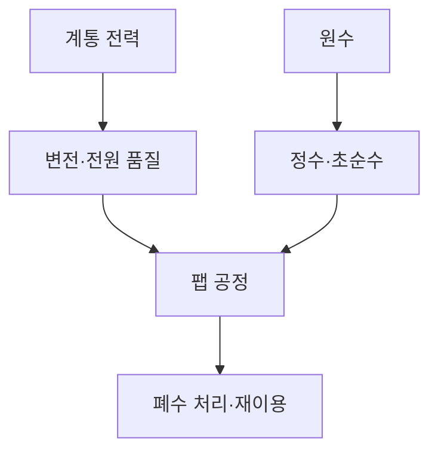
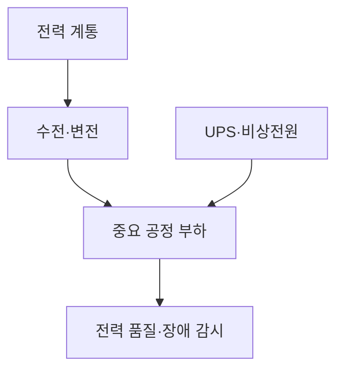
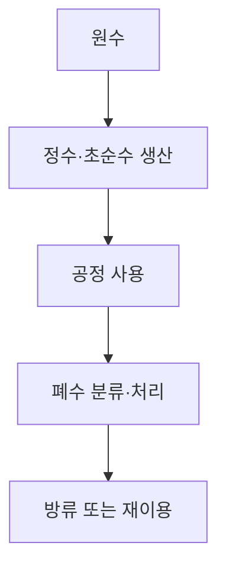

## 지식 로드맵 내 현재 위치

컴퓨터 시스템 및 네트워크 → 반도체 생산시스템 → 전력·용수 기반시설

## 30초 인출

- 본질: 반도체 특화 기반시설은 팹 생산에 필요한 안정적 전력·용수·환경 제어를 제공하는 유틸리티
- 메커니즘: 계통 전력·비상전원과 원수·정수·초순수·재이용수 설비를 공정 요구에 맞게 운영

핵심 용어

- **초순수(UPW, Ultrapure Water)**: 반도체 제조 공정에 사용하는 불순물 농도가 낮은 정제수
- **유틸리티(Utility)**: 생산설비 가동에 필요한 전력·용수·가스·공조 등 기반 자원
- **UPS (Uninterruptible Power Supply)**: 입력 전원이 끊길 때 중요 부하에 전력을 공급하도록 구성한 무정전 전원장치
- **재이용수(Reclaimed Water)**: 처리한 폐수·방류수를 용도 기준에 따라 다시 사용하는 물

---
## 1교시 예상문제 (10점)

> 반도체 생산 기반시설의 개념과 주요 구성요소를 설명하시오. (예상)

---
## 1교시 10점 답안

### Ⅰ. 정의·목적

| 구분 | 핵심 |
|---|---|
| 정의 | **반도체 생산 기반시설**은 팹 생산에 필요한 안정적 전력·용수·환경 제어를 제공하는 유틸리티 |
| 목적 | 공정의 연속성·품질·안전한 운영 지원 |

### Ⅱ. 주요 기반시설

| 자원 | 주요 구성 |
|---|---|
| 전력 | 계통 수전·변전·비상전원 |
| 용수 | 원수·정수·초순수·폐수 처리 |
| 환경 | 공조·온습도·청정도 관리 |

### Ⅲ. 운영 요점

생산 중단뿐 아니라 전압·수질·환경 편차가 공정 품질과 설비에 미치는 영향까지 관리

> 제언: 핵심 유틸리티별 허용범위·경보·복구 절차를 공정 중요도에 맞춰 수립

---
## 2~4교시 예상문제 (25점)

> 반도체 생산 기반시설의 구성과 운영 위험을 설명하고, 전력·용수 연속성 확보 방안을 제시하시오. (예상)

---
## 2~4교시 25점 답안

### Ⅰ. 정의·목적

| 구분 | 핵심 |
|---|---|
| 정의 | **반도체 생산 기반시설**은 팹 생산에 필요한 안정적 전력·용수·환경 제어를 제공하는 유틸리티 |
| 목적 | 공정의 연속성·품질·안전한 운영 지원 |

### Ⅱ. 전력 기반

| 요소 | 운영 통제 |
|---|---|
| 계통·수전 | 공급경로·보호·전압 품질 |
| 변전·배전 | 설비별 부하·보호협조 |
| UPS·비상전원 | 중요 부하의 순간·장시간 대응 구분 |

### Ⅲ. 용수·환경 기반

| 단계 | 역할 |
|---|---|
| 원수 확보 | 수량·수질·공급 위험 관리 |
| 정수·초순수 | 공정 요구 수질 제공 |
| 폐수 처리 | 오염물질 처리·배출 관리 |
| 재이용 | 적합한 용도에 처리수 재사용 |

### Ⅳ. 연속성 한계와 대응

| 한계 | 대응 |
|---|---|
| 계통 외란·설비 고장이 공정 부하에 영향 | 부하 중요도별 전원 보호·비상운전 계획 |
| 원수 수량·수질 편차 | 수원·저장·처리 여유와 수질 감시 |
| 환경 제어 실패가 품질·장비에 영향 | 설비 상태·공정 영향 연계 모니터링과 복구 훈련 |

### Ⅴ. 기술사적 제언

| 한계 | 해결 방안 |
|---|---|
| 전력·용수 설비의 개별 이중화가 생산 연속성을 보장하지 않음 | 공정별 필수 부하·필수 수질을 정의하고 유틸리티 장애 시나리오 통합 시험 |

## 검증 출처

- [SIA semiconductor manufacturing infrastructure report](https://www.semiconductors.org/wp-content/uploads/2021/04/4.5.21-SIA-supply-chain-submission.pdf): 안정적 전력·용수 필요성
- [U.S. DOE Water Efficiency Guide](https://www1.eere.energy.gov/femp/pdfs/bp_water_508.pdf): UPW·공정수 재이용 사례
