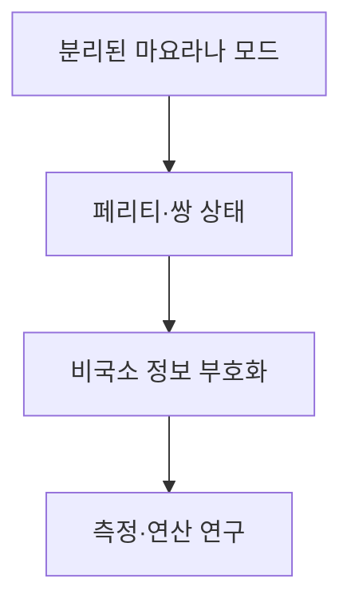
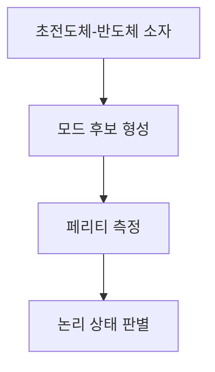
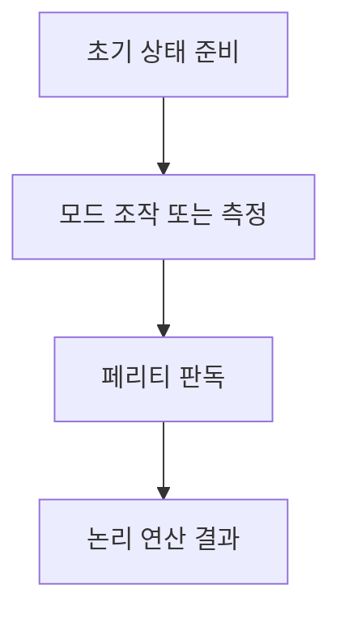

## 지식 로드맵 내 현재 위치

컴퓨터 시스템 및 네트워크 → 양자 컴퓨팅 → 마요라나 기반 위상 큐비트

## 30초 인출

- 본질: 위상 큐비트는 마요라나 제로 모드의 비국소 양자 상태에 정보를 부호화하려는 큐비트 구현 방식
- 메커니즘: 모드를 분리해 배치하고 페리티 측정·브레이딩을 이용하는 오류 내성 구조를 연구

핵심 용어

- **마요라나 제로 모드(Majorana Zero Mode, MZM)**: 위상 초전도체의 경계·결함에서 나타날 수 있는 영에너지 준입자 모드
- **위상 큐비트(Topological Qubit)**: 위상 상태·준입자 자유도에 정보를 부호화하는 양자 정보 단위
- **페리티(Parity)**: 페르미온 점유의 짝·홀 상태를 구분하는 물리량
- **브레이딩(Braiding)**: 비가환 애니온을 교환해 양자 상태에 연산을 구현하는 과정
- **안드레예프 속박 상태(Andreev Bound State)**: 초전도체와 정상 전도체 경계 등에 형성될 수 있는 국소화 에너지 상태

---
## 1교시 예상문제 (10점)

> 마요라나 기반 위상 큐비트의 개념과 정보 부호화 원리를 설명하시오. (예상)

---
## 1교시 10점 답안

### Ⅰ. 정의·목적

| 구분 | 핵심 |
|---|---|
| 정의 | **위상 큐비트**는 마요라나 제로 모드의 비국소 양자 상태에 정보를 부호화하려는 큐비트 구현 방식 |
| 목적 | 국소 잡음에 대한 민감도를 낮추는 오류 내성 양자정보 표현 연구 |

### Ⅱ. 부호화 개념

정보 부호화에는 물리 모드와 전체 페리티 등 구속조건이 필요하며, 두 개의 모드만으로 완전한 오류 내성 큐비트가 자동 구현되는 것은 아님

### Ⅲ. 연구 단계

마요라나 신호 관측, 페리티 측정, 비가환 브레이딩과 오류 내성 검증은 서로 다른 연구 단계

> 제언: 물리 신호와 완전한 위상 큐비트 실증을 구분해 평가

---
## 2~4교시 예상문제 (25점)

> 마요라나 기반 위상 큐비트의 부호화·연산 원리를 설명하고, 실험적 검증 과제를 제시하시오. (예상)

---
## 2~4교시 25점 답안

### Ⅰ. 정의·목적

| 구분 | 핵심 |
|---|---|
| 정의 | **위상 큐비트**는 마요라나 제로 모드의 비국소 양자 상태에 정보를 부호화하려는 큐비트 구현 방식 |
| 목적 | 국소 잡음에 대한 민감도를 낮추는 오류 내성 양자정보 표현 연구 |

### Ⅱ. 부호화 원리

| 구성 | 기능 |
|---|---|
| 마요라나 모드 | 초전도 소자 경계·결함에 형성될 후보 자유도 |
| 모드 쌍·페리티 | 상태 공간·측정 기준 구성 |
| 복수 모드 구성 | 논리 상태·연산을 위한 부호화 구조 |

### Ⅲ. 연산과 보호 원리

| 개념 | 의미 |
|---|---|
| 비국소 부호화 | 정보가 공간적으로 분리된 자유도에 걸쳐 표현 |
| 브레이딩 | 준입자 교환 경로에 의한 연산 제안 |
| 페리티 측정 | 상태·연산 결과 판별에 활용 |

### Ⅳ. 실증 한계와 검증

| 한계 | 검증 과제 |
|---|---|
| 제로 바이어스 신호가 MZM의 단독 증거가 아님 | 대체 설명인 안드레예프 상태 등 배제 |
| 페리티 판독과 위상 보호는 별도 입증 필요 | 잡음·길이 의존성·반복 재현성 확인 |
| 브레이딩 기반 논리 게이트까지 추가 과제 존재 | 비가환 연산과 오류 내성 실험 |

2025년 InAs–Al 단일 샷 페리티 측정 논문은 관련 측정 기술을 다루지만, 논문에 실린 결과만으로 보고 장치의 MZM 존재를 입증한 것은 아니라는 Nature 편집자 주의가 함께 제시됨

### Ⅴ. 기술사적 제언

| 한계 | 해결 방안 |
|---|---|
| 부품 수준의 측정 성과를 오류 내성 양자컴퓨터의 실증과 혼동할 수 있음 | 모드 검출·페리티 판독·브레이딩·논리 오류율을 단계별 검증 관문으로 관리 |

## 검증 출처

- [Majorana zero modes and topological quantum computation](https://www.nature.com/articles/npjqi20151): 위상 부호화·브레이딩 개념과 검증 단계
- [Interferometric single-shot parity measurement in InAs–Al hybrid devices](https://www.nature.com/articles/s41586-024-08445-2): 2025년 페리티 측정 결과와 편집자 주의
