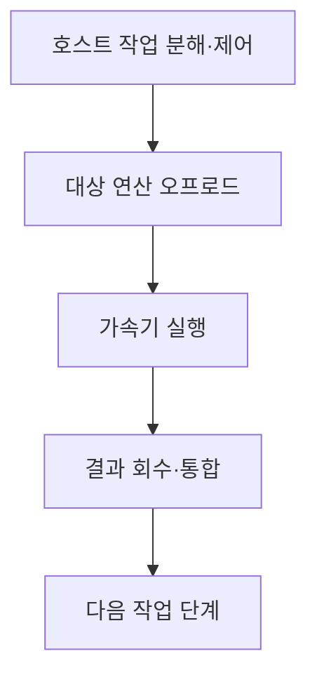
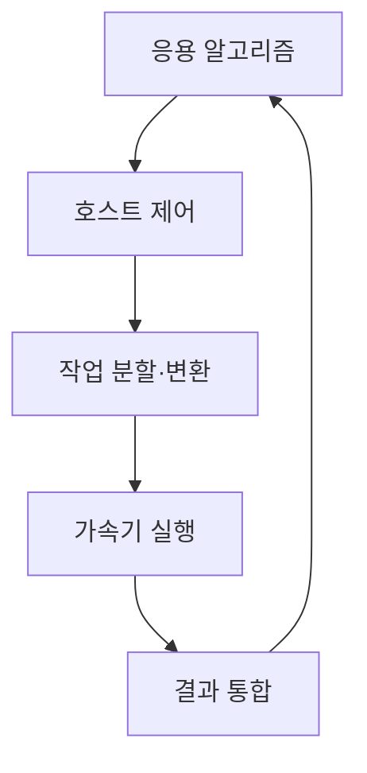
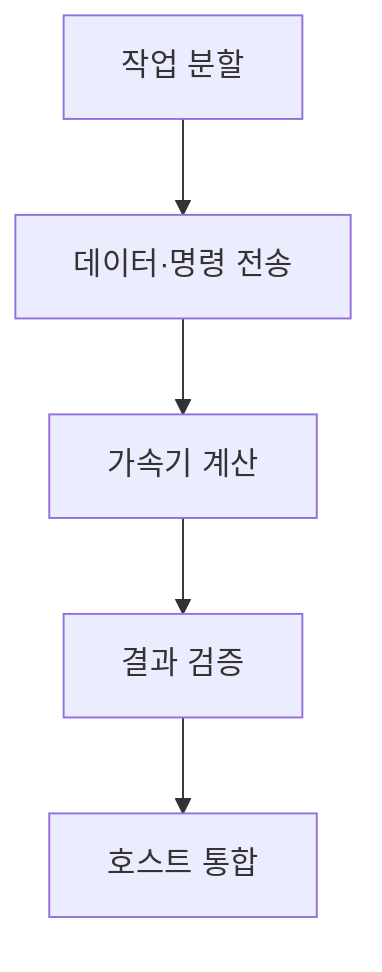

## 지식 로드맵 내 현재 위치

컴퓨터 시스템 및 네트워크 → 이종 컴퓨팅 → 하이브리드 컴퓨팅

## 30초 인출

- 본질: 하이브리드 컴퓨팅은 서로 다른 연산기의 강점을 하나의 작업 흐름에서 결합하는 방식
- 메커니즘: 호스트가 작업을 분할·제어하고 특화 가속기에 적합한 부분을 실행시킨 뒤 결과를 통합

핵심 용어

- **하이브리드 컴퓨팅(Hybrid Computing)**: 서로 다른 연산 구조를 연계해 한 작업을 처리하는 컴퓨팅 방식
- **CPU (Central Processing Unit)**: 범용 명령 실행·제어에 쓰이는 프로세서
- **GPU (Graphics Processing Unit)**: 대량 병렬 계산을 지원하는 프로세서
- **QPU (Quantum Processing Unit)**: 큐비트 연산을 수행하는 양자 처리 장치
- **오프로드(Offload)**: 특정 계산을 호스트에서 가속기로 전달해 수행하는 과정

---
## 1교시 예상문제 (10점)

> 하이브리드 컴퓨팅의 개념과 실행 흐름을 설명하시오. (예상)

---
## 1교시 10점 답안

### Ⅰ. 정의·목적

| 구분 | 핵심 |
|---|---|
| 정의 | **하이브리드 컴퓨팅**은 서로 다른 연산기를 하나의 작업 흐름에서 결합하는 방식 |
| 목적 | 작업 특성에 맞는 연산 자원을 활용하고 연산 결과를 통합 |

### Ⅱ. 실행 흐름

### Ⅲ. 적용 요점

CPU·GPU·QPU는 지원하는 연산과 비용이 다르며, 가속기 사용이 자동으로 전체 실행을 빠르게 하지는 않음

> 제언: 전송·변환·동기화 비용까지 포함해 전체 작업시간을 측정

---
## 2~4교시 예상문제 (25점)

> 하이브리드 컴퓨팅의 구성과 실행 흐름을 설명하고, 성능·정확성·연동 측면의 고려사항을 제시하시오. (예상)

---
## 2~4교시 25점 답안

### Ⅰ. 정의·목적

| 구분 | 핵심 |
|---|---|
| 정의 | **하이브리드 컴퓨팅**은 서로 다른 연산기를 하나의 작업 흐름에서 결합하는 방식 |
| 목적 | 작업 특성에 맞는 연산 자원을 활용하고 연산 결과를 통합 |

### Ⅱ. 구성 요소

| 구성 | 역할 |
|---|---|
| 호스트 CPU | 작업 제어·전처리·결과 통합 |
| 가속기 | 특화된 계산 수행 |
| 런타임·인터커넥트 | 작업 전달·실행·결과 회수 |
| 응용 알고리즘 | 각 연산기에 배분할 작업 정의 |

### Ⅲ. 실행 단계

| 단계 | 처리 |
|---|---|
| 분할 | 가속 가능한 하위 작업 식별 |
| 전송 | 데이터·명령 전달 |
| 실행 | CPU·GPU·QPU에서 계산 |
| 통합 | 결과와 오류·상태를 결합 |

### Ⅳ. 적용 한계와 대응

| 한계 | 대응 |
|---|---|
| 데이터 이동·동기화 비용이 이득을 상쇄 | 종단 간 성능 측정과 작업 크기 조정 |
| 수치 정밀도·확률 결과의 차이 | 기준 구현과 정확도·분산 검증 |
| 런타임·장치 종속성 | 추상화 인터페이스와 대체 경로 시험 |

### Ⅴ. 기술사적 제언

| 한계 | 해결 방안 |
|---|---|
| 연산기 처리량만 비교하면 전체 시스템 이득을 잘못 예측 | 전처리·전송·실행·통합 비용을 포함한 대표 업무 기준으로 도입 |

## 검증 출처

- [NVIDIA CUDA-Q overview](https://nvidia.github.io/cuda-quantum/latest/): 고전·양자 작업 흐름 연계
- [IBM Qiskit Runtime](https://quantum.cloud.ibm.com/docs/en/guides/compute-resources): 고전 호스트와 양자 실행 연계 개념
