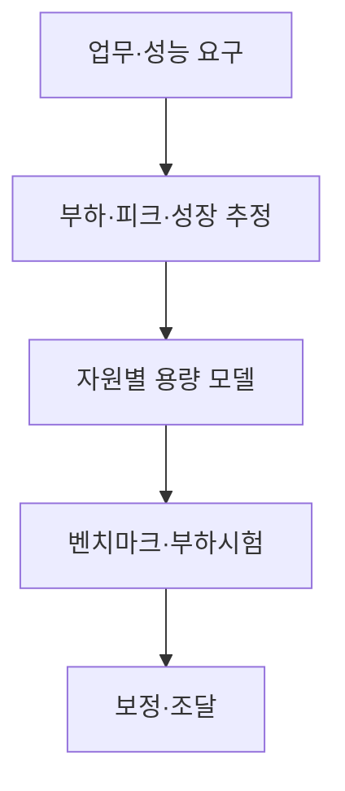
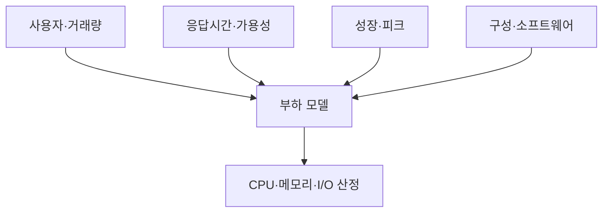
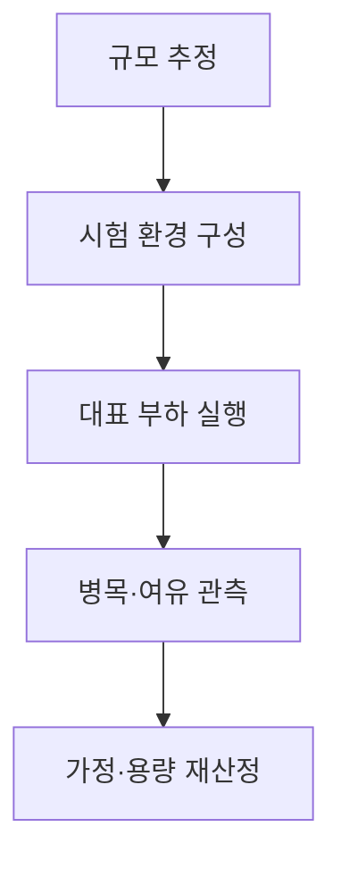

## 지식 로드맵 내 현재 위치

컴퓨터 시스템 및 네트워크 → 용량 계획 → 하드웨어 규모산정

## 30초 인출

- 본질: 하드웨어 규모산정은 업무 요구를 만족할 컴퓨팅·메모리·저장 용량을 추정하는 과정
- 메커니즘: 부하·성장·성능목표를 모델링하고 벤치마크·모니터링으로 가정과 결과를 보정

핵심 용어

- **하드웨어 규모산정(Hardware Sizing)**: 시스템 요구 부하와 성능목표에 맞는 하드웨어 용량을 추정하는 과정
- **TPS (Transactions Per Second)**: 초당 처리 트랜잭션 수
- **피크 부하(Peak Load)**: 특정 시간대에 집중되는 최대 또는 설계 부하
- **벤치마크(Benchmark)**: 정의된 부하·조건으로 시스템 성능을 측정하는 시험
- **용량계획(Capacity Planning)**: 현재·예상 수요에 맞춰 자원 용량을 계획·조정하는 활동

---
## 1교시 예상문제 (10점)

> 하드웨어 규모산정의 개념과 주요 절차를 설명하시오. (예상)

---
## 1교시 10점 답안

### Ⅰ. 정의·목적

| 구분 | 핵심 |
|---|---|
| 정의 | **하드웨어 규모산정**은 시스템 부하와 성능목표에 맞는 하드웨어 용량을 추정하는 과정 |
| 목적 | 성능·확장성과 비용 사이에서 적정 용량 결정 |

### Ⅱ. 산정 흐름

### Ⅲ. 산정 대상

| 자원 | 주요 부하 요소 |
|---|---|
| CPU | 동시성·연산량·응답시간 |
| 메모리 | 작업 집합·캐시·동시 세션 |
| 저장·네트워크 | IOPS·처리량·데이터 이동 |

> 제언: 초기 산정치를 부하 시험과 운영 지표로 주기적으로 갱신

---
## 2~4교시 예상문제 (25점)

> 정보시스템 하드웨어 규모산정의 절차와 자원별 산정요소를 설명하고, 산정 신뢰성 확보 방안을 제시하시오. (예상)

---
## 2~4교시 25점 답안

### Ⅰ. 정의·목적

| 구분 | 핵심 |
|---|---|
| 정의 | **하드웨어 규모산정**은 시스템 부하와 성능목표에 맞는 하드웨어 용량을 추정하는 과정 |
| 목적 | 성능·확장성과 비용 사이에서 적정 용량 결정 |

### Ⅱ. 산정 입력·모델

| 입력 | 반영 |
|---|---|
| 사용자·거래량 | 동시성·TPS·처리 패턴 |
| 성능목표 | 응답시간·처리량·가용성 |
| 성장·피크 | 기간별 증가·집중 부하 |
| 구성·소프트웨어 | 아키텍처·배치·데이터 특성 |

### Ⅲ. 자원별 검증

| 자원 | 검증 방법 |
|---|---|
| CPU | 대표 거래·동시 부하 시험 |
| 메모리 | 작업 집합·캐시·동시성 관찰 |
| 저장장치 | 용량·IOPS·처리량 시험 |
| 네트워크 | 동서·남북 트래픽·대역폭 검증 |

### Ⅳ. 산정 한계와 대응

| 한계 | 대응 |
|---|---|
| 평균 부하만 사용하면 피크 병목 누락 | 업무별 피크·동시성 분포 반영 |
| 단일 서버 수치가 분산 환경으로 그대로 확장되지 않음 | 목표 아키텍처에서 종단 간 시험 |
| 성장·운영 변동이 가정과 달라짐 | 민감도·단계별 확장·운영 재평가 |
| 벤치마크 조건이 실제와 다름 | 업무 대표성·재현 조건·병목을 기록 |

### Ⅴ. 기술사적 제언

| 한계 | 해결 방안 |
|---|---|
| 최초 조달량을 한 번 정하면 실제 수요와 어긋날 수 있음 | 단계적 용량 확보와 관측 기반 증설 절차를 설계 |

## 검증 출처

- [NIST SP 800-145](https://csrc.nist.gov/pubs/sp/800/145/final): 클라우드 자원 풀링·탄력성 참고
- [TPC benchmarks](https://www.tpc.org/information/benchmarks5.asp): 조건이 명시된 성능 벤치마크의 사용 참고
