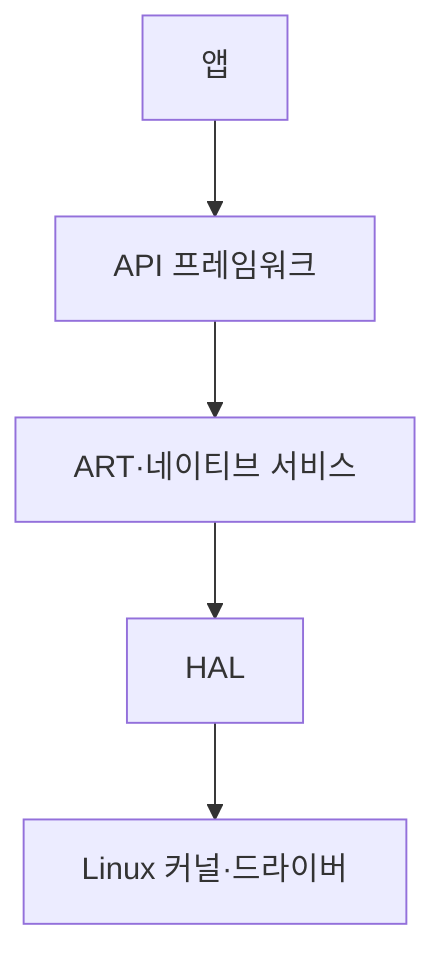
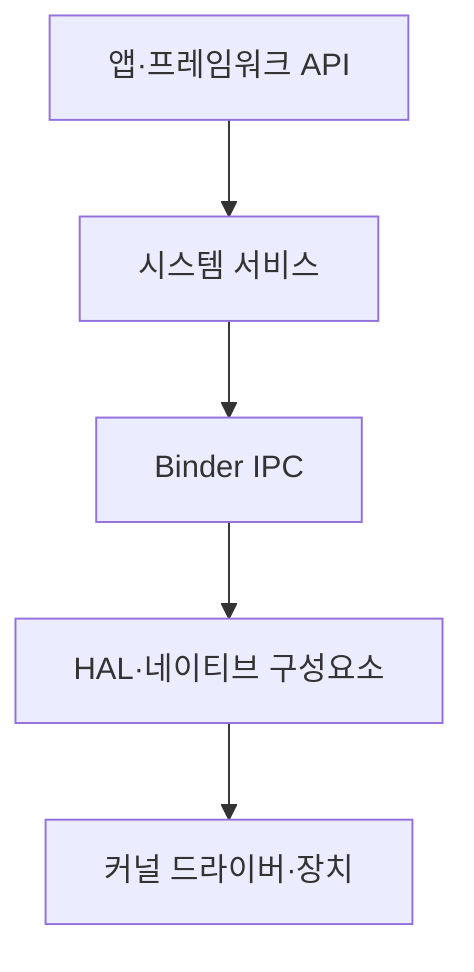
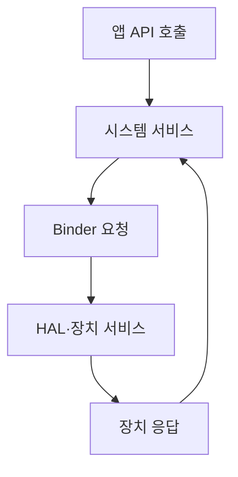

## 지식 로드맵 내 현재 위치

컴퓨터 시스템 및 네트워크 → 모바일 운영체제 → Android 플랫폼

## 30초 인출

- 본질: Android는 Linux 기반 커널·런타임·프레임워크·앱으로 구성된 모바일 소프트웨어 플랫폼
- 메커니즘: 프레임워크 API가 Binder IPC와 HAL을 거쳐 시스템 서비스·하드웨어 기능을 제공

핵심 용어

- **Android**: Linux 커널 기반의 오픈소스 모바일 소프트웨어 플랫폼
- **ART (Android Runtime)**: Android 앱 코드를 실행하는 런타임 환경
- **HAL (Hardware Abstraction Layer)**: 하드웨어 기능을 상위 프레임워크에 표준 인터페이스로 제공하는 계층
- **Binder IPC (Binder Interprocess Communication)**: Android 프로세스·서비스 사이의 프로세스 간 통신 메커니즘
- **Zygote**: 앱 프로세스 생성에 활용되는 Android 시스템 프로세스

---
## 1교시 예상문제 (10점)

> Android 플랫폼의 개념과 주요 계층을 설명하시오. (예상)

---
## 1교시 10점 답안

### Ⅰ. 정의·목적

| 구분 | 핵심 |
|---|---|
| 정의 | **Android**는 Linux 커널 기반의 오픈소스 모바일 소프트웨어 플랫폼 |
| 목적 | 다양한 장치에서 앱 실행·시스템 서비스·하드웨어 접근 제공 |

### Ⅱ. 플랫폼 계층

| 계층 | 역할 |
|---|---|
| 앱·API 프레임워크 | 앱 기능·시스템 서비스 API |
| Android 런타임·네이티브 라이브러리 | 앱 코드·시스템 기능 실행 |
| HAL | 장치별 하드웨어 기능 추상화 |
| Linux 커널 | 프로세스·메모리·드라이버·보안 기반 |

### Ⅲ. IPC

Binder IPC는 앱·시스템 프로세스 사이 서비스 호출과 데이터 전달을 지원

> 제언: 앱 상태·IPC 크기·백그라운드 정책을 플랫폼 버전에 맞춰 설계

---
## 2~4교시 예상문제 (25점)

> Android 플랫폼의 계층 구조와 주요 동작을 설명하고, 앱 안정성·하드웨어 추상화 관점의 운영 고려사항을 제시하시오. (예상)

---
## 2~4교시 25점 답안

### Ⅰ. 정의·목적

| 구분 | 핵심 |
|---|---|
| 정의 | **Android**는 Linux 커널 기반의 오픈소스 모바일 소프트웨어 플랫폼 |
| 목적 | 다양한 장치에서 앱 실행·시스템 서비스·하드웨어 접근 제공 |

### Ⅱ. 플랫폼 구성

| 구성 | 기능 |
|---|---|
| 시스템·사용자 앱 | 사용자 기능·서비스 제공 |
| Java/Kotlin API 프레임워크 | 앱 생명주기·시스템 API |
| ART·네이티브 라이브러리 | DEX 실행·시스템 구현 |
| HAL | 카메라·오디오 등 장치 인터페이스 |
| Linux 커널 | 저수준 자원·드라이버·보안 기능 |

### Ⅲ. 실행·통신

| 메커니즘 | 의미 |
|---|---|
| ART | 앱 바이트코드 실행·컴파일 |
| 프로세스 격리 | 앱별 실행 환경·권한 경계 |
| Binder | 프로세스 간 서비스 통신 |
| HAL | 상위 기능을 장치 구현과 분리 |

### Ⅳ. 한계와 대응

| 한계 | 대응 |
|---|---|
| OS가 자원 압박 시 앱 프로세스를 종료할 수 있음 | 상태를 영속화하고 재생성 안전하게 구현 |
| IPC 전송에 크기·성능 제약 | 대형 객체 대신 파일·URI·저장소 참조 전달 |
| 제조사별 하드웨어 구현 차이 | 표준 API·HAL 계약과 장치별 검증 활용 |

### Ⅴ. 기술사적 제언

| 한계 | 해결 방안 |
|---|---|
| 장치·OS 차이로 실제 동작과 성능이 달라질 수 있음 | 지원 장치 매트릭스와 프로세스 종료·IPC·권한 회귀시험을 유지 |

## 검증 출처

- [Android platform architecture](https://developer.android.com/guide/platform): 플랫폼 계층·ART·HAL
- [Android Binder overview](https://source.android.com/docs/core/architecture/ipc/binder-overview): Binder IPC
