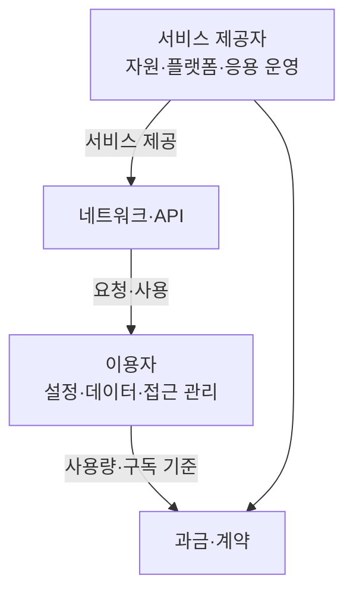
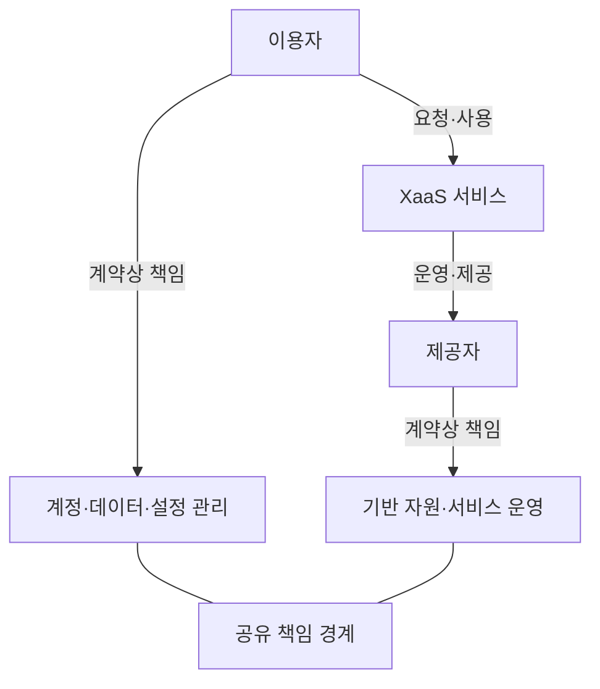

## 지식 로드맵 내 현재 위치

컴퓨터 시스템 및 네트워크 → 클라우드 컴퓨팅 → XaaS

## 30초 인출

- 본질: XaaS는 IT 기능과 자원을 서비스로 제공하고 사용자가 필요에 따라 이용하는 모델
- 메커니즘: 제공자가 서비스로 운영하고 사용자는 네트워크/API로 이용하며, 비용·책임은 서비스별 계약과 사용량 기준으로 배분

핵심 용어

- **XaaS(Everything as a Service):** 인프라·플랫폼·소프트웨어 등 기능을 서비스 형태로 제공하는 모델
- **IaaS(Infrastructure as a Service):** 컴퓨팅·스토리지·네트워크 기반 자원을 제공하는 서비스
- **PaaS(Platform as a Service):** 애플리케이션 개발·실행에 필요한 플랫폼을 제공하는 서비스
- **SaaS(Software as a Service):** 완성된 애플리케이션을 네트워크로 제공하는 서비스
- **공유 책임 모델(Shared Responsibility Model):** 제공자와 이용자의 보안·운영 책임을 서비스 경계에 따라 나누는 원칙

---

## 1교시 예상문제 (10점)

> XaaS의 개념과 서비스 제공 구조를 설명하시오. (예상)

---

## 1교시 10점 답안

### Ⅰ. XaaS 개요

| 구분 | 핵심 |
|---|---|
| 정의 | **XaaS(Everything as a Service):** IT 기능·자원을 서비스로 제공해 네트워크로 이용하는 모델 |
| 목적 | 초기 구축 부담을 낮추고 필요한 기능을 수요에 맞게 이용 |

### Ⅱ. 서비스 제공 구조

| 유형 | 제공 대상 | 이용자 관리 초점 |
|---|---|---|
| **IaaS** | 컴퓨팅·스토리지·네트워크 | OS·응용 설정과 데이터 |
| **PaaS** | 개발·실행 플랫폼 | 응용·데이터 |
| **SaaS** | 완성된 소프트웨어 | 계정·데이터·사용 설정 |

제언: 기능 편의와 함께 책임 경계·비용 산정 기준을 계약에서 확인

---

## 2~4교시 예상문제 (25점)

> XaaS의 개념과 주요 서비스 유형을 설명하고, 도입 시 고려사항과 적용 방안을 제시하시오. (예상)

---

## 2~4교시 25점 답안

## Ⅰ. XaaS 개요

| 구분 | 핵심 |
|---|---|
| 정의 | **XaaS(Everything as a Service):** IT 기능·자원을 서비스로 제공해 네트워크로 이용하는 모델 |
| 목적 | 초기 구축 부담을 낮추고 필요한 기능을 수요에 맞게 이용 |

## Ⅱ. 서비스 유형과 관리 범위

| 유형 | 제공자 운영 범위 | 이용자 관리 초점 |
|---|---|---|
| **IaaS** | 물리 인프라·가상화 | OS·응용·데이터 |
| **PaaS** | 인프라·실행 플랫폼 | 응용·데이터 |
| **SaaS** | 인프라·플랫폼·응용 | 계정·데이터·설정 |

## Ⅲ. 이용 방식과 책임 경계

서비스 모델에 따라 제공자가 맡는 운영 범위가 달라지므로 계약·설정·데이터 보호 책임을 함께 정리

| 확인 항목 | 이용자 확인 사항 |
|---|---|
| 서비스 수준 | 가용성 목표, 장애 통지·복구 절차 |
| 보안·개인정보 | 접근 통제, 암호화, 데이터 위치·삭제 |
| 비용 | 과금 단위, 사용량 변동, 종료 비용 |
| 이전·종료 | 데이터 반출 형식, 전환 기간, 계정 회수 |

## Ⅳ. 도입 한계와 대응

| 한계 | 대응 |
|---|---|
| 특정 제공자 API·기술에 대한 종속 | 표준 인터페이스·데이터 반출 경로와 대체 수단 검토 |
| 사용량 변동에 따른 비용 예측 어려움 | 태그·예산·사용량 경보와 정기 비용 검토 |
| 제공자·이용자 책임 혼선 | 서비스별 책임 분장과 운영 절차 문서화 |
| 외부 서비스 장애 영향 | 복구 목표·대체 경로·업무 연속성 시험 |

## Ⅴ. 기술사적 제언

| 한계 | 해결 방안 |
|---|---|
| 서비스 도입 편의가 장기 비용·이전성·책임 위험을 가릴 수 있음 | 핵심 업무별로 서비스 적합성·총비용·반출 가능성·책임 경계를 함께 평가하고, 비핵심 영역부터 단계적으로 도입 |

## 출제 이력과 검증 출처

- 제89회 1교시: `클라우드 서비스의 진화 모델인 XaaS(Everything as a Service)의 정의와 주요 구성 요소를 설명하시오.`
- 제101회 1교시: `XaaS(Everything as a Service)의 등장 배경, 서비스 유형 및 성공적인 도입을 위한 고려사항을 설명하시오.`
- [NIST SP 800-145 — The NIST Definition of Cloud Computing](https://csrc.nist.gov/pubs/sp/800/145/final)
- [NIST SP 800-210 — General Access Control Guidance for Cloud Systems](https://csrc.nist.gov/pubs/sp/800/210/final)
- [Q-Net 정보관리기술사 출제문제](https://www.q-net.or.kr/cst006.do?id=cst00601&gSite=Q&gId=)

## 연결 토픽

- [클라우드 컴퓨팅](./013_cloud_computing/) · [클라우드 서비스 모델](./109_cloud_computing_service_models/)
