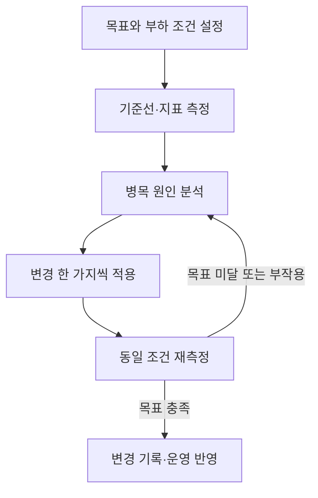
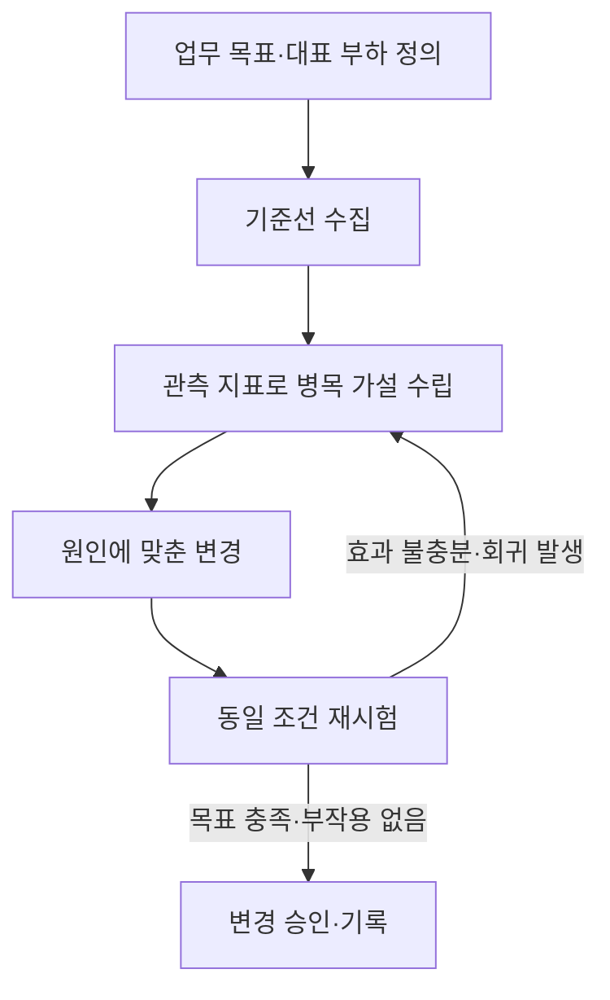

## 지식 로드맵 내 현재 위치

컴퓨터 시스템 → 성능 관리 → 성능 튜닝

## 30초 인출

- 본질: 성능 튜닝은 측정 자료를 바탕으로 서비스 병목을 찾아 개선하는 반복 활동
- 메커니즘: 목표·부하를 정하고 계측해 원인을 좁힌 뒤, 변경을 적용하고 같은 조건에서 결과와 부작용을 재확인

핵심 용어

- **성능 튜닝(Performance Tuning)**: 측정된 성능 병목의 원인을 개선하고 동일 조건에서 효과를 확인하는 활동
- **병목(Bottleneck)**: 처리 경로에서 전체 성능을 제한하는 자원 또는 단계
- **기준선(Baseline)**: 비교를 위해 기록한 시스템 성능과 부하 조건
- **처리량(Throughput)**: 단위 시간에 완료한 작업량
- **응답 시간(Response Time)**: 요청부터 응답 완료까지 걸린 시간

---

## 1교시 예상문제 (10점)

> 성능 튜닝의 개념과 기본 절차를 설명하시오. (예상)

---

## 1교시 10점 답안

### Ⅰ. 성능 튜닝 개요

| 구분 | 핵심 |
|---|---|
| 정의 | 측정 자료로 병목 원인을 찾아 시스템 구성을 개선하고 결과를 검증하는 활동 |
| 목적 | 정해진 서비스 목표를 만족하도록 응답 시간·처리량·자원 사용을 개선 |

### Ⅱ. 측정과 개선 절차

| 지표 | 보는 내용 |
|---|---|
| 응답 시간 | 평균뿐 아니라 분포·상위 백분위 지연 |
| 처리량 | 부하 조건에서 완료한 작업량 |
| 자원·오류 | CPU·메모리·I/O와 오류율의 동반 변화 |

제언: 튜닝 전후의 부하 조건과 지표를 함께 기록해 개선 효과를 판정

---

## 2~4교시 예상문제 (25점)

> 성능 튜닝의 개념과 절차를 설명하고, 계층별 병목 분석 및 개선 시 고려사항을 제시하시오. (예상)

---

## 2~4교시 25점 답안

## Ⅰ. 성능 튜닝 개요

| 구분 | 핵심 |
|---|---|
| 정의 | 측정 자료로 병목 원인을 찾아 시스템 구성을 개선하고 결과를 검증하는 활동 |
| 목적 | 정해진 서비스 목표를 만족하도록 응답 시간·처리량·자원 사용을 개선 |

## Ⅱ. 목표 설정과 반복 절차

| 실험 원칙 | 적용 |
|---|---|
| 비교 가능성 | 부하·데이터·환경을 맞춰 전후 비교 |
| 원인 추적 | 변경 범위를 작게 유지하고 관측값으로 가설 검증 |
| 안전성 | 회귀·오류율·자원 포화를 함께 확인하고 복구안 보유 |

## Ⅲ. 계층별 병목 분석

| 계층 | 관측 대상 | 개선 방향 예 |
|---|---|---|
| 애플리케이션 | 호출 경로, 알고리즘, 외부 호출 | 불필요한 연산·호출 감소, 캐시 적합성 검토 |
| 런타임·WAS | 스레드 대기, 힙·GC, 큐 | 요청 동시성·메모리 사용을 부하와 함께 조정 |
| 데이터베이스 | 실행계획, I/O, 잠금 대기 | 질의·인덱스·트랜잭션 범위 점검 |
| OS·인프라 | CPU 포화, 메모리 압박, 디스크·네트워크 지연 | 포화 원인과 용량·설정 병목 구분 |

계층별 지표와 요청 추적을 연결해 먼저 막힌 지점과 뒤따른 대기 현상을 구분

## Ⅳ. 부하 시험과 튜닝의 역할

| 활동 | 핵심 질문 | 산출 |
|---|---|---|
| 부하 시험 | 정해진 부하에서 서비스가 어떻게 동작하는가? | 처리량·지연·오류·포화 관측 |
| 성능 튜닝 | 관측된 병목의 원인을 어떻게 개선할 것인가? | 변경 내용과 전후 검증 결과 |

부하 시험은 튜닝의 입력 자료이며, 시험 결과만으로 원인이나 개선책이 확정되지는 않음

## Ⅴ. 기술사적 제언

| 한계 | 해결 방안 |
|---|---|
| 단일 수치·평균값 중심 평가는 피크 지연과 변경 부작용을 놓칠 수 있음 | 업무 목표에 맞는 지연 분포·처리량·오류율을 함께 정하고, 재현 가능한 시험 및 롤백 기준을 변경 승인 절차에 포함 |

## 출제 이력과 검증 출처

- 제81회 1교시: `소프트웨어 성능 튜닝의 개념 및 절차를 설명하시오.`
- 제95회 2교시: `웹 애플리케이션 시스템(WAS)과 데이터베이스(DB) 환경에서의 병목 현상 원인과 계층별 튜닝 방안을 설명하시오.`
- [OpenTelemetry Documentation — Signals](https://opentelemetry.io/docs/concepts/signals/)
- [Linux kernel documentation — perf](https://docs.kernel.org/tools/perf/index.html)
- [Oracle Java Flight Recorder](https://docs.oracle.com/en/java/javase/)
- [Q-Net 정보관리기술사 출제문제](https://www.q-net.or.kr/cst006.do?id=cst00601&gSite=Q&gId=)
