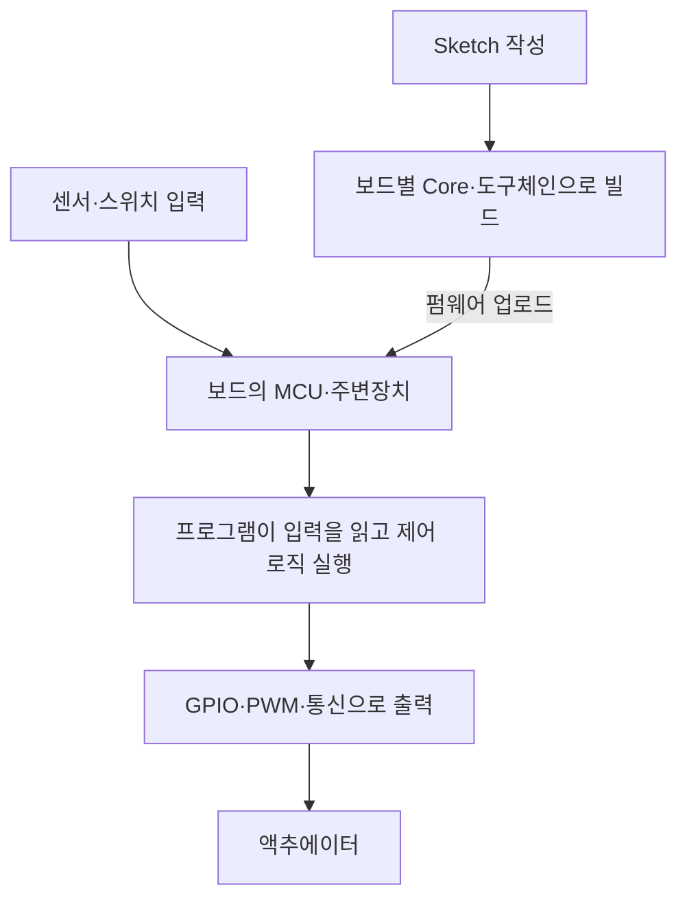
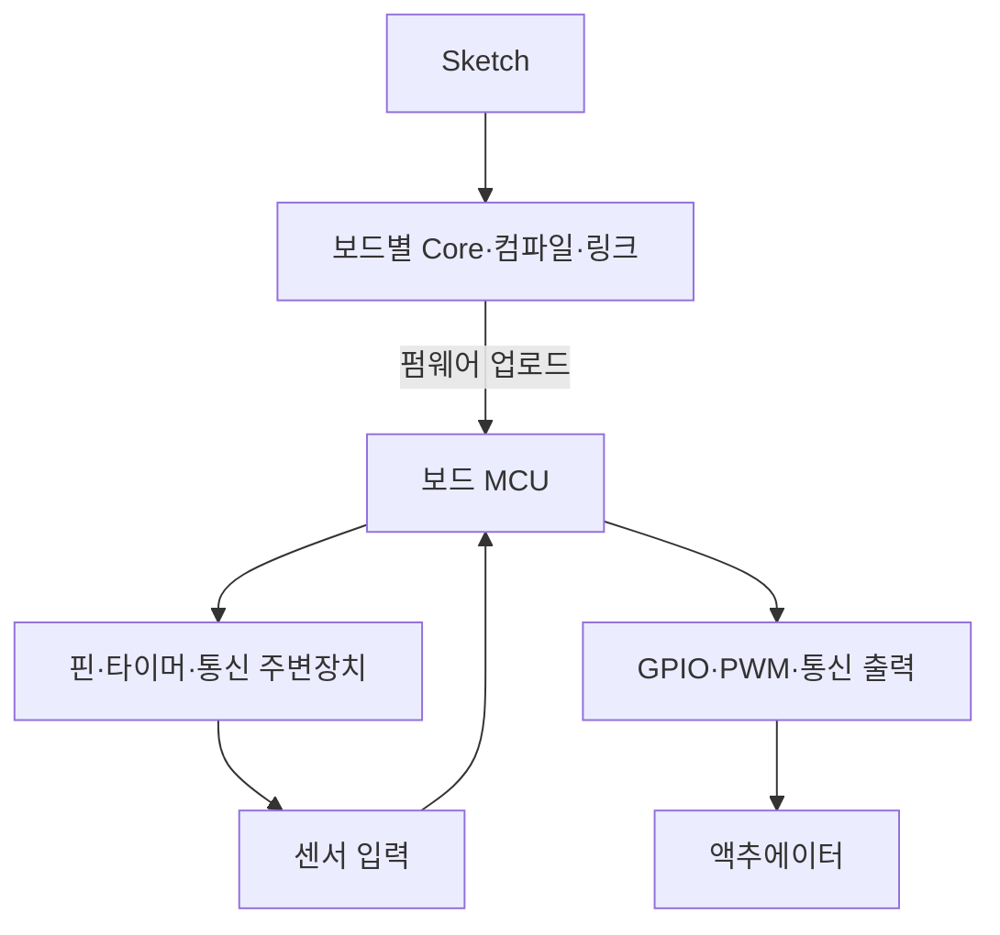

## 지식 로드맵 내 현재 위치

컴퓨터 시스템 → 임베디드 시스템 → 아두이노

## 30초 인출

- 본질: Arduino는 보드·개발 도구·라이브러리로 센서와 액추에이터를 제어하는 오픈 하드웨어·소프트웨어 플랫폼
- 메커니즘: 스케치를 보드별 도구체인이 펌웨어로 빌드해 MCU에 적재하고, 프로그램이 핀 입력을 읽어 출력·제어 동작 수행

핵심 용어

- **Arduino**: 보드와 IDE·코어 라이브러리를 결합해 임베디드 장치를 개발하는 플랫폼
- **MCU(Microcontroller Unit)**: CPU·메모리·주변장치를 통합해 장치 제어 프로그램을 실행하는 마이크로컨트롤러
- **GPIO(General-Purpose Input/Output)**: 디지털 신호를 입력하거나 출력하는 범용 핀 기능
- **PWM(Pulse-Width Modulation)**: 펄스의 듀티비를 조절해 평균 전압·전력을 제어하는 방식
- **Sketch**: Arduino 개발 환경에서 작성하는 보드용 프로그램

---

## 1교시 예상문제 (10점)

> 아두이노의 개념과 구성 및 동작 방식을 설명하시오. (예상)

---

## 1교시 10점 답안

### Ⅰ. 아두이노 개요

| 구분 | 핵심 |
|---|---|
| 정의 | 보드·개발 도구·라이브러리로 임베디드 장치를 개발하는 플랫폼 |
| 목적 | 하드웨어 제어 프로그램의 작성·빌드·업로드를 단순화 |

### Ⅱ. 구성과 실행 흐름

| 구성 | 역할 |
|---|---|
| 보드 | MCU와 핀·전원·통신 인터페이스 제공 |
| IDE·도구체인 | 코드 작성, 빌드, 업로드 지원 |
| Core·라이브러리 | 보드 기능과 주변장치 접근 API 제공 |

제언: 보드 선택 시 핀 전압·주변장치·메모리를 해당 보드의 공식 사양과 대조

---

## 2~4교시 예상문제 (25점)

> 아두이노 플랫폼의 구조와 동작을 설명하고, 보드 선택 및 실제 적용 시 고려사항을 제시하시오. (예상)

---

## 2~4교시 25점 답안

## Ⅰ. 아두이노 개요

| 구분 | 핵심 |
|---|---|
| 정의 | 보드·개발 도구·라이브러리로 임베디드 장치를 개발하는 플랫폼 |
| 목적 | 하드웨어 제어 프로그램의 작성·빌드·업로드를 단순화 |

## Ⅱ. 플랫폼 구성 및 실행 경로

| 구성 | 책임 |
|---|---|
| 보드·MCU | 명령 실행, 메모리·핀·주변장치 제공 |
| 개발 도구 | 소스 편집·빌드·업로드·일부 보드의 디버깅 |
| Core·라이브러리 | 공통 API와 보드별 기능 연결 |

## Ⅲ. 입력·처리·출력 방식

| 기능 | 처리 방식 | 설계 시 확인 |
|---|---|---|
| 디지털 I/O | 논리 입력 판독·출력 설정 | 보드의 논리 전압·허용 전류 |
| 아날로그 입력 | ADC 지원 핀에서 전압을 디지털 값으로 변환 | 해상도·입력 범위·기준 전압 |
| PWM | 지원 핀의 펄스 듀티 제어 | 핀 지원 여부·주파수·부하 구동 회로 |
| 통신 | 보드가 제공하는 UART·I²C·SPI 등 사용 | 핀 충돌·전기 규격·전송 속도 |

## Ⅳ. 보드 계열과 적용 범위

Arduino는 단일 보드 사양이 아니라 여러 MCU와 성능 구성을 갖는 플랫폼. 예를 들어 Uno Rev3는 ATmega328P 기반이고, Uno R4 Minima는 Renesas RA4M1 기반이며, Uno Q는 Linux MPU와 MCU를 결합한 구조

| 선택 기준 | 확인 내용 |
|---|---|
| 제어 작업 | 실시간성, 계산량, 동시 입출력 수 |
| 하드웨어 | 전압, 핀 수, ADC·PWM, 통신 인터페이스 |
| 자원 | 플래시·RAM·주변장치의 보드별 공식 사양 |
| 운영 | 전원·환경 조건, 보안 업데이트, 원격 관리 방식 |

## Ⅴ. 기술사적 제언

| 한계 | 해결 방안 |
|---|---|
| 보드 간 MCU·전압·주변장치 차이를 무시하면 이식·현장 연결 오류 발생 | 제품명만으로 사양을 추정하지 않고 공식 보드 문서로 핀·전기 규격·메모리를 확인한 뒤, 산업 현장에서는 절연·보호 회로와 장애 복구를 설계·시험 |

## 출제 이력과 검증 출처

- 제102회 1교시: `오픈소스 하드웨어(OSHW)의 개념과 아두이노(Arduino)의 구조적 특징을 설명하시오.`
- 제105회 1교시: `아두이노(Arduino)와 라즈베리 파이(Raspberry Pi)의 하드웨어 특성 및 용도를 비교 설명하시오.`
- [Arduino UNO Rev3 — Official Documentation](https://docs.arduino.cc/hardware/uno-rev3/)
- [Arduino UNO R4 Minima — Official Documentation](https://docs.arduino.cc/hardware/uno-r4-minima/)
- [Arduino UNO Q — Official Documentation](https://docs.arduino.cc/hardware/uno-q/)
- [Arduino Language Reference](https://docs.arduino.cc/language-reference/)
- [Q-Net 정보관리기술사 출제문제](https://www.q-net.or.kr/cst006.do?id=cst00601&gSite=Q&gId=)
