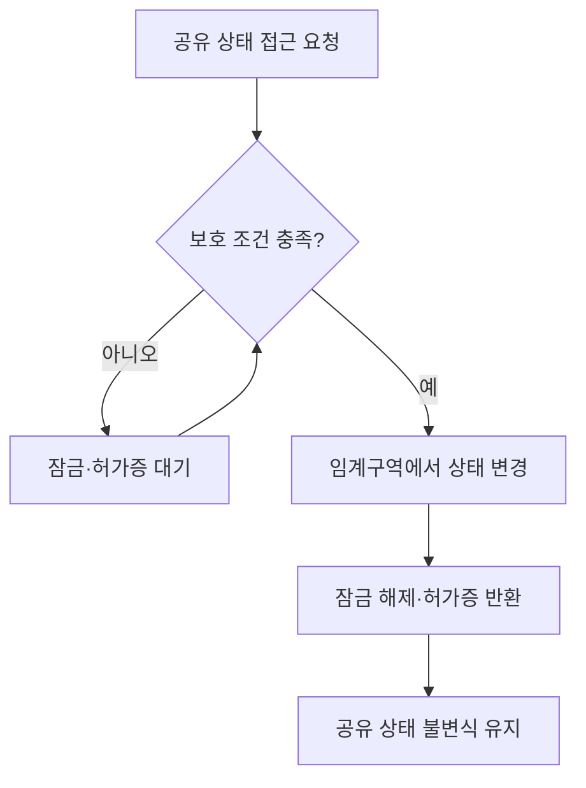
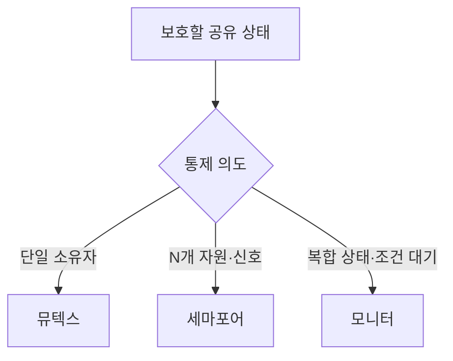

## 지식 로드맵 내 현재 위치

운영체제 → 동시성 제어 → 프로세스 동기화

## 30초 인출

- 본질: 프로세스 동기화는 공유 상태의 동시 변경과 실행 순서를 통제하는 기법
- 메커니즘: 뮤텍스는 소유권 잠금, 세마포어는 허가증 수, 모니터는 상태와 조건 대기를 묶어 임계구역과 순서를 관리

핵심 용어

- **프로세스 동기화(Process Synchronization)**: 공유 상태 접근과 실행 순서를 조정해 데이터 불변식을 지키는 기법
- **뮤텍스(Mutex, Mutual Exclusion)**: 소유권을 가진 실행 흐름만 해제하는 상호배제 잠금
- **세마포어(Semaphore)**: 원자적 wait/signal 연산으로 허가증 수와 대기자를 관리하는 동기화 객체
- **모니터(Monitor)**: 공유 데이터와 연산을 캡슐화하고 한 번에 하나의 실행 흐름만 진입하게 하는 동기화 구조
- **조건 변수(Condition Variable)**: 조건이 성립할 때까지 잠금을 놓고 대기한 뒤 상태를 다시 확인하도록 돕는 객체
- **경쟁 상태(Race Condition)**: 실행 순서에 따라 공유 상태의 결과가 달라지는 오류

---

## 1교시 예상문제 (10점)

> 프로세스 동기화의 개념과 뮤텍스·세마포어·모니터의 차이를 설명하시오. (예상)

---

## 1교시 10점 답안

## Ⅰ. 프로세스 동기화 개요

| 구분 | 핵심 |
|---|---|
| 정의 | **프로세스 동기화(Process Synchronization)**: 공유 상태의 동시 접근과 조건 대기를 조정하는 기법 |
| 목적 | 경쟁 상태를 막고 공유 데이터의 불변식을 보존 |

## Ⅱ. 동기화 기법 선택

| 기법 | 핵심 통제 | 대표 용도 |
|---|---|---|
| **뮤텍스(Mutex)** | 소유권이 있는 단일 잠금 | 임계구역 보호 |
| **세마포어(Semaphore)** | 가용 허가증 수와 신호 | 자원 풀·실행 순서 |
| **모니터(Monitor)** | 공유상태·연산·조건변수 캡슐화 | 복합 상태 보호 |

제언: 보호 대상의 소유권·수량·조건 복잡성에 따라 동기화 기법을 선택

---

## 2~4교시 예상문제 (25점)

> 프로세스 동기화의 목적과 동작 원리를 설명하고, 뮤텍스·세마포어·모니터를 비교하여 동기화 오류 통제방안을 제시하시오. (예상)

---

## 2~4교시 25점 답안

## Ⅰ. 프로세스 동기화 개요

| 구분 | 핵심 |
|---|---|
| 정의 | **프로세스 동기화(Process Synchronization)**: 공유 상태의 동시 접근과 조건 대기를 조정하는 기법 |
| 목적 | 경쟁 상태를 막고 공유 데이터의 불변식을 보존 |

## Ⅱ. 임계구역과 원자 연산

| 조건 | 의미 |
|---|---|
| 상호배제 | 동시에 임계구역을 실행하는 흐름 제한 |
| 진행 | 임계구역이 비었을 때 진입 결정을 무기한 미루지 않음 |
| 한정 대기 | 진입 요청 후 무한 대기 방지 |

## Ⅲ. 뮤텍스·세마포어·모니터 동작

| 동기화 객체 | 원자 동작 | 소유권·조건 |
|---|---|---|
| **뮤텍스(Mutex)** | Lock 획득 → 임계구역 → Unlock | 보통 획득한 실행 흐름이 해제 |
| **세마포어(Semaphore)** | wait에서 허가증 획득, signal에서 반환 | 소유권보다 수량·신호 통제 |
| **모니터(Monitor)** | 진입 상호배제 + 조건변수 대기·통지 | 공유 상태와 조작을 한 구조로 캡슐화 |

## Ⅳ. 대표 오류와 통제

| 한계 | 발생 원인 | 통제 |
|---|---|---|
| 교착 | 잠금을 서로 다른 순서로 획득 | 전역 잠금 순서·시간 제한·잠금 수 축소 |
| 허가증 누수 | 예외 경로에서 signal 누락 | 구조적 정리와 모든 종료 경로 검토 |
| 기아 | 대기자 선택에서 특정 흐름이 계속 밀림 | 공정성 정책과 대기시간 관측 |
| 조건 오류 | 깨어난 뒤 조건이 이미 달라짐 | 잠금 안에서 while 조건 재검사 |
| 우선순위 역전 | 낮은 우선순위 흐름이 자원을 보유 | 우선순위 상속 등 OS 지원 확인 |

## Ⅴ. 기술사적 제언

| 한계 | 해결 방안 |
|---|---|
| 저수준 Lock·P/V를 여러 경로에 흩어 놓으면 획득 순서와 예외 처리를 검증하기 어려움 | 공유 상태의 불변식에 맞는 가장 높은 동기화 추상화를 선택하고, 전역 획득 순서·구조적 반환·조건 재검사를 코드 검토 기준으로 적용 |

## 출제 이력과 검증 출처

- 제139회 정보관리기술사 4교시 2번: `운영체제의 프로세스 동기화 기법 중 뮤텍스(Mutex), 세마포어(Semaphore), 모니터(Monitor)에 대하여 설명하시오.`
- [The Open Group Base Specifications Issue 8 — pthread_mutex_lock](https://pubs.opengroup.org/onlinepubs/9799919799/functions/pthread_mutex_lock.html)
- [The Open Group Base Specifications Issue 8 — pthread_cond_wait](https://pubs.opengroup.org/onlinepubs/9799919799/functions/pthread_cond_wait.html)
- [The Open Group Base Specifications Issue 8 — sem_wait](https://pubs.opengroup.org/onlinepubs/9799919799/functions/sem_wait.html)
- [The Open Group Base Specifications Issue 8 — sem_post](https://pubs.opengroup.org/onlinepubs/9799919799/functions/sem_post.html)
- [Q-Net 정보관리기술사 출제문제](https://www.q-net.or.kr/cst006.do?id=cst00601&gSite=Q&gId=)

## 연결 토픽

- [교착상태](./038_deadlock/) · [우선순위 역전](./059_priority_inversion/) · [경쟁 상태](./091_race_condition/) · [IPC](./034_ipc/)
