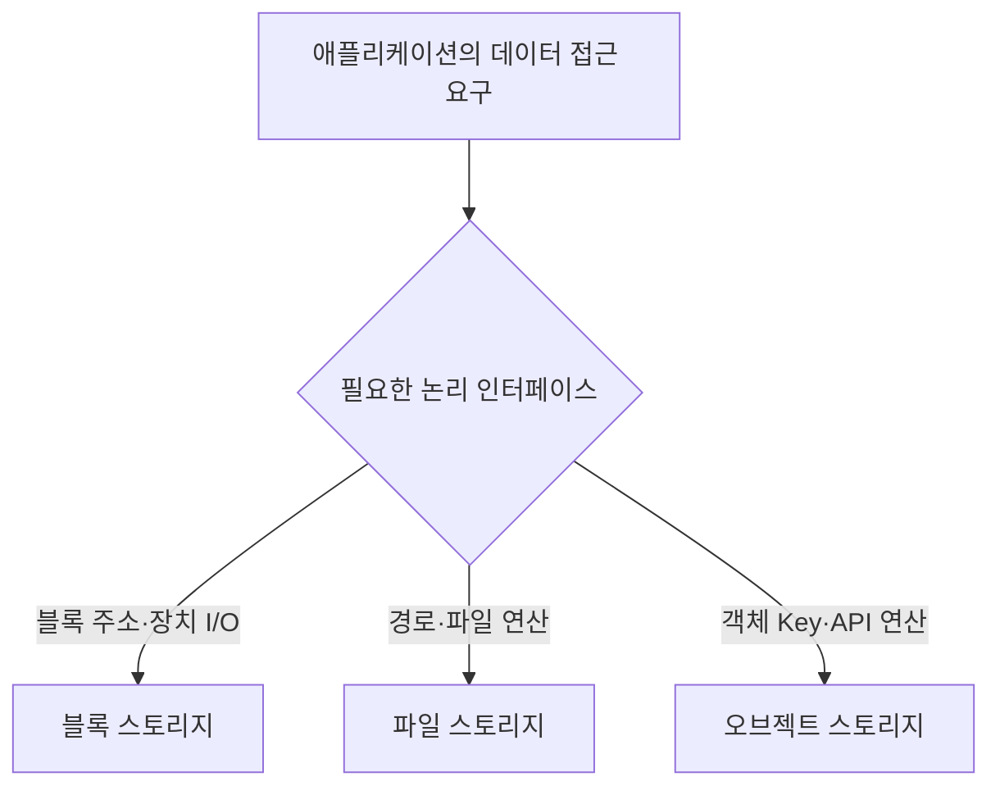

## 지식 로드맵 내 현재 위치

컴퓨터 시스템 → 스토리지 아키텍처 → 블록·파일·오브젝트 스토리지

## 30초 인출

- 본질: 스토리지 유형은 같은 데이터를 블록 주소·파일 경로·객체 키라는 서로 다른 논리 단위로 접근하는 방식
- 메커니즘: 블록은 상위 파일시스템에 의미 해석을 맡기고, 파일은 계층 Namespace를 제공하며, 오브젝트는 Data·Metadata·ID를 API로 관리
- 활용: DB·VM에는 블록, 공동 작업에는 파일, 대량 비정형·보관에는 오브젝트를 검토하고 지연·공유·갱신·확장 조건으로 선택

핵심 용어

- **블록·파일·오브젝트 스토리지**: 데이터를 블록 주소·파일 경로·객체 키라는 서로 다른 접근 단위로 제공하는 저장 인터페이스
- `LUN(Logical Unit Number)`: 호스트에 블록 장치를 식별시킴 → 파일 의미는 상위 계층이 담당
- `Namespace`: 데이터 이름과 위치를 찾는 규칙 → 블록 주소·계층 경로·Bucket/Key를 구분
- `POSIX(Portable Operating System Interface)`: 파일 접근 의미와 API의 공통 기준 → 기존 애플리케이션 호환성을 가름
- `Object API`: Key 기반 PUT·GET·DELETE 인터페이스 → 수평 확장과 객체 단위 갱신 특성을 결정
- `Erasure Coding(삭제 코딩)`: 데이터를 조각과 패리티로 분산 보호 → 용량 효율과 복구 계산 비용을 교환

---

## 1교시 예상문제 (10점)

> 블록·파일·오브젝트 스토리지의 데이터 접근 방식과 특징을 비교하시오. (예상)

---

## 1교시 10점 답안

## Ⅰ. 스토리지 유형 개요

| 구분 | 핵심 |
|---|---|
| 정의 | **블록·파일·오브젝트 스토리지**: 데이터를 블록 주소·파일 경로·객체 키 단위로 접근하는 인터페이스 유형 |
| 목적 | 지연·공유·확장·갱신 요구에 맞는 저장 구조를 선택 |

## Ⅱ. 접근 유형 비교

| 유형 | 접근 단위 | 대표 강점 | 대표 활용 |
|---|---|---|---|
| 블록 | Block Address·**LUN** | 저지연 임의 I/O | DB·VM |
| 파일 | Directory·Path | 계층 관리·공유·**POSIX** | 협업·공유 파일 |
| 오브젝트 | Bucket·Key·**Object API**·Metadata | 대량 수평 확장 | 백업·Data Lake |

제언: 워크로드의 접근·갱신·공유 요구에 따른 세 유형의 조합

---

## 2~4교시 예상문제 (25점)

> 블록·파일·오브젝트 스토리지의 구조와 접근방식을 비교하고, 업무별 활용 및 선택 시 고려사항을 설명하시오. (예상)

---

## 2~4교시 25점 답안

## Ⅰ. 접근 의미로 구분하는 스토리지 유형 개요

| 구분 | 핵심 |
|---|---|
| 정의 | **블록·파일·오브젝트 스토리지**: 데이터를 블록 주소·파일 경로·객체 키 단위로 접근하는 인터페이스 유형 |
| 목적 | 지연·공유·확장·갱신 요구에 맞는 저장 구조를 선택 |

| 유형 | 논리 단위 | **Namespace** | 대표 업무 |
|---|---|---|---|
| **블록** | 고정 크기 블록 | 호스트 파일시스템 | DB·VM 디스크 |
| **파일** | 파일·디렉터리 | 계층 경로·**POSIX** | 공동 작업·홈 디렉터리 |
| **오브젝트** | Data·Metadata·ID | Bucket·Key | 백업·미디어·Data Lake |

## Ⅱ. 주소·메타데이터·갱신 구조

> 세 유형은 애플리케이션에 서로 다른 주소와 연산 의미를 제공하므로, 기존 소프트웨어와의 호환성 및 갱신 방식이 선택에 영향을 줌.

복제·Snapshot·RAID·**Erasure Coding(삭제 코딩)**·Versioning은 제품 구현 선택이므로 특정 스토리지 유형의 필수 속성으로 단정하지 않음

## Ⅲ. 워크로드 선택축 비교

> 저지연 임의 갱신·계층 공유·대량 수평 확장은 서로 다른 강점이므로 단일 유형 표준화보다 데이터 생명주기별 조합이 합리적임.

| 축 | 블록 | 파일 | 오브젝트 |
|---|---|---|---|
| 접근 | Device·Volume·LBA | Path·NFS/SMB | HTTP 기반 **Object API** |
| 갱신 | 블록 단위 | Byte Range·파일 | 객체 교체 중심 |
| 공유 | Cluster SW 필요 | 다중 Client 강점 | API 기반 분산 접근 |
| 지연 | 저지연 임의 I/O 강점 | Metadata·공유 조정 | 대량 순차·병렬 접근 강점 |
| 확장 | Array·Volume 구성 | Namespace·Metadata Server 병목 고려 | 대량 객체 수평 확장 강점 |
| 적합 | DB·VM·Transaction | 협업·POSIX 도구 | 비정형·보관·분석 원천 |

## Ⅳ. 데이터 생명주기 배치와 통제

> 데이터 생명주기의 각 작업은 접근 방식이 다를 수 있어, 원본 보관·공유 처리·저지연 갱신의 요구에 맞춰 저장 계층을 배치.

| 데이터 단계 | 주요 접근 요구 | 우선 검토할 유형 |
|---|---|---|
| 원천·대량 보관 | 객체 단위 접근, 확장, 버전·수명주기 | 오브젝트 |
| 공동 처리 | 경로 기반 도구, 다중 호스트 파일 공유 | 파일 |
| 트랜잭션·가상 디스크 | 블록 주소, 임의 읽기·쓰기, 낮은 지연 | 블록 |
| 장기 보존·복구 | 보존 정책, 이동·복구 가능성 | 오브젝트 또는 파일, 정책·제품 기준으로 선정 |

| 한계 | 원인 | 대책 | 검증 |
|---|---|---|---|
| 소형 파일·객체 비효율 | Path 탐색·요청·Metadata 비용 | 묶음 포맷·Partition·병렬 파일시스템 | 크기별 처리량·Metadata Ops |
| 데이터 중력 | 대용량 계층 이동 | 계산의 데이터 인접 배치 | 이동시간·전송량 |
| 일관성 오해 | 제품·연산별 보장 차이 | API 의미와 요구 수준 대조 | 동시 읽기·쓰기 시험 |
| 복제 확산 | 계층별 사본 증가 | Catalog·Lineage·수명주기 | 원천 추적·복구시험 |

## Ⅴ. 기술사적 제언

| 한계 | 해결 방안 |
|---|---|
| 한 가지 스토리지 인터페이스로 모든 업무를 맞추면 접근 지연·공유·갱신 요구가 충돌 | 업무 단계별 접근 패턴을 시험해 원본·공유 작업·저지연 갱신 계층을 배치하고, 사본 수명·권한·복구 책임을 데이터 카탈로그에 연결 |

## 출제 이력과 검증 출처

- 제132회 정보관리기술사 1교시 12번: `블록 스토리지, 파일 스토리지, 오브젝트 스토리지의 데이터 접근방식`
- 제140회 정보관리기술사 3교시 5번: `클라우드 컴퓨팅 환경에서 대규모 AI 학습 데이터 구축 및 서비스 인프라 구성을 위해 다양한 스토리지 아키텍처가 활용된다. 블록 스토리지(Block Storage), 파일 스토리지(File Storage), 오브젝트 스토리지(Object Storage)를 비교하여 설명하고, 각 스토리지의 최적 활용 방안에 대하여 설명하시오.`
- [SNIA Dictionary](https://www.snia.org/education/online-dictionary)
- [NVM Express — NVMe over Fabrics](https://nvmexpress.org/specifications/)
- [IETF RFC 8881 — NFS Version 4 Minor Version 1 Protocol](https://www.rfc-editor.org/rfc/rfc8881)
- [NIST SP 800-209, Security Guidelines for Storage Infrastructure](https://csrc.nist.gov/pubs/sp/800/209/final)
- [Q-Net 정보관리기술사 출제문제](https://www.q-net.or.kr/cst006.do?id=cst00601&gSite=Q&gId=)

## 연결 토픽

- [스토리지 가상화](./081_storage_virtualization/) · [스토리지 연결 방식](./080_nas/) · [RAID](./056_raid/) · [클라우드 컴퓨팅](./013_cloud_computing/)
