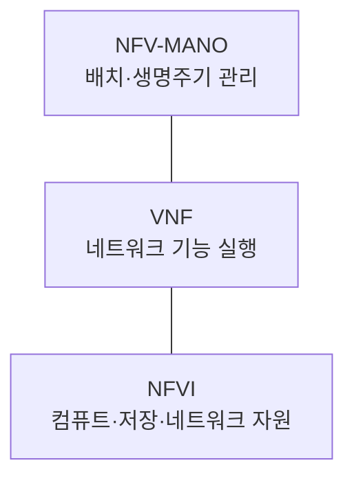
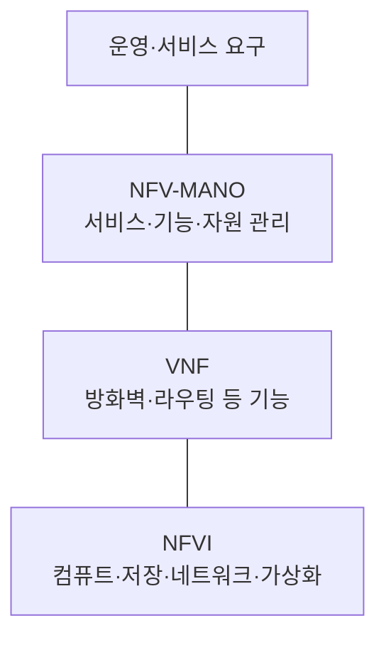
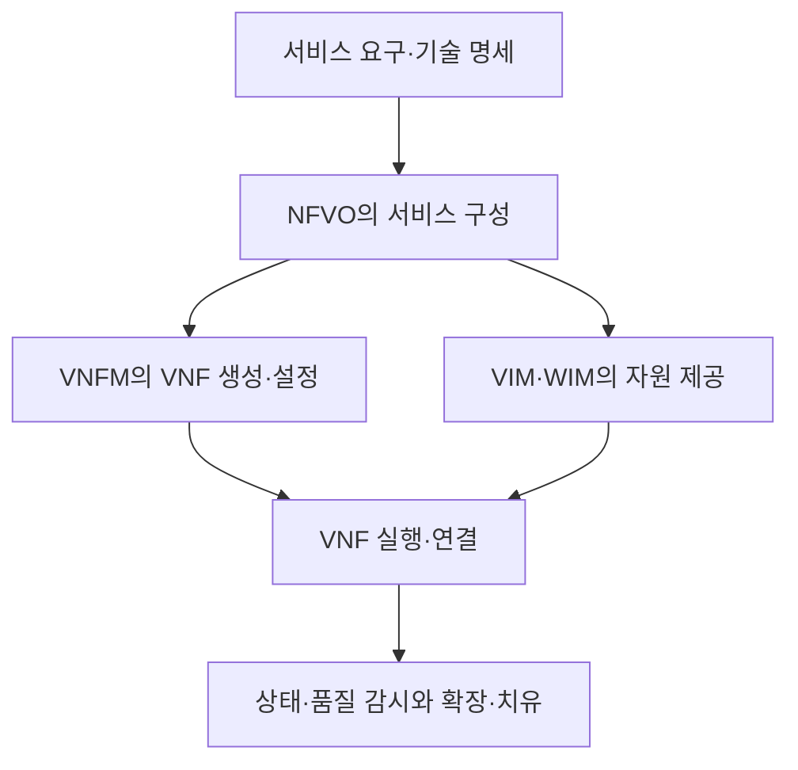

---
sidebar:
  order: 1
  label: "001. NFV"
  badge:
    text: "기초"
    variant: note
title: "NFV(Network Functions Virtualisation)"
author: "Codex"
date: "2026-09-24T00:00:00+09:00"
tags:
  - "notes-network"
weight: 1
extra:
  model: "GPT-6"
  keyword_grade: "기초"
  question_no: "001"
---

## 지식 로드맵 내 현재 위치

지식 위치: 네트워크 → 네트워크 서비스 아키텍처 → **NFV**

## 30초 인출

- 본질: **NFV** : 네트워크 기능을 전용 장비에서 분리해 범용 인프라의 소프트웨어로 실행하는 아키텍처
- 메커니즘: 기능은 **VNF**, 실행 자원은 **NFVI**, 배치·확장·복구 등의 생명주기 관리는 **NFV-MANO**에서 담당

핵심 용어

- **NFV(Network Functions Virtualisation)** : 네트워크 기능을 전용 하드웨어와 분리해 소프트웨어로 실행하는 아키텍처
- **VNF(Virtualised Network Function)** : 가상화된 인프라 위에서 실행되는 소프트웨어 네트워크 기능
- **NFVI(NFV Infrastructure)** : VNF 실행에 필요한 컴퓨트·저장·네트워크 자원과 가상화 계층
- **NFV-MANO(NFV Management and Orchestration)** : NFV 서비스·기능·인프라 자원의 생명주기를 관리·조정하는 체계
- **NFVO(NFV Orchestrator)** : 네트워크 서비스 구성과 필요한 자원의 조정을 담당하는 기능
- **VNFM(VNF Manager)** : VNF의 생성·변경·종료 등 생명주기를 관리하는 기능
- **VIM(Virtualised Infrastructure Manager)** : NFVI의 가상화 자원을 관리하는 기능
- **WIM(Wide Area Network Infrastructure Manager)** : 사이트 간 광역 네트워크 자원을 관리하는 기능
- **SDN(Software-Defined Networking)** : 제어 평면과 전달 평면을 분리하고 네트워크를 소프트웨어로 제어하는 방식

---

## 1교시 예상문제 (10점)

> NFV의 개념과 핵심 구성요소를 설명하시오. (예상·10점)

---

## 1교시 10점 답안

### Ⅰ. NFV의 개요

| 구분 | 핵심 |
|---|---|
| 정의 | **NFV** : 네트워크 기능을 전용 장비에서 분리해 범용 인프라에서 소프트웨어로 실행하는 아키텍처 |
| 목적 | 기능의 배치·확장·변경을 인프라와 분리해 서비스 운영의 유연성 확보 |

### Ⅱ. 기능·자원·관리의 관계

- 제언: VNF의 기능 실행과 NFVI 자원 관리, MANO의 운영 책임을 구분해 설명.

---

## 2~4교시 예상문제 (25점)

> NFV의 아키텍처와 NFV-MANO 구성요소의 역할을 설명하고, 적용 한계와 대응 방안을 제시하시오. (예상·25점)

---

## 2~4교시 25점 답안

## Ⅰ. NFV의 개요

| 구분 | 핵심 |
|---|---|
| 정의 | **NFV** : 네트워크 기능을 전용 장비에서 분리해 범용 인프라에서 소프트웨어로 실행하는 아키텍처 |
| 목적 | 기능의 배치·확장·변경을 인프라와 분리해 서비스 운영의 유연성 확보 |

## Ⅱ. NFV 아키텍처

화살표는 작업 순서가 아닌 기능 간 관리·실행 관계이므로 정적 연결선으로 표현. 실제 네트워크 서비스는 여러 기능을 조합할 수 있음.

## Ⅲ. MANO의 역할 분담

| 구성 | 관리 대상 | 핵심 역할 |
|---|---|---|
| NFVO | 네트워크 서비스 | 기능 조합과 서비스에 필요한 자원 조정 |
| VNFM | VNF | 생성·확장·치유·종료 등 생명주기 관리 |
| VIM | NFVI | 컴퓨트·저장·네트워크 가상 자원 관리 |
| WIM | 사이트 간 WAN 자원 | 광역 연결 자원 관리 |

ETSI Release 4의 MANO 아키텍처에는 WIM도 포함. 세부 구현에서는 기능을 결합하거나 분리할 수 있음.

## Ⅳ. 서비스 생성 과정

실행 흐름은 구현마다 다르지만, 서비스 수준 조정과 기능·자원 수준 관리의 책임 구분이 핵심.

## Ⅴ. NFV와 SDN의 관계

| 관점 | NFV | SDN |
|---|---|---|
| 분리 대상 | 네트워크 기능과 전용 장비 | 제어 평면과 전달 평면 |
| 핵심 관리 | VNF 배치·생명주기 | 경로·흐름·정책 제어 |
| 결합 예 | 가상 방화벽 기능 배치 | 해당 기능을 지나는 트래픽 경로 설정 |

서로 대체하는 기술이 아니라 필요에 따라 함께 적용하는 아키텍처 요소.

## Ⅵ. 한계와 대응

| 한계 | 대응 |
|---|---|
| VNF는 실행되지만 처리량·지연 목표 미달 | 기능별 자원·네트워크 요구와 실측 품질 확인 |
| MANO 기능 사이의 책임·상태 불일치 | 서비스·VNF·인프라 관리 경계와 상태 연계 정의 |
| 여러 사이트의 연결 자원 누락 | WAN 자원과 지연·용량을 배치 판단에 포함 |
| 특정 구현에 기능·명세가 종속 | 기술 명세·인터페이스의 호환성과 이전 시험 |

## Ⅶ. 기술사적 제언

| 우선 제언 | 실행·확인 |
|---|---|
| 기능 분리의 효과를 서비스로 검증 | VNF 처리량·지연·장애 복구를 서비스 지표와 연결 |
| 관리 범위의 공백 제거 | NFVO·VNFM·VIM·WIM의 상태·책임·연동 경계 명시 |

---

## 검증 출처

- [ETSI GS NFV 006: NFV-MANO Architectural Framework](https://docbox.etsi.org/ISG/NFV/open/Publications_pdf/Specs-Reports/NFV%20006v4.5.1%20-%20GS%20-%20MANO%20Arch%20Fwk.pdf)
- [ETSI: Network Functions Virtualisation](https://www.etsi.org/technologies/689-network-functions-virtualisation?tmpl=component)

## 연결 토픽

- 연관 토픽: [SDN](./035_sdn.md), [OpenFlow](./031_openflow.md)