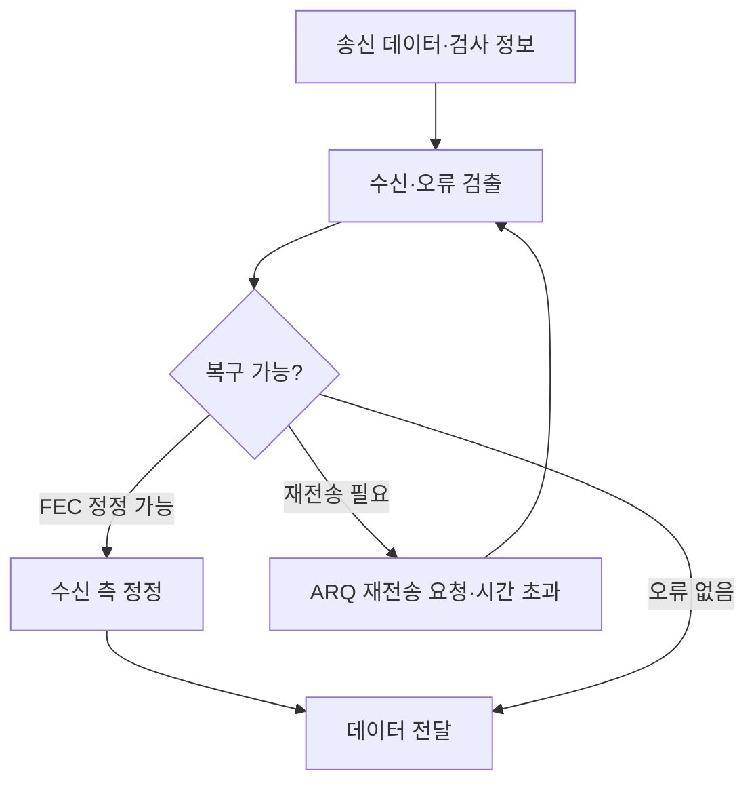

---
sidebar:
  order: 3
  label: "003. 오류제어"
  badge:
    text: "기초"
    variant: note
title: "오류제어(Error Control)"
author: "Codex"
date: "2026-09-24T00:00:00+09:00"
tags:
  - "notes-network"
weight: 3
extra:
  model: "GPT-6"
  keyword_grade: "기초"
  question_no: "003"
---

## 지식 로드맵 내 현재 위치

지식 위치: 네트워크 → 데이터 통신 → **전송 오류 검출·복구**

## 30초 인출

- 본질: **오류제어** : 전송 중 손상되거나 손실된 데이터를 검출하고 정정 또는 재전송으로 복구하는 체계
- 메커니즘: 검사 정보로 오류 판정 → **FEC**는 수신 측 정정, **ARQ**는 확인 응답·시간 초과를 이용한 재전송

핵심 용어

- **오류제어(Error Control)** : 전송 중 발생한 데이터 오류·손실을 검출하고 복구하는 체계
- **CRC(Cyclic Redundancy Check)** : 다항식 연산으로 만든 검사값을 비교해 오류를 검출하는 기법
- **FEC(Forward Error Correction)** : 추가 부호를 전송해 수신 측에서 일정 범위의 오류를 정정하는 기법
- **ARQ(Automatic Repeat reQuest)** : 수신 확인과 시간 초과 등을 근거로 전송 데이터를 다시 보내는 기법
- **ACK(Acknowledgement)** : 데이터 수신 상태를 송신 측에 알리는 확인 응답
- **RTT(Round-Trip Time)** : 송신 측에서 보낸 신호가 수신 측을 거쳐 응답으로 돌아오는 왕복 시간
- **Go-Back-N ARQ** : 오류나 손실이 난 프레임부터 이후 송신분까지 다시 보내는 방식
- **Selective Repeat ARQ** : 손실·오류가 있는 프레임을 선택해 다시 보내는 방식

---

## 1교시 예상문제 (10점)

> 오류제어의 검출·정정·재전송 방식을 설명하시오. (예상·10점)

---

## 1교시 10점 답안

### Ⅰ. 오류제어의 개요

| 구분 | 핵심 |
|---|---|
| 정의 | **오류제어** : 손상·손실 데이터를 검출하고 정정 또는 재전송으로 복구하는 체계 |
| 목적 | 전송 오류의 영향과 잔류 오류를 줄여 신뢰성 확보 |

### Ⅱ. 복구 수단

| 구분 | 대표 기법 | 역할 |
|---|---|---|
| 검출 | CRC | 오류 여부 판정 |
| 정정 | FEC | 수신 측에서 복구 |
| 재전송 | ARQ | 확인 응답·시간 초과에 따라 다시 전송 |

- 제언: 채널 오류와 왕복 지연에 따라 중복 부호량과 재전송 비용을 함께 판단.

---

## 2~4교시 예상문제 (25점)

> 오류제어의 검출·정정·재전송 원리를 설명하고 ARQ 방식별 특성과 적용 한계·대응 방안을 제시하시오. (예상·25점)

---

## 2~4교시 25점 답안

## Ⅰ. 오류제어의 개요

| 구분 | 핵심 |
|---|---|
| 정의 | **오류제어** : 손상·손실 데이터를 검출하고 정정 또는 재전송으로 복구하는 체계 |
| 목적 | 전송 오류의 영향과 잔류 오류를 줄여 신뢰성 확보 |

## Ⅱ. 검출에서 복구까지

CRC 같은 검출 부호는 손상을 알아내는 수단이며, 자체적으로 손상 데이터를 고치지는 않음. FEC와 ARQ는 채널에 따라 결합 가능.

## Ⅲ. 검출·정정·재전송 비교

| 기법 | 추가 정보 | 장점 | 한계 |
|---|---|---|---|
| CRC | 검사값 | 다양한 비트 오류 검출 | 검출 범위의 한계·자체 정정 불가 |
| FEC | 정정 부호 | 피드백 없이 일정 오류 정정 | 부호 중복·연산 비용 |
| ARQ | 순서 번호·ACK·타이머 | 필요할 때 재전송 | 왕복 지연·재전송 트래픽 |

## Ⅳ. ARQ 유형

| 방식 | 전송 창 | 손실 시 재전송 | 주요 부담 |
|---|---|---|---|
| Stop-and-Wait | 1개 | 해당 프레임 | 긴 RTT에서 대기 |
| Go-Back-N | 여러 개 | 손실분부터 후속분까지 | 오류 시 중복 재전송 |
| Selective Repeat | 여러 개 | 손실분 선택 | 수신 버퍼·순서 재조립 |

방식별 실제 효율은 오류율·RTT·창 크기·구현의 확인 응답 규칙에 따라 달라짐.

## Ⅴ. 채널 특성에 따른 선택

| 조건 | 우선 확인 | 대응 예 |
|---|---|---|
| 왕복 지연이 큼 | 재전송 대기 비용 | FEC 결합·전송 창 조정 |
| 오류가 드묾 | 부호 중복 비용 | 검출 후 ARQ |
| 연속 오류가 잦음 | 손실 패턴·정정 능력 | FEC 강도와 재전송 범위 조정 |

한 방식이 항상 유리한 것은 아니므로 실제 오류 패턴과 응용의 지연 허용치를 함께 판단.

## Ⅵ. 한계와 대응

| 한계 | 대응 |
|---|---|
| 검출 부호만 쓰고 복구 경로 없음 | 정정 또는 재전송 절차 마련 |
| 타이머가 너무 짧아 불필요한 재전송 증가 | RTT 변동을 반영해 시간 초과 값 설정 |
| 재전송으로 지연 목표 초과 | FEC·ARQ 조합과 오류 주입 시험 |
| 수신 순서 뒤바뀜·중복 전달 | 순서 번호·버퍼·중복 제거 검증 |

## Ⅶ. 기술사적 제언

| 우선 제언 | 실행·확인 |
|---|---|
| 검출·정정·재전송의 책임 분리 | 계층별 CRC·FEC·ARQ 적용 위치와 잔류 오류 확인 |
| 채널 특성 기반의 복구 선택 | 오류율·RTT·허용 지연을 측정하고 재전송·부호 비용 비교 |

---

## 검증 출처

- [RFC 3366: Advice to link designers on link ARQ](https://www.rfc-editor.org/rfc/rfc3366)
- [RFC 6363: Forward Error Correction Framework](https://www.rfc-editor.org/rfc/rfc6363)
- [RFC 6298: Computing TCP's Retransmission Timer](https://www.rfc-editor.org/rfc/rfc6298)

## 연결 토픽

- 연관 토픽: [ARQ](./015_arq.md), [CRC](./068_crc.md), [슬라이딩 윈도우](./018_sliding_window.md)