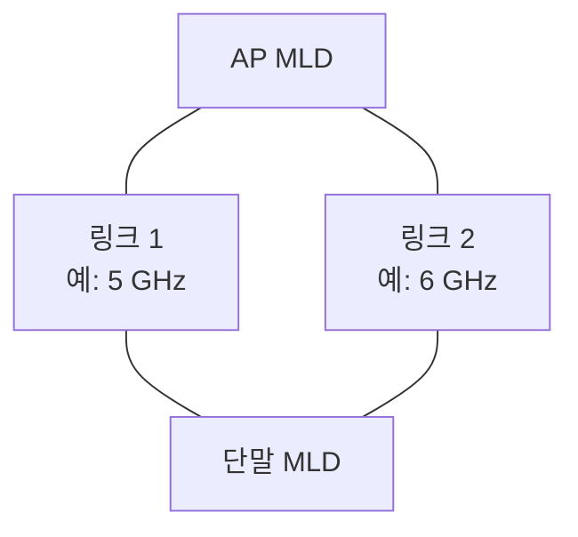
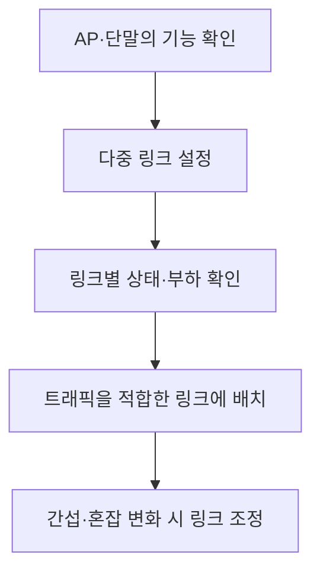

---
sidebar:
  order: 5
  label: "005. Wi-Fi 7"
  badge:
    text: "기초"
    variant: note
title: "Wi-Fi 7(IEEE 802.11be EHT)"
author: "Codex"
date: "2026-09-24T00:00:00+09:00"
tags:
  - "notes-network"
weight: 5
extra:
  model: "GPT-6"
  keyword_grade: "기초"
  question_no: "005"
---

## 지식 로드맵 내 현재 위치

지식 위치: 네트워크 → 무선 LAN → **Wi-Fi 7**

## 30초 인출

- 본질: **Wi-Fi 7** : IEEE 802.11be EHT를 기반으로 넓은 채널·고차 변조·다중 링크를 결합한 무선 LAN 세대
- 메커니즘: PHY에서 채널·변조·자원 배정을 확장하고 MAC의 **MLO** 기능으로 여러 링크를 하나의 논리 연결에서 운용

핵심 용어

- **Wi-Fi 7** : IEEE 802.11be의 EHT 기능을 적용한 무선 LAN 세대
- **EHT(Extremely High Throughput)** : IEEE 802.11be의 고처리량 PHY·MAC 개선 기술
- **PHY(Physical Layer)** : 무선 신호의 변조·전송을 담당하는 물리 계층
- **MAC(Medium Access Control)** : 무선 매체 사용과 프레임 전송을 제어하는 계층
- **MLO(Multi-Link Operation)** : 여러 무선 링크를 하나의 논리적 연결에서 운용하는 기술
- **MLD(Multi-Link Device)** : 여러 링크를 지원하는 하나의 논리적 Wi-Fi 장치
- **4096-QAM(4096-Quadrature Amplitude Modulation)** : 한 심볼에서 더 많은 비트를 표현하는 고차 변조
- **MRU(Multiple Resource Unit)** : 한 단말에 복수의 무선 자원 단위를 배정하는 방식
- **프리앰블 펑처링(Preamble Puncturing)** : 넓은 채널 중 사용하기 어려운 일부 구간을 제외해 전송하는 방식

---

## 1교시 예상문제 (10점)

> Wi-Fi 7의 개념과 핵심 기술을 설명하시오. (예상·10점)

---

## 1교시 10점 답안

### Ⅰ. Wi-Fi 7의 개요

| 구분 | 핵심 |
|---|---|
| 정의 | **Wi-Fi 7** : IEEE 802.11be EHT의 PHY·MAC 개선을 적용한 무선 LAN 기술 |
| 목적 | 무선 처리량과 혼잡·간섭 상황의 전송 유연성 향상 |

### Ⅱ. 핵심 기술

| 영역 | 기술 | 역할 |
|---|---|---|
| PHY | 320 MHz·4096-QAM | 넓은 채널과 높은 변조 효율 |
| 자원 배정 | MRU·펑처링 | 가용 채널의 유연한 활용 |
| MAC | MLO | 복수 링크의 논리적 결합·선택 |

- 제언: 최고 속도보다 AP·단말의 기능 지원과 실제 혼잡 환경의 지연·처리량 확인.

---

## 2~4교시 예상문제 (25점)

> Wi-Fi 7의 PHY·MAC 핵심 기술과 MLO 구조를 설명하고 Wi-Fi 6/6E와 비교하여 도입 한계와 대응 방안을 제시하시오. (예상·25점)

---

## 2~4교시 25점 답안

## Ⅰ. Wi-Fi 7의 개요

| 구분 | 핵심 |
|---|---|
| 정의 | **Wi-Fi 7** : IEEE 802.11be EHT의 PHY·MAC 개선을 적용한 무선 LAN 기술 |
| 목적 | 무선 처리량과 혼잡·간섭 상황의 전송 유연성 향상 |

## Ⅱ. PHY·MAC의 개선 축

| 계층 | 기술 | 기여 | 조건 |
|---|---|---|---|
| PHY | 320 MHz 채널 | 전송 가능한 대역폭 확대 | 6 GHz 대역·국가별 채널 허용 |
| PHY | 4096-QAM | 좋은 채널에서 심볼당 정보량 증가 | 높은 신호 품질 |
| 자원 배정 | MRU·펑처링 | 남은 무선 자원의 활용 | AP·단말의 지원 기능 |
| MAC | MLO | 여러 링크의 연결·선택 | AP·단말의 MLO 기능 |

기술의 효과는 지원 대역·주파수 규제·신호 품질·상대 장치 기능에 따라 달라짐.

## Ⅲ. MLO의 정적 구조

복수 링크가 한 논리 연결에 속함. 모든 단말이 두 링크를 항상 동시에 송수신하는 것은 아니며 지원 방식과 무선 자원에 따라 운용이 달라짐.

## Ⅳ. MLO 동작

여러 링크를 사용할 수 있어도 지연·처리량 향상은 스케줄링과 실제 채널 상태에 따라 달라짐.

## Ⅴ. Wi-Fi 6/6E와 비교

| 관점 | Wi-Fi 6/6E | Wi-Fi 7 |
|---|---|---|
| 기술 기반 | IEEE 802.11ax | IEEE 802.11be EHT |
| 최대 채널 폭 | 160 MHz | 320 MHz 지원 |
| 링크 운용 | 단일 링크 중심 | MLO 도입 |
| 변조 | 최대 1024-QAM | 4096-QAM 지원 |
| 6 GHz | Wi-Fi 6E에서 활용 | 320 MHz 활용 조건 중 하나 |

표의 최대값은 표준 기능이며 모든 제품·지역·연결에서 제공되는 값이 아님.

## Ⅵ. 한계와 대응

| 한계 | 대응 |
|---|---|
| 6 GHz 사용이나 320 MHz 채널 확보가 어려움 | 현지 주파수 허용과 채널 계획 확인 |
| AP·단말 기능 차이로 MLO 미동작 | 장치의 지원 기능·펌웨어·인증 범위 확인 |
| 넓은 채널이 간섭으로 일부 사용 불가 | 채널 상태 측정과 펑처링·채널 폭 조정 |
| 고차 변조를 적용할 신호 품질 부족 | 배치·간섭·커버리지 최적화 후 실측 |

## Ⅶ. 기술사적 제언

| 우선 제언 | 실행·확인 |
|---|---|
| 기능 목록과 실제 품질을 구별 | 대표 단말·AP 조합에서 MLO·채널·지연을 시험 |
| 무선 자원을 서비스 요구에 맞춰 설계 | 밀집도·간섭·6 GHz 가용성을 반영해 채널 계획 수립 |

---

## 검증 출처

- [IEEE 802.11be EHT Task Group](https://www.ieee802.org/11/Reports/tgbe_update.htm)
- [IEEE 802.11 Standards Timeline](https://www.ieee802.org/11/Reports/802.11_Timelines.htm)
- [Wi-Fi Alliance: Wi-Fi CERTIFIED 7 announcement](https://www.globenewswire.com/news-release/2024/01/08/2805409/0/en/Wi-Fi-Alliance-introduces-Wi-Fi-CERTIFIED-7.html)

## 연결 토픽

- 연관 토픽: [Wi-Fi 8](./047_wifi_8.md), [IEEE 802.11bn](./043_ieee_802_11bn.md)