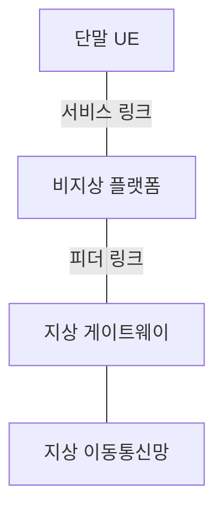
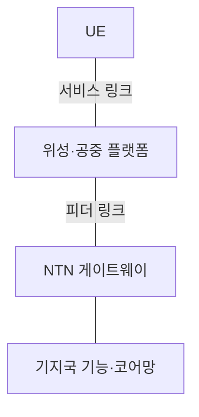
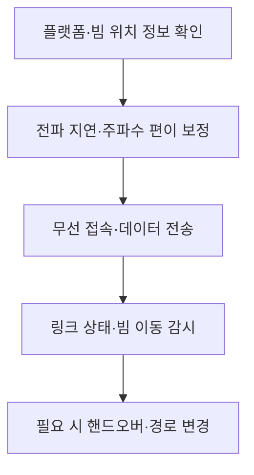

---
sidebar:
  order: 6
  label: "006. NTN"
  badge:
    text: "기초"
    variant: note
title: "NTN(Non-Terrestrial Network)"
author: "Codex"
date: "2026-09-24T00:00:00+09:00"
tags:
  - "notes-network"
weight: 6
extra:
  model: "GPT-6"
  keyword_grade: "기초"
  question_no: "006"
---

## 지식 로드맵 내 현재 위치

지식 위치: 네트워크 → 이동통신 접속 → **비지상 네트워크**

## 30초 인출

- 본질: **NTN** : 위성이나 공중 플랫폼을 통신 경로에 활용해 지상망이 닿기 어려운 지역의 접속을 보완하는 네트워크
- 메커니즘: 단말·비지상 플랫폼·게이트웨이·지상망을 연결하고, 긴 전파 지연·도플러·이동 빔에 맞춰 무선 절차 조정

핵심 용어

- **NTN(Non-Terrestrial Network)** : 위성·공중 플랫폼 등을 통신 경로에 사용하는 비지상 네트워크
- **UE(User Equipment)** : 이동통신망에 접속하는 이용자 단말
- **서비스 링크(Service Link)** : 단말과 비지상 플랫폼 사이의 무선 연결
- **피더 링크(Feeder Link)** : 비지상 플랫폼과 지상 게이트웨이 사이의 연결
- **투명 페이로드(Transparent Payload)** : 위성이 무선 신호를 중계하고 기지국 기능은 지상에 두는 구성
- **재생 페이로드(Regenerative Payload)** : 위성이 일부 또는 전체 기지국 신호 처리 기능을 수행하는 구성
- **TA(Timing Advance)** : 상향 송신 시점을 조정해 기지국 수신 타이밍을 맞추는 기법
- **도플러 편이(Doppler Shift)** : 송신자·수신자 상대 운동으로 수신 주파수가 달라지는 현상

---

## 1교시 예상문제 (10점)

> NTN의 개념과 기본 통신 구조를 설명하시오. (예상·10점)

---

## 1교시 10점 답안

### Ⅰ. NTN의 개요

| 구분 | 핵심 |
|---|---|
| 정의 | **NTN** : 위성·공중 플랫폼을 이용해 지상망 밖까지 무선 접속을 확장하는 네트워크 |
| 목적 | 원격지·해상·재난 등 지상망의 접속 공백 보완 |

### Ⅱ. 기본 연결 구조

- 제언: 커버리지뿐 아니라 전파 지연·도플러·이동 중 접속 연속성을 확인.

---

## 2~4교시 예상문제 (25점)

> NTN의 통신 구조와 투명·재생 페이로드를 설명하고, 전파 지연·도플러·이동성의 한계와 대응 방안을 제시하시오. (예상·25점)

---

## 2~4교시 25점 답안

## Ⅰ. NTN의 개요

| 구분 | 핵심 |
|---|---|
| 정의 | **NTN** : 위성·공중 플랫폼을 이용해 지상망 밖까지 무선 접속을 확장하는 네트워크 |
| 목적 | 원격지·해상·재난 등 지상망의 접속 공백 보완 |

## Ⅱ. 비지상 접속의 구성

이 그림은 투명 페이로드의 기본 구성 예. 재생 페이로드는 기지국 기능의 일부 또는 전체를 플랫폼에 둠. 위성 간 링크는 선택 가능한 추가 구성이지 필수 경로가 아님.

## Ⅲ. 페이로드 처리 위치

| 구분 | 투명 페이로드 | 재생 페이로드 |
|---|---|---|
| 플랫폼의 역할 | 무선 신호 중계 | 일부·전체 기지국 신호 처리 |
| 기지국 기능 | 주로 지상 | 일부·전체가 플랫폼 |
| 설계 초점 | 피더 링크·게이트웨이 의존 | 탑재 전력·처리 능력·운용 복잡도 |
| 공통 요소 | 서비스 링크·이동성 관리 | 서비스 링크·이동성 관리 |

특정 페이로드가 항상 더 낮은 지연을 보장하지 않음. 게이트웨이·경로·탑재 처리 구조를 함께 비교.

## Ⅳ. 지상망과 다른 무선 조건

| 조건 | NTN에서의 영향 | 대응 방향 |
|---|---|---|
| 긴 전파 지연 | 왕복 절차·타이머 부담 | 타이밍 보정·절차 조정 |
| 위성 상대 운동 | 도플러 편이 | 궤도 정보·주파수 보정 |
| 빔·위성 이동 | 접속 대상 변경 | 이동성·핸드오버 관리 |
| 차폐·기상 영향 | 링크 품질 변화 | 링크 적응·대체 경로 검토 |

영향의 크기는 LEO·GEO·공중 플랫폼과 단말 위치·서비스 주파수에 따라 달라짐.

## Ⅴ. 접속 유지 절차

이 흐름은 설계 관점의 요약이며 모든 3GPP 절차가 동일한 순서로 수행된다는 뜻은 아님.

## Ⅵ. 한계와 대응

| 한계 | 대응 |
|---|---|
| 지상망 타이머를 그대로 적용해 접속 실패 | NTN 지원 절차·타이밍 파라미터 적용 |
| 도플러 보정 부족으로 수신 주파수 이탈 | 플랫폼 궤도·상대 운동 기반 보정 |
| 피더 링크 장애로 광역 접속 중단 | 게이트웨이·경로 다중화 검토 |
| 단말이 이동 빔을 따라가지 못함 | 핸드오버 시험과 단절·재접속 지표 확인 |

## Ⅶ. 기술사적 제언

| 우선 제언 | 실행·확인 |
|---|---|
| 커버리지와 서비스 품질을 함께 검증 | 서비스별 지연·접속 성공률·전환 단절 측정 |
| 탑재 기능의 위치를 설계 근거로 제시 | 투명·재생 구조의 지상 의존성·전력·운용 부담 비교 |

---

## 검증 출처

- [3GPP TR 38.811: Study on NR to Support NTN](https://www.3gpp.org/dynareport/38811.htm)
- [3GPP TS 38.300: NR and NG-RAN Overall Description](https://www.3gpp.org/dynareport/38300.htm)
- [ETSI TS 138 300 v19.2.0](https://www.etsi.org/deliver/etsi_ts/138300_138399/138300/19.02.00_60/ts_138300v190200p.pdf)

## 연결 토픽

- 연관 토픽: [위성·공중·지상 통합망](./004_satin.md), [6G 위성 융합](./041_6g_satellite_convergence.md)