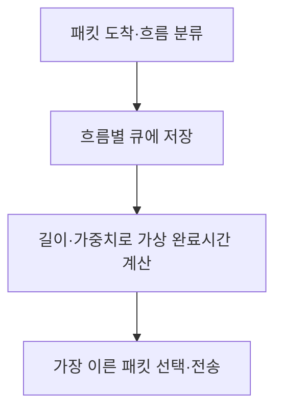
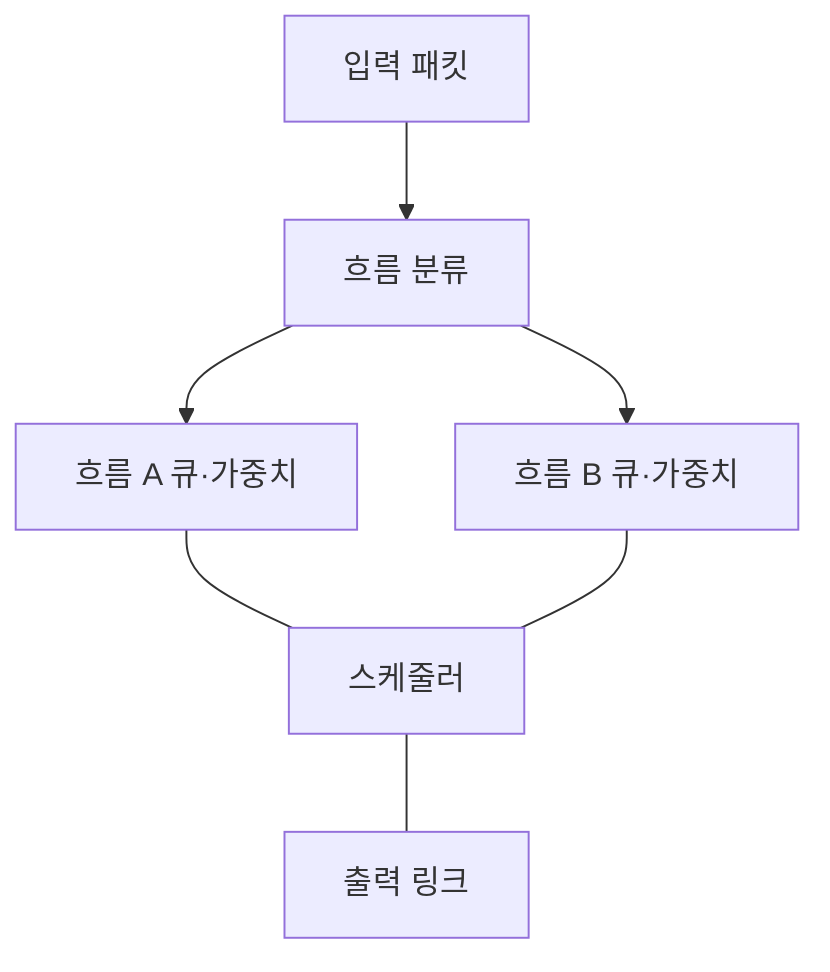
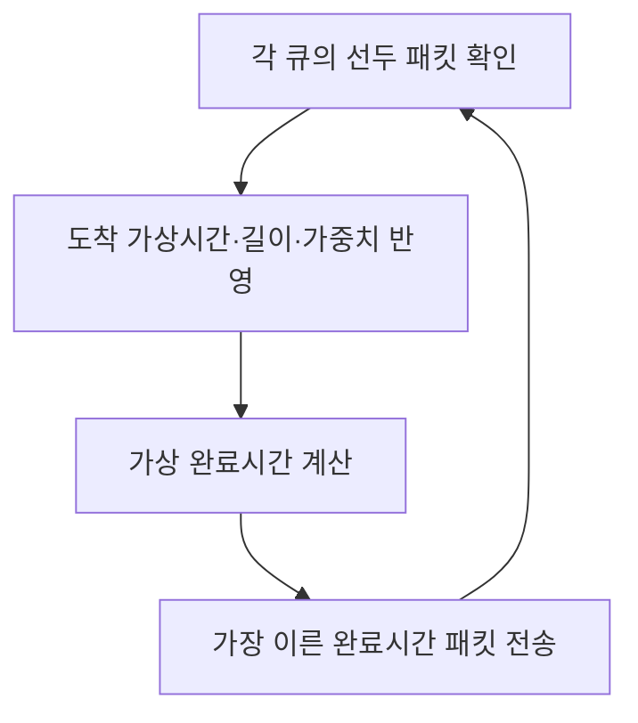

---
sidebar:
  order: 8
  label: "008. WFQ"
  badge:
    text: "기초"
    variant: note
title: "WFQ(Weighted Fair Queuing)"
author: "Codex"
date: "2026-09-24T00:00:00+09:00"
tags:
  - "notes-network"
weight: 8
extra:
  model: "GPT-6"
  keyword_grade: "기초"
  question_no: "008"
---

## 지식 로드맵 내 현재 위치

지식 위치: 네트워크 → QoS → **출력 큐 스케줄링**

## 30초 인출

- 본질: **WFQ** : 흐름별 큐에 가중치를 주고 출력 링크의 전송 기회를 배분하는 패킷 스케줄링
- 메커니즘: 패킷을 흐름별로 분류 → 길이·가중치에 따른 가상 완료시간 계산 → 가장 이른 패킷 전송

핵심 용어

- **WFQ(Weighted Fair Queuing)** : 흐름·클래스별 가중치를 반영해 패킷 전송 순서를 정하는 큐 스케줄링
- **FIFO(First In First Out)** : 패킷이 큐에 들어온 순서대로 내보내는 방식
- **흐름(Flow)** : 분류 규칙에 따라 같은 연결·트래픽으로 묶인 패킷 집합
- **GPS(Generalized Processor Sharing)** : 여러 흐름을 가중치에 비례해 연속적으로 서비스한다고 가정하는 이상적 모델
- **가상 완료시간(Virtual Finish Time)** : 패킷이 가상 서비스 모델에서 전송을 마칠 시각을 나타내는 순서 결정 값
- **QoS(Quality of Service)** : 서비스별 지연·손실·처리량 등 네트워크 품질을 관리하는 개념

---

## 1교시 예상문제 (10점)

> WFQ의 개념과 패킷 전송 순서 결정 원리를 설명하시오. (예상·10점)

---

## 1교시 10점 답안

### Ⅰ. WFQ의 개요

| 구분 | 핵심 |
|---|---|
| 정의 | **WFQ** : 흐름별 큐와 가중치에 따라 출력 링크의 패킷 전송 순서를 정하는 방식 |
| 목적 | 혼합 트래픽의 전송 기회를 가중치에 맞게 배분하고 흐름 간 간섭 완화 |

### Ⅱ. 전송 순서 결정

- 제언: 가중치 설정과 흐름 분류가 실제 지연·대역폭 배분에 맞는지 측정.

---

## 2~4교시 예상문제 (25점)

> WFQ의 구조와 가상 완료시간 기반 전송 원리를 설명하고 FIFO와 비교하여 적용 한계와 대응 방안을 제시하시오. (예상·25점)

---

## 2~4교시 25점 답안

## Ⅰ. WFQ의 개요

| 구분 | 핵심 |
|---|---|
| 정의 | **WFQ** : 흐름별 큐와 가중치에 따라 출력 링크의 패킷 전송 순서를 정하는 방식 |
| 목적 | 혼합 트래픽의 전송 기회를 가중치에 맞게 배분하고 흐름 간 간섭 완화 |

## Ⅱ. 흐름별 큐 구조

스케줄러와 큐 사이의 선은 구성 관계. 패킷 입력·분류와 출력은 처리 흐름.

## Ⅲ. 가상 완료시간 기반 선택

대표 식: `F(i,k) = max(F(i,k-1), V(a(i,k))) + L(i,k)/w(i)`. 패킷 길이 `L`이 길면 완료시간이 뒤로, 가중치 `w`가 크면 앞으로 이동. 구현마다 세부 태그 계산은 달라질 수 있음.

## Ⅳ. FIFO와 비교

| 관점 | FIFO | WFQ |
|---|---|---|
| 큐 구성 | 단일 도착 순서 | 흐름별 큐 |
| 전송 기준 | 먼저 도착한 패킷 | 가상 완료시간·가중치 |
| 트래픽 분리 | 선두 흐름이 뒤 흐름에 영향 | 흐름별 전송 기회 분리 |
| 관리 비용 | 낮음 | 흐름 분류·큐 상태·스케줄링 비용 |

WFQ의 가중 공정성은 혼잡한 출력 링크에서 의미가 큼. 물리 링크 용량 자체를 늘리지는 않음.

## Ⅴ. 가중치의 의미

| 활성 흐름 | 가중치 | 모두 계속 보낼 때의 예시 몫 |
|---|---:|---:|
| A | 1 | 1/3 |
| B | 2 | 2/3 |

가중치는 **활성 흐름끼리** 상대적인 서비스 몫. 빈 큐의 몫을 계속 비워 두는 고정 분할과 구별.

## Ⅵ. 한계와 대응

| 한계 | 대응 |
|---|---|
| 너무 많은 흐름별 큐로 상태·계산 부담 증가 | 필요한 분류 단위와 구현 가능 흐름 수 검토 |
| 잘못된 흐름 분류로 품질 정책 불일치 | 실제 트래픽을 기준으로 분류 규칙 검증 |
| 가중치를 높여도 과부하 링크 지연 발생 | 용량·큐 길이·손실 관리와 함께 설계 |
| 구성만으로 지연 보장을 가정 | 부하별 대기시간·처리량·손실 측정 |

## Ⅶ. 기술사적 제언

| 우선 제언 | 실행·확인 |
|---|---|
| 병목 출력 링크의 서비스 몫을 먼저 정함 | 활성 흐름과 가중치에 따른 실제 대역폭·지연 비교 |
| QoS 수단의 역할 구분 | WFQ의 전송 순서, 트래픽 조절과 큐 혼잡 관리의 책임을 분리 |

---

## 검증 출처

- [Cisco: Congestion Management Overview, WFQ](https://www.cisco.com/c/en/us/td/docs/ios/qos/configuration/guide/12_2sr/qos_12_2sr_book/congstion_mgmt_oview.html)

## 연결 토픽

- 연관 토픽: [QoS](./032_qos.md), [DiffServ](./029_diffserv.md)
