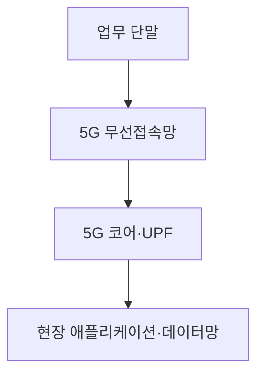
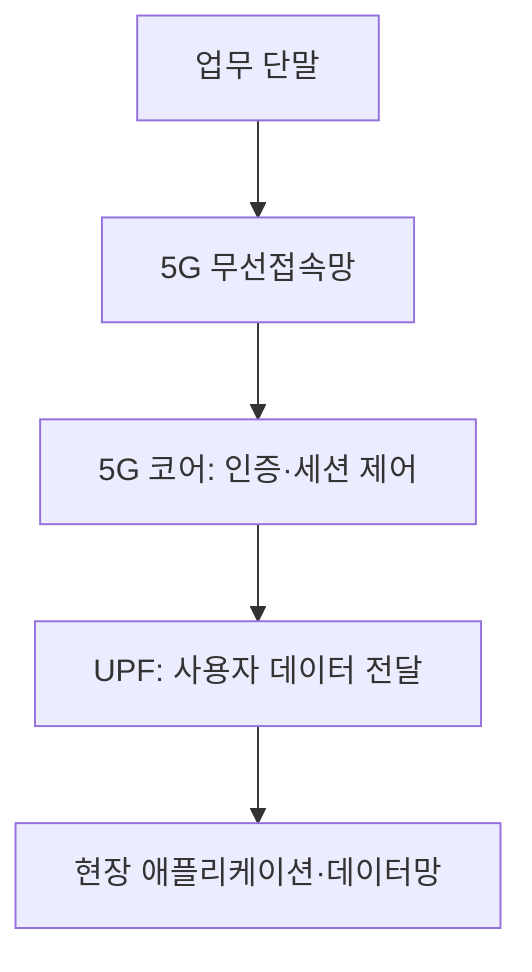

---
sidebar:
  order: 9
  label: "009. 5G 특화망"
  badge:
    text: "기초"
    variant: note
title: "5G 특화망(이음5G)"
author: "Codex"
date: "2026-09-24T00:00:00+09:00"
tags:
  - "notes-network"
weight: 9
extra:
  model: "GPT-6"
  keyword_grade: "기초"
  question_no: "009"
---

## 지식 로드맵 내 현재 위치

네트워크 → 이동통신 → **5G 특화망**

## 30초 인출

- 본질: **5G 특화망** : 특정 조직·지역의 업무에 맞춰 구축·운영하는 비공중 5G망
- 메커니즘: 전용 무선접속망과 5G 코어의 전체 또는 일부를 업무 요구에 맞춰 배치하고 현장 서비스에 연결

핵심 용어

- **5G 특화망(이음5G)** : 국내에서 기업·기관 등의 수요에 맞춰 구축하는 5G 기반 통신망
- **NPN(Non-Public Network)** : 특정 조직 또는 이용 범위에 제공하는 3GPP의 비공중망 개념
- **SNPN(Standalone NPN)** : 공중망과 독립적으로 식별·운영되는 비공중망 구성
- **PNI-NPN(Public Network Integrated NPN)** : 공중망의 자원 또는 기능을 활용하는 비공중망 구성
- **UPF(User Plane Function)** : 사용자 데이터의 전달·분기 등을 담당하는 5G 코어 기능
- **로컬 브레이크아웃(Local Breakout)** : 트래픽을 현장 가까운 데이터망으로 분기하는 배치 방식

---

## 1교시 예상문제 (10점)

> 5G 특화망에 관하여 설명하시오. (예상·10점)

---

## 1교시 10점 답안

### Ⅰ. 5G 특화망의 개요

| 구분 | 핵심 |
|---|---|
| 정의 | **5G 특화망** : 특정 조직·지역의 업무에 맞춰 구축·운영하는 비공중 5G망 |
| 목적 | 업무별 통신 품질·접근 범위·데이터 경로의 맞춤 설계 |

### Ⅱ. 핵심 구성

- 구성 선택: 전체 독립망인 **SNPN**과 공중망 기능을 활용하는 **PNI-NPN**을 구분.
- 제언: 커버리지·지연·보안 요구를 측정하고 무선망과 코어의 배치 범위를 결정.

---

## 2~4교시 예상문제 (25점)

> 5G 특화망의 개념과 구성 방식을 설명하고, 구축 시 고려사항과 적용 방안을 제시하시오. (예상·25점)

---

## 2~4교시 25점 답안

## Ⅰ. 5G 특화망의 개요

| 구분 | 핵심 |
|---|---|
| 정의 | **5G 특화망** : 특정 조직·지역의 업무에 맞춰 구축·운영하는 비공중 5G망 |
| 목적 | 업무별 통신 품질·접근 범위·데이터 경로의 맞춤 설계 |

## Ⅱ. 무선접속·코어·업무망의 연결

현장 UPF는 필요한 경우 데이터 경로를 짧게 하는 배치 선택지이며 모든 특화망의 필수 형태는 아님.

## Ⅲ. 비공중망 구축 방식

| 비교 축 | SNPN | PNI-NPN |
|---|---|---|
| 공중망과 관계 | 독립 식별·운영 | 공중망 기능·자원 활용 |
| 운영 책임 | 전용망 운영 주체 중심 | 통신사업자와 역할 분담 |
| 선택 기준 | 독립 운영·접속 통제 요구 | 기존 망 활용·운영 부담 고려 |

보안 수준은 망의 명칭보다 인증, 데이터 경로, 운영 통제에 좌우.

## Ⅳ. 업무 요구와 기술 선택

| 업무 요구 | 설계 항목 | 확인 방법 |
|---|---|---|
| 이동 장비 | 커버리지·핸드오버·음영 | 이동 경로 품질 측정 |
| 영상·센서 | 상향 용량·혼잡·UPF 위치 | 동시 접속 부하 시험 |
| 현장 처리 | 로컬 브레이크아웃·엣지 연동 | 데이터 경로·지연 측정 |
| 접근 통제 | 단말 인증·망 분리·권한 | 접속·장애 시험 |

국내 이음5G의 4.7GHz·28GHz 대역은 공급 정책의 대상. 실제 이용 가능 대역과 할당 조건은 신청 시점 공고로 확인.

## Ⅴ. 한계와 대응

| 한계 | 대응 |
|---|---|
| 설비·이동 경로의 전파 음영 | 현장 측정 후 기지국 위치·대역 설계 |
| 전용망 구축·운영 부담 | SNPN·PNI-NPN 비용과 책임 비교 |
| 지연·가용성의 과도한 기대 | 종단 구간별 측정과 장애 전환 시험 |

## Ⅵ. 기술사적 제언

| 우선순위 | 제언 |
|---|---|
| 업무 기준 | 업무별 커버리지, 지연, 데이터 경로 목표를 수치화 |
| 구축 판단 | 독립 운영 필요성에 따라 구축 방식과 UPF 위치 결정 |
| 운영 검증 | 이동·혼잡·장애 상황에서 서비스 품질과 보안 확인 |

---

## 검증 출처

- [한국방송통신전파진흥원: 5G 특화망(이음5G)](https://www.kca.kr/contentsView.do?pageId=www277)
- [3GPP TS 23.501: 5G 시스템 아키텍처](https://www.etsi.org/deliver/etsi_ts/123500_123599/123501/18.06.00_60/ts_123501v180600p.pdf)

## 연결 노트

- 연계 개념: [5G SA](./038_5g_sa.md), [5G-Advanced](./039_5g_advanced.md)
