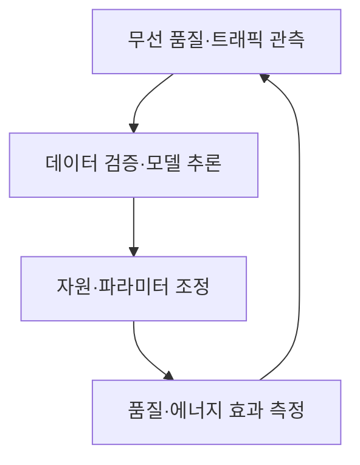
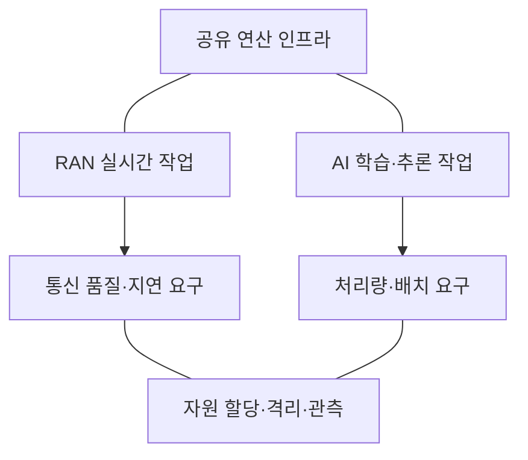

---
sidebar:
  order: 10
  label: "010. AI-RAN"
  badge:
    text: "서브"
    variant: note
title: "AI-RAN"
author: "Codex"
date: "2026-09-24T00:00:00+09:00"
tags:
  - "notes-network"
weight: 10
extra:
  model: "GPT-6"
  keyword_grade: "서브"
  question_no: "010"
---

## 지식 로드맵 내 현재 위치

네트워크 → 무선접속망 → **AI-RAN**

## 30초 인출

- 본질: **AI-RAN** : AI로 무선접속망을 개선하고, 무선망 인프라에서 AI 작업도 수행하려는 기술 방향
- 메커니즘: 무선망 최적화, AI·RAN 연산 자원 공유, 무선망 엣지의 AI 서비스라는 세 관점

핵심 용어

- **AI-RAN(Artificial Intelligence–Radio Access Network)** : AI와 무선접속망의 결합을 연구·구현하는 기술 분야
- **AI-for-RAN** : 무선 신호 처리·자원 관리·운영 효율을 AI로 개선하는 관점
- **AI-and-RAN** : AI 작업과 무선망 작업이 연산 인프라를 공유하는 관점
- **AI-on-RAN** : 무선망 인프라를 활용해 엣지 AI 서비스를 제공하는 관점
- **RAN(Radio Access Network)** : 단말과 이동통신 코어 사이의 무선 접속 기능
- **O-RAN(Open Radio Access Network)** : 개방형 인터페이스와 지능형 제어를 추진하는 무선접속망 구조·표준화 체계

---

## 1교시 예상문제 (10점)

> AI-RAN에 관하여 설명하시오. (예상·10점)

---

## 1교시 10점 답안

### Ⅰ. AI-RAN의 개요

| 구분 | 핵심 |
|---|---|
| 정의 | **AI-RAN** : AI를 무선접속망의 성능 개선과 인프라 활용에 결합하는 기술 방향 |
| 목적 | 무선망 성능·운영 효율 개선과 엣지 AI 서비스 지원 |

### Ⅱ. 세 가지 적용 관점

| 관점 | 핵심 기능 |
|---|---|
| **AI-for-RAN** | AI를 통한 무선망 신호·자원·운영 최적화 |
| **AI-and-RAN** | AI 작업과 RAN 작업의 연산 인프라 공유 |
| **AI-on-RAN** | 무선망 인프라에서 엣지 AI 애플리케이션 제공 |

- 제언: 무선망의 품질 목표를 먼저 정하고, 연산 자원 공유 시 통신 작업의 지연·격리를 검증.

---

## 2~4교시 예상문제 (25점)

> AI-RAN의 개념과 세 적용 관점을 설명하고, 공유 인프라의 고려사항과 도입 방안을 제시하시오. (예상·25점)

---

## 2~4교시 25점 답안

## Ⅰ. AI-RAN의 개요

| 구분 | 핵심 |
|---|---|
| 정의 | **AI-RAN** : AI를 무선접속망의 성능 개선과 인프라 활용에 결합하는 기술 방향 |
| 목적 | 무선망 성능·운영 효율 개선과 엣지 AI 서비스 지원 |

## Ⅱ. AI와 RAN의 세 결합 방식

| 관점 | AI의 위치·역할 | 대표 과제 |
|---|---|---|
| AI-for-RAN | 무선망 기능·운영에 AI 적용 | 채널 추정, 자원 관리, 에너지 최적화 |
| AI-and-RAN | AI·RAN 작업의 연산 기반 공유 | 가속기·메모리 할당, 성능 격리 |
| AI-on-RAN | 무선망 엣지에서 AI 서비스 실행 | 추론 배치, 연결·지연 품질 |

세 관점은 서로 대체하는 구축 유형이 아니라 적용 목적을 구분하는 축. 특히 **AI-on-RAN**은 무선망 신호 처리 알고리즘을 AI로 바꾼다는 뜻이 아님.

## Ⅲ. AI-for-RAN의 제어 흐름

모델 개선 효과는 스펙트럼 효율, 오류, 커버리지, 에너지 등 실제 지표로 비교. 추론 결과를 무선망 제어에 연결할 때는 적용 범위와 장애 시 복귀 경로를 정의.

## Ⅳ. AI-and-RAN의 자원 공유

정적 선은 공통 인프라와 요구 조건의 구성 관계, 화살표는 요구가 자원 관리로 전달되는 방향. AI 작업을 병행해도 통신 품질이 자동으로 유지되는 것은 아니므로 부하별 검증이 필요.

## Ⅴ. 한계와 대응

| 한계 | 대응·검증 |
|---|---|
| AI·RAN 작업의 가속기·메모리 경합 | 자원 예약·격리 후 최대 부하 시 지연 측정 |
| 학습·운영 데이터 분포 변화 | 모델 성능 감시와 기존 제어로의 복귀 |
| 엣지 AI 서비스의 위치·연결 제약 | 사용자 위치와 상향 전송량을 포함해 종단 지연 측정 |

## Ⅵ. 기술사적 제언

| 순서 | 제언 |
|---|---|
| 목적 선정 | 무선망 최적화, 자원 공유, 엣지 서비스 중 해결할 과제를 먼저 특정 |
| 단계 적용 | 관측·추론·제어 경로와 자원 격리 정책을 분리 검증 |
| 운영 판정 | 실제 혼잡·이동·장애 조건에서 품질과 비용의 개선 여부 확인 |

---

## 검증 출처

- [AI-RAN Alliance: 설립 발표와 세 적용 영역](https://ai-ran.org/press-releases/alliance-formation)
- [AI-RAN Alliance: Vision and Mission White Paper](https://ai-ran.org/wp-content/uploads/2024/12/AI-RAN_Alliance_Whitepaper.pdf)

## 연결 노트

- 연계 개념: [5G 특화망](./009_5g_private_network.md), [AI-native Network](./014_ai_native_network.md)
