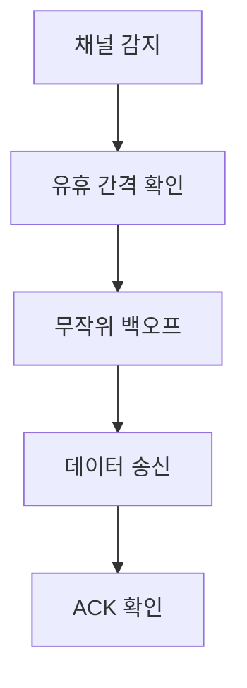
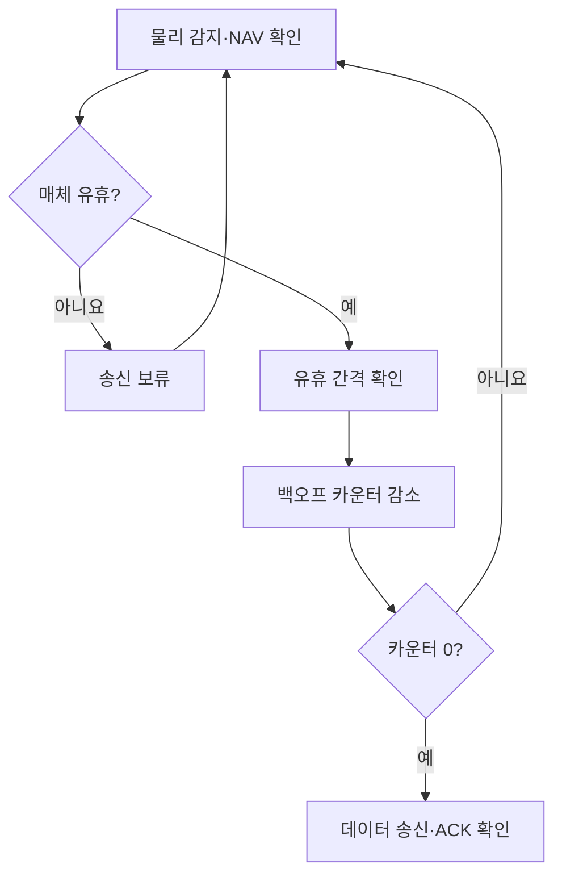
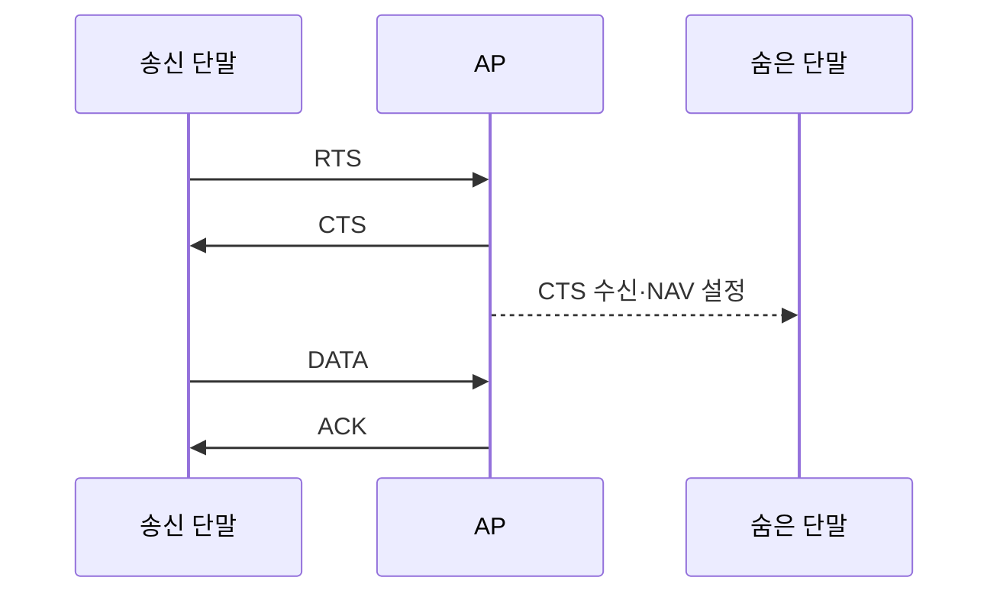

---
sidebar:
  order: 11
  label: "011. CSMA/CA"
  badge:
    text: "기초"
    variant: note
title: "CSMA/CA"
author: "Codex"
date: "2026-09-24T00:00:00+09:00"
tags:
  - "notes-network"
weight: 11
extra:
  model: "GPT-6"
  keyword_grade: "기초"
  question_no: "011"
---

## 지식 로드맵 내 현재 위치

네트워크 → 무선 LAN → **CSMA/CA**

## 30초 인출

- 본질: **CSMA/CA** : 무선 매체를 감지하고 무작위 대기해 동시 송신 충돌 가능성을 줄이는 접근 방식
- 메커니즘: 채널 감지 → 유휴 구간 확인 → 백오프 → 송신 → ACK 확인; RTS/CTS는 선택적 보조 절차

핵심 용어

- **CSMA/CA(Carrier Sense Multiple Access with Collision Avoidance)** : 채널 사용 여부를 감지하고 전송을 분산해 충돌을 회피하는 무선 매체 접근 방식
- **DCF(Distributed Coordination Function)** : IEEE 802.11의 분산형 매체 접근 기능
- **DIFS(DCF Interframe Space)** : DCF의 송신 경쟁 전에 확인하는 프레임 간 간격
- **백오프(Backoff)** : 선택한 슬롯 수만큼 유휴 시간을 기다려 송신 시점을 분산하는 절차
- **RTS/CTS(Request to Send/Clear to Send)** : 데이터 송신에 앞서 매체 사용 시간을 알리는 선택적 제어 프레임 교환
- **NAV(Network Allocation Vector)** : 수신한 프레임의 지속시간 정보에 따라 매체 점유를 가상으로 추적하는 값
- **ACK(Acknowledgment)** : 수신 성공을 알리는 확인 응답

---

## 1교시 예상문제 (10점)

> CSMA/CA에 관하여 설명하시오. (예상·10점)

---

## 1교시 10점 답안

### Ⅰ. CSMA/CA의 개요

| 구분 | 핵심 |
|---|---|
| 정의 | **CSMA/CA** : 무선 매체를 감지하고 송신 시점을 분산해 충돌 가능성을 줄이는 접근 방식 |
| 목적 | 같은 채널을 쓰는 단말 사이의 매체 경합·재전송 감소 |

### Ⅱ. 기본 동작

- **RTS/CTS**는 숨은 단말 문제에 사용할 수 있으나 모든 프레임의 필수 단계는 아님.
- 제언: 충돌·재전송과 제어 프레임 부담을 함께 측정해 RTS/CTS 사용 범위를 결정.

---

## 2~4교시 예상문제 (25점)

> CSMA/CA의 동작과 숨은 단말 대응 방식을 설명하고, 한계와 무선 LAN 설계 방안을 제시하시오. (예상·25점)

---

## 2~4교시 25점 답안

## Ⅰ. CSMA/CA의 개요

| 구분 | 핵심 |
|---|---|
| 정의 | **CSMA/CA** : 무선 매체를 감지하고 송신 시점을 분산해 충돌 가능성을 줄이는 접근 방식 |
| 목적 | 같은 채널을 쓰는 단말 사이의 매체 경합·재전송 감소 |

## Ⅱ. DCF의 송신 절차

다른 전송으로 매체가 바빠지면 백오프 카운터를 멈추고, 다시 유휴 상태가 되면 남은 카운터를 이어서 사용. **ACK** 실패는 충돌 가능성을 알려주지만 충돌의 유일한 원인으로 단정할 수 없음.

## Ⅲ. 숨은 단말과 RTS/CTS

서로의 송신을 감지하지 못하는 단말도 AP의 CTS를 들을 수 있다면 예약 시간을 알 수 있음. 그러나 CTS를 듣지 못하거나 제어 프레임이 충돌하면 완전한 충돌 방지는 불가.

## Ⅳ. 핵심 구성요소의 역할

| 요소 | 역할 | 설계 시 고려 |
|---|---|---|
| 물리 감지 | 현재 무선 신호 확인 | 간섭·숨은 단말에 따른 감지 한계 |
| NAV | 예약된 매체 사용 시간 추적 | RTS/CTS·데이터 프레임의 기간 정보 |
| 백오프 | 경쟁 단말의 송신 시점 분산 | 단말 밀집 시 대기·재전송 증가 |
| RTS/CTS | 송신 전 예약 정보 공유 | 충돌 감소 효과와 제어 프레임 오버헤드 비교 |

## Ⅴ. 한계와 대응

| 한계 | 대응·확인 |
|---|---|
| 숨은 단말의 동시 송신 | AP 배치·출력·채널 검토 후 RTS/CTS 효과 측정 |
| 단말 밀집에 따른 경합 증가 | 채널 분산과 무선 자원 이용률·재전송률 확인 |
| 작은 프레임에 RTS/CTS 오버헤드 | 프레임 크기와 충돌률을 고려해 사용 조건 설정 |

## Ⅵ. 기술사적 제언

| 우선순위 | 제언 |
|---|---|
| 원인 확인 | 채널 사용률, 재전송률, 숨은 단말 위치 측정 |
| 구성 조정 | 채널·AP 배치와 RTS/CTS 설정을 순서대로 조정 |
| 효과 검증 | 실제 단말 밀도에서 처리량·지연·재전송 비교 |

---

## 검증 출처

- [IEEE 802.11 DCF·CSMA/CA 설명 자료](https://www.ieee802.org/11/Documents/DocumentArchives/1995_docs/1195059_scan.pdf)
- [IEEE 802.11 숨은 단말·RTS/CTS·NAV 튜토리얼](https://www.ieee802.org/11/Documents/DocumentArchives/1996_docs/1196049C_scan.pdf)

## 연결 노트

- 연계 개념: [Wi-Fi 7](./005_wifi_7.md), [TDMA](./023_tdma.md)
