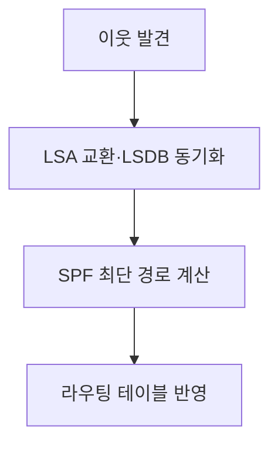
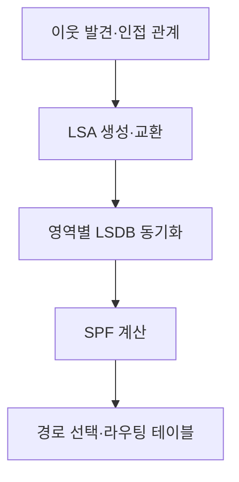
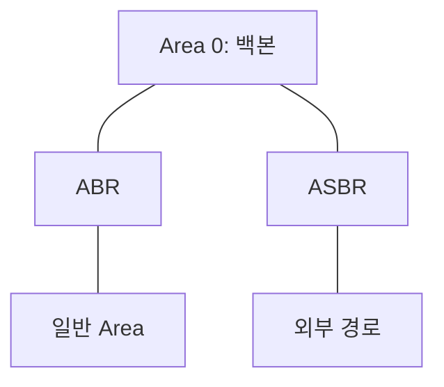

---
sidebar:
  order: 12
  label: "012. OSPF"
  badge:
    text: "기초"
    variant: note
title: "OSPF(Open Shortest Path First)"
author: "Codex"
date: "2026-09-24T00:00:00+09:00"
tags:
  - "notes-network"
weight: 12
extra:
  model: "GPT-6"
  keyword_grade: "기초"
  question_no: "012"
---

## 지식 로드맵 내 현재 위치

네트워크 → 내부 라우팅 → **OSPF**

## 30초 인출

- 본질: **OSPF** : 링크 상태를 공유한 뒤 각 라우터가 목적지까지의 최저 비용 경로를 계산하는 내부 라우팅 프로토콜
- 메커니즘: 인접 라우터 발견 → LSA 교환·LSDB 동기화 → SPF 계산 → 라우팅 테이블 반영

핵심 용어

- **OSPF(Open Shortest Path First)** : 링크 상태 데이터베이스와 최단 경로 우선 계산을 사용하는 내부 게이트웨이 프로토콜
- **LSA(Link State Advertisement)** : 라우터·네트워크의 링크 상태를 알리는 정보 단위
- **LSDB(Link State Database)** : 같은 영역의 라우터가 동기화하는 링크 상태 정보 집합
- **SPF(Shortest Path First)** : 링크 비용을 바탕으로 최단 경로 트리를 계산하는 알고리즘
- **Area(영역)** : 링크 상태 정보와 SPF 계산의 범위를 구분하는 OSPF 구성 단위
- **ABR(Area Border Router)** : 둘 이상의 OSPF 영역을 연결하는 라우터
- **ASBR(Autonomous System Boundary Router)** : 외부 경로 정보를 OSPF로 유입하는 라우터
- **DR/BDR(Designated Router/Backup Designated Router)** : 브로드캐스트·NBMA 망에서 인접 관계와 정보 교환을 조정하는 대표·예비 라우터

---

## 1교시 예상문제 (10점)

> OSPF에 관하여 설명하시오. (예상·10점)

---

## 1교시 10점 답안

### Ⅰ. OSPF의 개요

| 구분 | 핵심 |
|---|---|
| 정의 | **OSPF** : 링크 상태를 공유하고 각 라우터가 최저 비용 경로를 계산하는 내부 라우팅 프로토콜 |
| 목적 | 자율시스템 내부의 경로 계산과 변경된 토폴로지 반영 |

### Ⅱ. 경로 계산 절차

- 영역을 나누면 영역 내 링크 상태 전파·계산 범위를 관리 가능.
- 제언: 링크 비용과 영역 경계를 설계하고 장애 시 수렴 시간을 측정.

---

## 2~4교시 예상문제 (25점)

> OSPF의 링크 상태 라우팅과 영역 구조를 설명하고, 설계 시 고려사항과 운영 방안을 제시하시오. (예상·25점)

---

## 2~4교시 25점 답안

## Ⅰ. OSPF의 개요

| 구분 | 핵심 |
|---|---|
| 정의 | **OSPF** : 링크 상태를 공유하고 각 라우터가 최저 비용 경로를 계산하는 내부 라우팅 프로토콜 |
| 목적 | 자율시스템 내부의 경로 계산과 변경된 토폴로지 반영 |

## Ⅱ. 링크 상태 정보와 경로 계산

같은 영역의 라우터는 링크 상태 정보를 공유하고 각자 자신을 루트로 최단 경로 트리를 계산. 장애 순간에는 정보 전파·재계산 시차로 일시적인 경로 불일치가 생길 수 있음.

## Ⅲ. 영역과 라우터 역할

실선은 영역·라우터의 연결 관계. **ABR**은 영역 간 라우팅 정보를 전달하고, **ASBR**은 외부 경로를 주입. **DR/BDR**은 브로드캐스트·NBMA 망의 세그먼트 안에서 선출되며 영역 계층을 대표하는 역할이 아님.

## Ⅳ. 설계 요소의 구분

| 설계 요소 | 핵심 역할 | 주의점 |
|---|---|---|
| 링크 비용 | 경로 선택의 기준 | 기본값·참조 대역폭은 장비 설정에 따라 확인 |
| 영역 경계 | LSDB·계산 범위 관리 | 백본 연결과 영역 간 경로 확인 |
| DR/BDR | 다중 접속 망의 인접 관계 조정 | 포인트 투 포인트 링크에는 불필요 |
| 외부 경로 재분배 | 다른 라우팅 영역과 연계 | 루프·경로 우선순위·요약 경계 검토 |

OSPF의 비용은 고정된 `10^8/대역폭` 규칙으로 단정할 수 없음. 장비의 참조 대역폭과 수동 비용 설정이 결과를 바꿈.

## Ⅴ. 한계와 대응

| 한계 | 대응·검증 |
|---|---|
| 빈번한 링크 상태 변화와 SPF 부하 | 장애 원인 제거, 영역·타이머 설계 후 CPU·수렴 측정 |
| 영역 간 경로 누락 | ABR·백본 연결 및 요약 정책 확인 |
| 외부 경로 재분배에 따른 루프·우회 | 주입 범위·경로 우선순위·필터 검증 |

## Ⅵ. 기술사적 제언

| 우선순위 | 제언 |
|---|---|
| 토폴로지 | 백본과 영역 경계를 먼저 정의 |
| 경로 정책 | 링크 비용과 외부 경로 유입 범위 검증 |
| 운영 | 이웃 상태, LSDB 불일치, 장애 수렴 시간을 지속 측정 |

---

## 검증 출처

- [RFC 2328: OSPF Version 2](https://www.rfc-editor.org/rfc/rfc2328)
- [RFC 5340: OSPF for IPv6](https://www.rfc-editor.org/rfc/rfc5340)

## 연결 노트

- 연계 개념: [EGP](./042_egp.md), [경로 조회](./023_routing_table_lookup.md)
