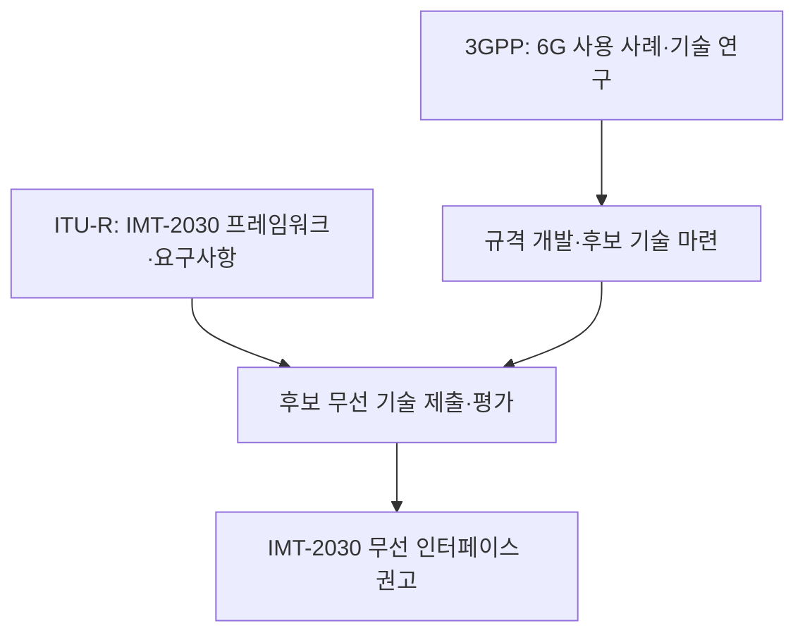

---
sidebar:
  order: 13
  label: "013. 6G 표준화"
  badge:
    text: "서브"
    variant: note
title: "6G 표준화와 IMT-2030"
author: "Codex"
date: "2026-09-24T00:00:00+09:00"
tags:
  - "notes-network"
weight: 13
extra:
  model: "GPT-6"
  keyword_grade: "서브"
  question_no: "013"
---

## 지식 로드맵 내 현재 위치

네트워크 → 이동통신 표준 → **IMT-2030·6G**

## 30초 인출

- 본질: **6G 표준화** : 차세대 이동통신의 사용 시나리오·성능 요구·무선 기술을 국제 절차로 합의하는 작업
- 메커니즘: ITU-R의 IMT-2030 프레임워크·평가 절차와 3GPP의 6G 기술 연구·규격 개발을 구분

핵심 용어

- **IMT-2030(International Mobile Telecommunications-2030)** : ITU-R의 2030년대 이동통신 체계에 대한 프레임워크·표준화 명칭
- **ITU-R(International Telecommunication Union Radiocommunication Sector)** : 국제전기통신연합의 전파통신 부문
- **3GPP(3rd Generation Partnership Project)** : 이동통신 시스템 규격을 개발하는 표준화 협력체
- **M.2160** : IMT-2030의 개발 방향과 여섯 사용 시나리오를 제시한 ITU-R 권고
- **ISAC(Integrated Sensing and Communication)** : 통신과 주변 환경의 감지 기능을 함께 연구하는 기술 방향
- **RIT(Radio Interface Technology)** : IMT 평가에 제출하는 무선 인터페이스 기술

---

## 1교시 예상문제 (10점)

> 6G 표준화에 관하여 설명하시오. (예상·10점)

---

## 1교시 10점 답안

### Ⅰ. 6G 표준화의 개요

| 구분 | 핵심 |
|---|---|
| 정의 | **6G 표준화** : IMT-2030의 사용 시나리오·요구사항과 차세대 무선 기술을 국제적으로 합의하는 과정 |
| 목적 | 장비·서비스 간 상호운용과 차세대 이동통신의 공통 기술 기반 마련 |

### Ⅱ. ITU-R과 3GPP의 역할

| 기구 | 핵심 역할 |
|---|---|
| **ITU-R** | IMT-2030 프레임워크, 요구사항, 후보 기술 평가·권고 |
| **3GPP** | 6G 사용 사례 연구와 이동통신 기술 규격 개발 |

- 제언: 확정된 ITU-R 프레임워크와 연구 중인 3GPP 기술 항목을 구분해 설명.

---

## 2~4교시 예상문제 (25점)

> 6G 표준화의 IMT-2030 체계와 주요 사용 시나리오를 설명하고, 표준화 단계별 검토 방안을 제시하시오. (예상·25점)

---

## 2~4교시 25점 답안

## Ⅰ. 6G 표준화의 개요

| 구분 | 핵심 |
|---|---|
| 정의 | **6G 표준화** : IMT-2030의 사용 시나리오·요구사항과 차세대 무선 기술을 국제적으로 합의하는 과정 |
| 목적 | 장비·서비스 간 상호운용과 차세대 이동통신의 공통 기술 기반 마련 |

## Ⅱ. 국제 표준화의 역할 분담

ITU-R의 **M.2160**은 기술 구현 완료 선언이 아니라 개발 방향을 정한 프레임워크. 3GPP의 릴리스 연구 항목도 최종 6G 규격 또는 서비스 성능 보장을 뜻하지 않음.

## Ⅲ. IMT-2030의 여섯 사용 시나리오

| 확장 시나리오 | 지향점 |
|---|---|
| 몰입형 통신 | 상호작용형·실감형 서비스 |
| 초고신뢰·저지연 통신 | 높은 신뢰도와 짧은 반응 시간 |
| 대규모 통신 | 많은 단말의 연결 |
| 유비쿼터스 연결 | 지상·비지상 등 폭넓은 연결 |
| AI와 통신의 통합 | AI 기능과 네트워크 기능의 결합 |
| 센싱과 통신의 통합 | 무선 통신과 환경 감지의 결합 |

각 시나리오는 요구를 분류하는 틀이며, 모든 지표를 한 시스템이 동시에 달성한다는 뜻이 아님.

## Ⅳ. 기술 연구와 확정 수준

| 구분 | 현재 설명 가능한 범위 | 주의점 |
|---|---|---|
| IMT-2030 프레임워크 | 여섯 시나리오와 개발 목표 | 개별 구현 기술 확정과 구분 |
| 3GPP Rel-20 연구 | 6G 요구·구조·무선 기술 연구 | 연구 결과를 규격 완료로 표현 금지 |
| 후보 기술·평가 | ITU-R 절차에 따라 제출·검증 | 최종 무선 인터페이스 권고와 구분 |

주파수 대역, AI 기반 무선 인터페이스, ISAC 구조 등은 검토 주제. 특정 대역 또는 기술이 6G의 필수 구성이 되었다고 단정할 단계가 아님.

## Ⅴ. 한계와 대응

| 한계 | 대응 |
|---|---|
| 연구 발표를 확정 표준처럼 오인 | ITU-R 권고·3GPP 연구·최종 규격의 상태 표시 |
| 시나리오별 목표를 동시 성능 보장으로 오해 | 시나리오·평가 조건·측정 지표를 함께 명시 |
| 특정 기술에 조기 종속 | 후보 평가 결과와 상호운용 시험 후 도입 판단 |

## Ⅵ. 기술사적 제언

| 판단 단계 | 제언 |
|---|---|
| 요구 정리 | 서비스별 연결·지연·신뢰도·센싱 요구 구분 |
| 표준 추적 | ITU-R 요구·평가 절차와 3GPP 릴리스 상태 분리 관리 |
| 도입 결정 | 최종 규격과 실증 결과를 확인한 뒤 적용 범위 결정 |

---

## 검증 출처

- [ITU-R M.2160: IMT-2030 프레임워크](https://www.itu.int/rec/R-REC-M.2160-0-202311-I)
- [ITU-R: IMT-2030 후보 기술 제출·평가 절차](https://www.itu.int/en/ITU-R/study-groups/rsg5/rwp5d/imt-2030/Pages/submission-eval.aspx)
- [3GPP: 6G 기술 연구 항목](https://portal.3gpp.org/desktopmodules/Specifications/SpecificationDetails.aspx?specificationId=4374)

## 연결 노트

- 연계 개념: [AI-native Network](./014_ai_native_network.md), [6G 이동통신](./040_6g_mobile_telecommunication_tech.md)
