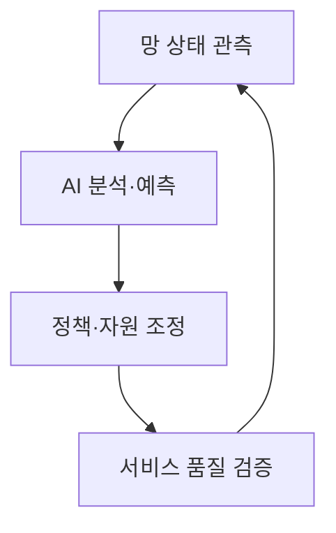
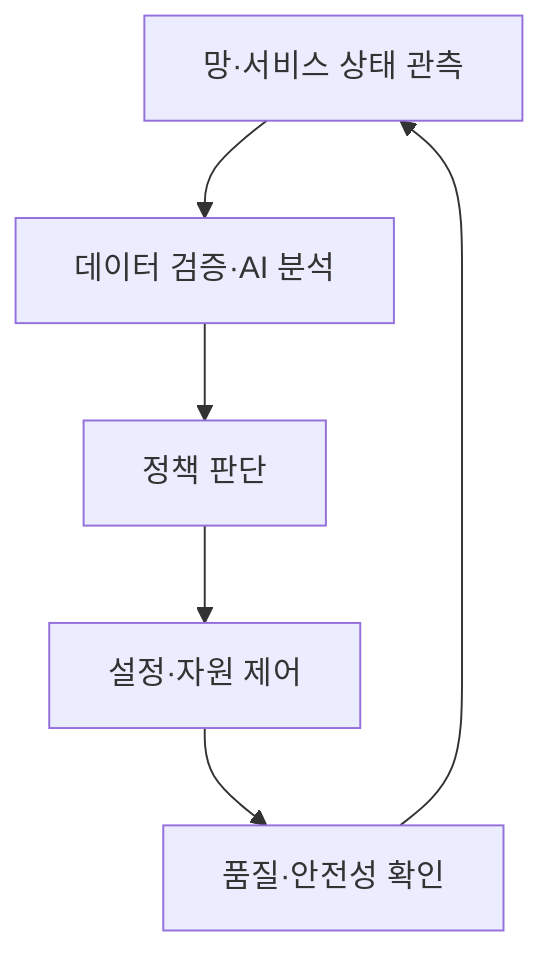

---
sidebar:
  order: 14
  label: "014. AI-native Network"
  badge:
    text: "서브"
    variant: note
title: "AI-native Network"
author: "Codex"
date: "2026-09-24T00:00:00+09:00"
tags:
  - "notes-network"
weight: 14
extra:
  model: "GPT-6"
  keyword_grade: "서브"
  question_no: "014"
---

## 지식 로드맵 내 현재 위치

네트워크 → 지능형 네트워크 → **AI-native Network**

## 30초 인출

- 본질: **AI-native Network** : AI의 데이터·모델·추론·운영을 네트워크 설계에 처음부터 포함하는 접근
- 메커니즘: 망 상태 관측 → AI 분석·예측 → 정책 적용 → 품질 검증의 반복 제어

핵심 용어

- **AI-native Network** : AI 기능과 그 운영 체계를 네트워크 구조·운영에 내재화하는 설계 접근
- **폐루프 제어(Closed-loop Control)** : 관측·판단·실행 결과를 다시 관측해 정책을 조정하는 운영 방식
- **텔레메트리(Telemetry)** : 장비·서비스의 상태와 성능을 수집하는 측정 정보
- **MLOps(Machine Learning Operations)** : 모델 개발·배포·감시·갱신을 관리하는 운영 체계
- **ZSM(Zero-touch network and Service Management)** : ETSI의 네트워크·서비스 자동화 관리 프레임워크
- **NWDAF(Network Data Analytics Function)** : 5G 코어의 네트워크 데이터 분석 기능

---

## 1교시 예상문제 (10점)

> AI-native Network에 관하여 설명하시오. (예상·10점)

---

## 1교시 10점 답안

### Ⅰ. AI-native Network의 개요

| 구분 | 핵심 |
|---|---|
| 정의 | **AI-native Network** : AI 기능과 모델 운영을 망 설계·제어·관리에 처음부터 포함하는 접근 |
| 목적 | 망 상태에 맞춘 자원 조정과 서비스 품질 관리의 자동화 |

### Ⅱ. 핵심 운영 흐름

- 제언: 제어 목표와 허용 범위를 먼저 정의하고 잘못된 추론 시 복귀 수단을 마련.

---

## 2~4교시 예상문제 (25점)

> AI-native Network의 개념과 폐루프 운영 구조를 설명하고, 모델 통제와 적용 방안을 제시하시오. (예상·25점)

---

## 2~4교시 25점 답안

## Ⅰ. AI-native Network의 개요

| 구분 | 핵심 |
|---|---|
| 정의 | **AI-native Network** : AI 기능과 모델 운영을 망 설계·제어·관리에 처음부터 포함하는 접근 |
| 목적 | 망 상태에 맞춘 자원 조정과 서비스 품질 관리의 자동화 |

## Ⅱ. 망 운영의 폐루프

**폐루프**는 제어 후의 실제 효과를 다시 측정하는 구조. 모델 추론만으로 자동 운영이 완성되는 것은 아니며, 변경 범위·승인 조건·복귀 기준이 필요.

## Ⅲ. 구성 요소와 책임

| 구성 요소 | 역할 | 검증 항목 |
|---|---|---|
| 텔레메트리 | 망 상태·품질 관측 | 수집 지연·누락·정확성 |
| AI 모델 | 상태 예측·정책 후보 생성 | 오탐·분포 변화·재현성 |
| 정책 엔진 | 허용된 설정 범위 결정 | 서비스별 우선순위·충돌 |
| 실행·감시 | 변경 적용과 결과 확인 | 장애 복귀·감사 기록 |

**NWDAF**는 5G 코어 분석 기능의 한 예이고 **ZSM**은 자동화 관리 프레임워크. 둘을 AI-native Network 전체와 동일시하지 않음.

## Ⅳ. 적용 수준의 선택

| 수준 | 운영 방식 | 적용 예 |
|---|---|---|
| 관측 보조 | AI 분석 결과를 운영자가 검토 | 혼잡 예측·원인 후보 |
| 제한적 자동화 | 허용 범위 안에서 정책 조정 | 특정 셀의 자원 조정 |
| 폐루프 운영 | 적용 결과를 검증해 반복 조정 | 서비스 품질 기반 최적화 |

적용 수준은 망의 안전 요구와 모델 신뢰도에 따라 선택. 6G의 모든 프로토콜 계층이 신경망으로 대체된다는 의미는 아님.

## Ⅴ. 한계와 대응

| 한계 | 대응·검증 |
|---|---|
| 학습 데이터와 현장 망 상태의 차이 | 모델 성능·데이터 분포 지속 감시 |
| 잘못된 자동 제어의 장애 확산 | 권한·변경 범위 제한과 수동 복귀 |
| 모델·정책의 설명 어려움 | 입력·결정·적용 결과 기록 |

## Ⅵ. 기술사적 제언

| 우선순위 | 제언 |
|---|---|
| 목표 | 품질·에너지·운영 효율 중 개선 지표 정의 |
| 단계 | 관측 보조부터 시작해 검증된 정책만 자동 적용 |
| 통제 | 모델 변화·제어 이력·장애 복귀를 운영 기준으로 관리 |

---

## 검증 출처

- [ETSI ZSM: 네트워크·서비스 자동화](https://www.etsi.org/technical-groups/zsm/)
- [ETSI GS ZSM 002: 참조 아키텍처와 폐루프 운영](https://www.etsi.org/deliver/etsi_gs/ZSM/001_099/002/01.01.01_60/gs_ZSM002v010101p.pdf)
- [ITU-R IMT-2030 개발 방향](https://www.itu.int/en/ITU-R/study-groups/rsg5/rwp5d/imt-2030/pages/default.aspx)

## 연결 노트

- 연계 개념: [AI-RAN](./010_ai_ran.md), [6G 표준화](./013_6g_standardization.md)
