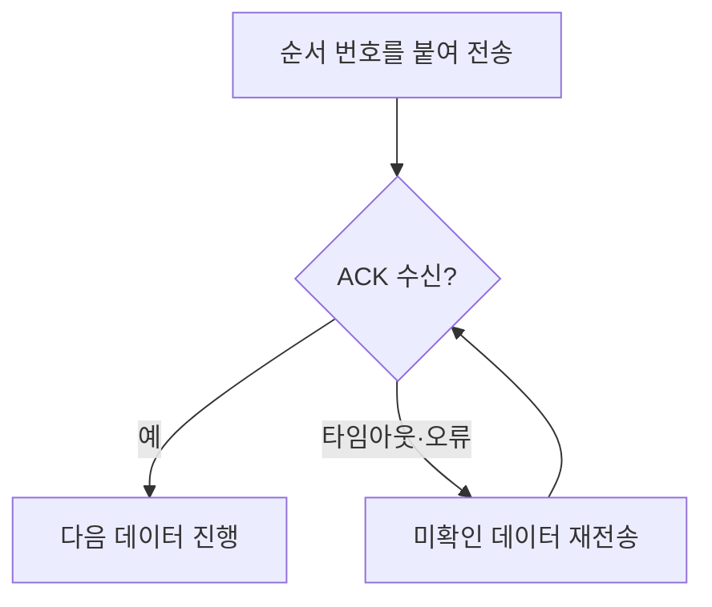

---
sidebar:
  order: 15
  label: "015. ARQ"
  badge:
    text: "기초"
    variant: note
title: "ARQ(Automatic Repeat reQuest)"
author: "Codex"
date: "2026-09-24T00:00:00+09:00"
tags:
  - "notes-network"
weight: 15
extra:
  model: "GPT-6"
  keyword_grade: "기초"
  question_no: "015"
---

## 지식 로드맵 내 현재 위치

네트워크 → 오류 제어 → **ARQ**

## 30초 인출

- 본질: **ARQ** : 송신 데이터의 손실·오류를 확인 응답과 재전송으로 복구하는 오류 제어 방식
- 메커니즘: 순서 번호·ACK·타이머로 미확인 데이터를 추적하고 필요할 때 재전송

핵심 용어

- **ARQ(Automatic Repeat reQuest)** : 확인 응답 또는 타임아웃을 통해 손실·오류 데이터를 다시 보내는 방식
- **ACK(Acknowledgment)** : 수신 성공 또는 수신 위치를 송신자에게 알리는 확인 응답
- **타임아웃(Timeout)** : 정해진 시간까지 확인을 받지 못하면 재전송을 시작하는 조건
- **Stop-and-Wait** : 한 프레임을 보낸 뒤 확인 응답을 기다리는 ARQ 방식
- **Go-Back-N** : 여러 프레임을 연속 송신하다 미확인 위치부터 다시 보내는 방식
- **Selective Repeat** : 수신되지 않은 프레임을 선택해 다시 보내고 정상 수신 프레임은 보관하는 방식
- **FEC(Forward Error Correction)** : 재전송 없이 수신자가 오류를 정정할 수 있도록 여분 정보를 보내는 방식

---

## 1교시 예상문제 (10점)

> ARQ에 관하여 설명하시오. (예상·10점)

---

## 1교시 10점 답안

### Ⅰ. ARQ의 개요

| 구분 | 핵심 |
|---|---|
| 정의 | **ARQ** : 수신 확인과 재전송으로 손실·오류 데이터를 복구하는 방식 |
| 목적 | 전송 중 손상·유실된 데이터의 복구 |

### Ⅱ. 대표 방식

| 방식 | 재전송 범위 | 수신측 처리 |
|---|---|---|
| Stop-and-Wait | 미확인 프레임 1개 | 한 번에 한 프레임 확인 |
| Go-Back-N | 미확인 위치 이후 | 순서 밖 프레임 폐기 |
| Selective Repeat | 누락된 프레임 중심 | 순서 밖 정상 프레임 보관 |

- 제언: 지연·손실률·버퍼 비용에 따라 재전송 방식과 윈도우 크기를 결정.

---

## 2~4교시 예상문제 (25점)

> ARQ의 동작과 세 가지 방식을 비교하고, 적용 시 고려사항과 대응 방안을 제시하시오. (예상·25점)

---

## 2~4교시 25점 답안

## Ⅰ. ARQ의 개요

| 구분 | 핵심 |
|---|---|
| 정의 | **ARQ** : 수신 확인과 재전송으로 손실·오류 데이터를 복구하는 방식 |
| 목적 | 전송 중 손상·유실된 데이터의 복구 |

## Ⅱ. 확인·재전송 흐름

수신측 오류 검출에는 CRC 등을 사용할 수 있으나 ARQ가 특정 검출 부호 하나에 묶인 것은 아님. 확인 응답 자체가 손실될 수도 있어 순서 번호를 통한 중복 처리 필요.

## Ⅲ. 세 방식의 차이

| 방식 | 송신 윈도우 | 손실 시 처리 | 비용·특성 |
|---|---|---|---|
| Stop-and-Wait | 1개 | 해당 프레임 재전송 | 단순하지만 왕복 지연 동안 송신 대기 |
| Go-Back-N | 복수 | 미확인 위치부터 재전송 | 수신 처리는 단순, 정상 프레임 중복 가능 |
| Selective Repeat | 복수 | 누락 프레임 선택 재전송 | 수신 버퍼·재정렬 필요 |

예: `0·1·2·3` 전송 중 `1` 손실 시, Go-Back-N은 `1` 이후를 다시 보내고 Selective Repeat는 보관된 정상 프레임을 활용해 `1`을 선택 재전송.

## Ⅳ. 윈도우·번호 공간

| 설계 항목 | 이유 |
|---|---|
| 송신 윈도우 | 왕복 지연 동안 여러 프레임을 전송해 링크 활용 |
| 수신 버퍼 | Selective Repeat의 순서 밖 정상 프레임 보관 |
| 순서 번호 공간 | 재전송된 이전 프레임과 새 프레임 구분 |
| 타이머 | 지연·손실 조건에 맞춰 불필요한 재전송 억제 |

Selective Repeat의 번호 공간은 일반적인 동일 송수신 윈도우 모델에서 윈도우 크기의 최소 두 배가 필요. 실제 프로토콜은 번호 관리와 확인 응답 방식에 따라 세부 제약이 달라짐.

## Ⅴ. ARQ와 FEC의 선택

| 구분 | ARQ | FEC |
|---|---|---|
| 복구 수단 | 확인 응답·재전송 | 여분 부호를 통한 수신측 정정 |
| 주요 비용 | 추가 왕복 지연·재전송 | 여분 전송량·복호 처리 |
| 검토 환경 | 피드백이 가능하고 지연 여유 존재 | 재전송 지연이 큰 환경 |

## Ⅵ. 기술사적 제언

| 한계 | 제언 |
|---|---|
| 긴 RTT와 Stop-and-Wait의 유휴 시간 | 윈도우 기반 방식 검토 |
| 높은 오류율에서 Go-Back-N 중복 송신 | Selective Repeat 및 버퍼 비용 비교 |
| 재전송 지연에 민감한 서비스 | FEC·ARQ 조합과 종단 지연 검증 |

---

## 검증 출처

- [RFC 3366: 링크 ARQ 설계 지침](https://www.rfc-editor.org/rfc/rfc3366)
- [ITU-R F.2058: Go-Back-N과 Selective Repeat 비교](https://www.itu.int/dms_pub/itu-r/opb/rep/R-REP-F.2058-2006-PDF-E.pdf)

## 연결 노트

- 연계 개념: [오류 제어](./003_error_control.md), [슬라이딩 윈도우](./018_sliding_window.md)
