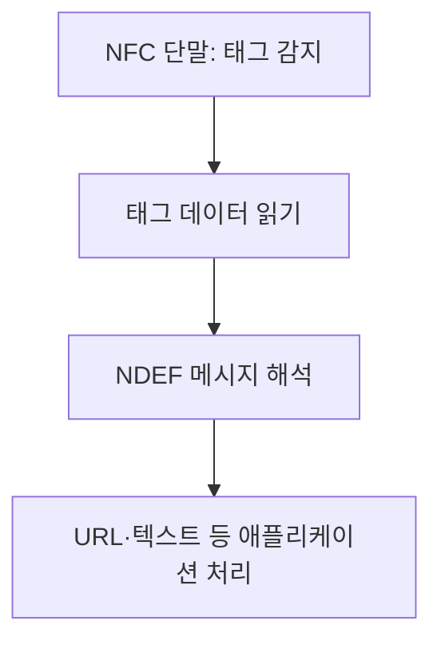

---
sidebar:
  order: 16
  label: "016. NFC"
  badge:
    text: "기초"
    variant: note
title: "NFC(Near Field Communication)"
author: "Codex"
date: "2026-09-24T00:00:00+09:00"
tags:
  - "notes-network"
weight: 16
extra:
  model: "GPT-6"
  keyword_grade: "기초"
  question_no: "016"
---

## 지식 로드맵 내 현재 위치

네트워크 → 근거리 무선통신 → **NFC**

## 30초 인출

- 본질: **NFC** : 가까이 댄 기기·태그가 13.56MHz 근거리 무선으로 데이터를 주고받는 통신 기술
- 메커니즘: 리더가 태그를 읽거나, 단말이 카드처럼 동작하거나, 두 단말이 직접 정보를 교환

핵심 용어

- **NFC(Near Field Communication)** : 13.56MHz 대역을 사용하는 근거리 비접촉 통신 기술
- **리더/라이터(Reader/Writer)** : 단말이 NFC 태그의 데이터를 읽거나 쓰는 동작 방식
- **카드 에뮬레이션(Card Emulation)** : 단말이 비접촉 카드처럼 리더에 응답하는 동작 방식
- **P2P(Peer-to-Peer)** : 두 NFC 단말이 직접 데이터를 교환하는 동작 방식
- **NDEF(NFC Data Exchange Format)** : NFC 기기·태그 간 애플리케이션 데이터를 표현하는 공통 형식
- **SE(Secure Element)** : 비밀 정보·보안 연산을 격리하는 보안 구성 요소
- **HCE(Host Card Emulation)** : 카드 에뮬레이션 처리를 단말의 호스트 소프트웨어에서 수행하는 방식

---

## 1교시 예상문제 (10점)

> NFC에 관하여 설명하시오. (예상·10점)

---

## 1교시 10점 답안

### Ⅰ. NFC의 개요

| 구분 | 핵심 |
|---|---|
| 정의 | **NFC** : 가까운 기기·태그 사이에서 13.56MHz 대역으로 정보를 교환하는 비접촉 통신 기술 |
| 목적 | 접촉 없이 태그 정보 조회, 카드 기능, 기기 간 정보 교환 지원 |

### Ⅱ. 세 가지 동작 방식

| 방식 | 단말의 역할 | 예 |
|---|---|---|
| 리더/라이터 | 태그의 데이터 읽기·쓰기 | 안내 태그 조회 |
| 카드 에뮬레이션 | 카드처럼 리더에 응답 | 비접촉 결제·출입 |
| P2P | 다른 NFC 단말과 직접 교환 | 기기 간 정보 전달 |

- 제언: 서비스 방식에 맞춰 인증·데이터 보호를 설계하고 접촉 거리만으로 안전성을 판단하지 않음.

---

## 2~4교시 예상문제 (25점)

> NFC의 동작 방식과 데이터 교환 구조를 설명하고, 보안 고려사항과 적용 방안을 제시하시오. (예상·25점)

---

## 2~4교시 25점 답안

## Ⅰ. NFC의 개요

| 구분 | 핵심 |
|---|---|
| 정의 | **NFC** : 가까운 기기·태그 사이에서 13.56MHz 대역으로 정보를 교환하는 비접촉 통신 기술 |
| 목적 | 접촉 없이 태그 정보 조회, 카드 기능, 기기 간 정보 교환 지원 |

## Ⅱ. NFC 동작 방식

| 방식 | 통신 관계 | 주요 데이터 |
|---|---|---|
| 리더/라이터 | 단말 → 태그 | NDEF 등 태그 데이터 |
| 카드 에뮬레이션 | 리더 ↔ 카드 역할 단말 | 애플리케이션별 거래 데이터 |
| P2P | 단말 ↔ 단말 | 단말 간 데이터 |

**NDEF**는 데이터 표현 형식이지 모든 NFC 통신의 필수 결제 형식이 아님. 카드 에뮬레이션은 구현에 따라 SE 또는 HCE 등을 활용하며 SE 내장을 필수로 단정하지 않음.

## Ⅲ. 태그 읽기와 데이터 활용

태그에 URL이 있어도 링크 대상의 신뢰성은 별도로 확인. NFC는 근접 연결을 제공하지만 상위 서비스의 인증·암호화 정책까지 자동으로 제공하지 않음.

## Ⅳ. 보안 경계

| 위험 | 근본 원인 | 대응 |
|---|---|---|
| 악성 태그 링크 | 데이터 출처 불명 | URL 검증·사용자 확인 |
| 중계 공격 | 카드와 리더 사이 통신을 원격 전달 | 거래 인증·서비스별 거리 검증 고려 |
| 민감 정보 노출 | 애플리케이션 데이터 보호 부족 | 토큰·암호화·키 관리 적용 |

짧은 통신 거리는 사용 편의에 기여하지만 도청·중계 공격이 불가능하다는 보안 보증은 아님.

## Ⅴ. 적용 선택

| 서비스 | 필요한 NFC 방식 | 추가 설계 |
|---|---|---|
| 안내·자산 태그 | 리더/라이터 | 태그 무결성·링크 검증 |
| 출입·결제 | 카드 에뮬레이션 | 사용자·거래 인증, 키 보호 |
| 기기 연동 | P2P 또는 태그 기반 연결 인계 | 상대 기기 확인, 후속 통신 보안 |

## Ⅵ. 기술사적 제언

| 순서 | 제언 |
|---|---|
| 기능 정의 | 읽기·카드·기기 교환 중 필요한 모드 선정 |
| 보안 설계 | 태그 출처, 사용자 인증, 키와 거래 데이터 보호 검토 |
| 현장 검증 | 실제 단말·태그 호환성과 중계·오인식 위험 시험 |

---

## 검증 출처

- [NFC Forum: NFC 기술 개요](https://nfc-forum.org/learn/nfc-technology/)
- [NFC Forum: NDEF 기술 규격](https://nfc-forum.org/build/specifications/data-exchange-format-ndef-technical-specification/)
- [NFC Forum: 세 가지 동작 모드](https://nfc-forum.org/news/2026-02-roadmap-reader-mode-interoperability/)

## 연결 노트

- 연계 개념: [무선 LAN 매체 접근](./011_csma_ca.md)
