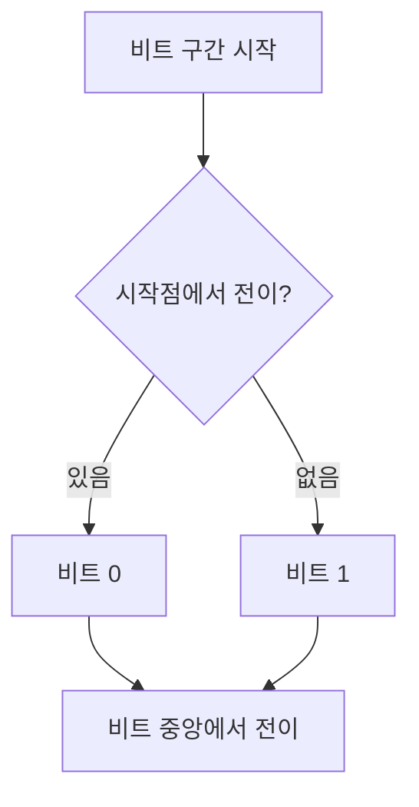

---
sidebar:
  order: 24
  label: "024. 차동 맨체스터 부호화"
  badge:
    text: "기초"
    variant: note
title: "차동 맨체스터 부호화"
author: "Codex"
date: "2026-09-24T00:00:00+09:00"
tags:
  - "notes-network"
weight: 24
extra:
  model: "GPT-6"
  keyword_grade: "기초"
  question_no: "024"
---

## 지식 로드맵 내 현재 위치

지식 위치: 네트워크 → 물리 계층 부호화 → **차동 맨체스터 부호화**

## 30초 인출

- 본질: **차동 맨체스터 부호화(Differential Manchester Encoding)** : 비트 경계의 전이 유무로 데이터를 표시하고 비트 중앙 전이로 수신 동기를 제공하는 선로 부호
- 메커니즘: 매 비트 중앙에서 전이 → 비트 시작 전이 여부를 판정 → 비트값 복원

핵심 용어

- **차동 맨체스터 부호화(Differential Manchester Encoding)** : 비트 중앙 전이를 유지하며 비트 경계의 전이 여부로 정보를 표현하는 부호
- **비트 경계 전이(Bit-boundary Transition)** : 이 부호에서 비트값을 나타내는 비트 시작 시점의 신호 변화
- **자가 클로킹(Self-clocking)** : 신호의 규칙적인 전이에서 수신 타이밍을 복원하는 성질
- **극성 반전(Polarity Inversion)** : 송수신 배선·회로 극성 변화로 신호의 High와 Low가 뒤바뀌는 현상; 차동 판정은 절대 레벨에 의존하지 않음
- **라인 코딩(Line Coding)** : 비트열을 전송 매체에 맞는 신호 파형으로 표현하는 방식

---

## 1교시 예상문제 (10점)

> 차동 맨체스터 부호화의 비트값 표현과 동기화 원리를 설명하시오. (예상·10점)

---

## 1교시 10점 답안

### Ⅰ. 차동 맨체스터 부호화의 개요

| 구분 | 핵심 |
|---|---|
| 정의 | **차동 맨체스터 부호화** : 비트 중앙 전이로 동기를 제공하고 시작 전이 유무로 데이터를 표현하는 선로 부호 |
| 목적 | 별도 클록선 없이 비트 경계·중앙의 전이로 데이터와 수신 타이밍 표현 |

### Ⅱ. 비트값 부호화 규칙

IEEE 802.5 토큰링 관련 자료에서 0은 비트 시작 전이, 1은 시작 전이 없음으로 설명. 매 비트 중앙 전이는 클록 복원에 쓰임.

- 제언: 시작점 전이와 중앙 전이의 서로 다른 역할을 기준으로 파형 판독.

---

## 2~4교시 예상문제 (25점)

> 차동 맨체스터 부호화의 규칙·파형·장단점을 설명하고, 맨체스터 부호화와 비교하시오. (예상·25점)

---

## 2~4교시 25점 답안

### Ⅰ. 차동 맨체스터 부호화의 개요

| 구분 | 핵심 |
|---|---|
| 정의 | **차동 맨체스터 부호화** : 비트 중앙 전이로 동기를 제공하고 시작 전이 유무로 데이터를 표현하는 선로 부호 |
| 목적 | 별도 클록선 없이 비트 경계·중앙의 전이로 데이터와 수신 타이밍 표현 |

### Ⅱ. 부호화·복호화 흐름

수신기는 매 비트 중앙의 전이에서 동기를 맞춘 뒤 구간 시작점의 전이 유무를 읽어 데이터 비트를 복원.

### Ⅲ. 파형 규칙

| 비트 구간 | 비트 0 | 비트 1 | 공통 |
|---|---|---|---|
| 시작점 | 전이 발생 | 전이 없음 | 직전 신호 레벨 기준으로 판정 |
| 중앙 | 전이 발생 | 전이 발생 | 수신 타이밍 기준 제공 |

### Ⅳ. 맨체스터 부호화와 비교

| 구분 | 맨체스터 | 차동 맨체스터 |
|---|---|---|
| 데이터 표현 | 중앙 전이 방향 | 시작 전이 유무 |
| 비트 중앙 | 항상 전이 | 항상 전이 |
| 판정 기준 | 절대 전이 방향 | 직전 상태와의 차이 |
| 극성 반전 영향 | 전이 방향 판정이 달라질 수 있음 | 전이 유무 기반이라 영향 감소 |

시작 전이의 0/1 대응은 사용 규격에 따라 다를 수 있으므로 문제에 제시된 규칙 또는 표준을 우선 적용.

### Ⅴ. 장점과 한계

| 관점 | 내용 |
|---|---|
| 장점 | 매 비트 중앙 전이로 동기 정보를 제공, 연속 같은 값에서도 비트 경계가 유지, 절대 전압 극성에 덜 의존 |
| 한계 | 비트당 1~2회 전이로 대역폭 요구가 커질 수 있음; 구체적인 전이 빈도는 데이터 패턴에 의존 |
| 적용 판단 | 동기·극성 내성의 이점과 대역폭·회로 복잡도를 매체·속도 기준으로 비교 |

### Ⅵ. 기술사적 제언

| 우선 선택 | 적용·확인 |
|---|---|
| 동기 복구와 극성 내성이 필요한 전송에서 후보 부호로 평가 | 목표 비트율·선로 대역폭·수신기 구현을 실제 파형 시험으로 검증 |

---

## 출제 이력과 검증 출처

- 제140회 1교시 10번: “차등적 맨체스터(Differential Manchester) 부호화 방법”
- [IEEE 802.3 Study Group technical presentation](https://grouper.ieee.org/groups/802/3/cg/public/Nov2017/An_3cg_01_1117.pdf) — 중간 전이·경계 전이 및 차동 맨체스터 규칙 비교

## 연결 토픽

- 연관 토픽: [차동적 맨체스터 부호화](./025_differential_manchester_coding.md)
