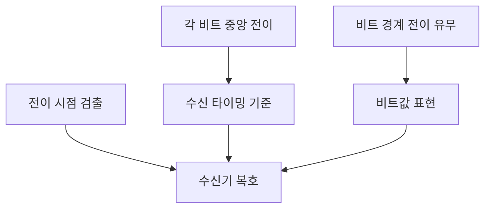

---
sidebar:
  order: 25
  label: "025. 차동적 맨체스터 부호화"
  badge:
    text: "서브"
    variant: note
title: "차동적 맨체스터(Differential Manchester) 부호화"
author: "Codex"
date: "2026-09-24T00:00:00+09:00"
tags:
  - "notes-network"
weight: 25
extra:
  model: "GPT-6"
  keyword_grade: "서브"
  question_no: "025"
---

## 지식 로드맵 내 현재 위치

지식 위치: 네트워크 → 물리 계층 부호화 → 차동 부호 → **차동적 맨체스터 부호화**

## 30초 인출

- 본질: **차동 맨체스터 부호화(Differential Manchester Encoding)** : 비트 중앙의 전이로 동기화하고 비트 경계 전이의 유무로 데이터를 표현하는 라인 코드
- 메커니즘: 모든 비트 중앙에서 전이, 비트 시작 전이 유무 판정, 규격의 비트값 대응에 따라 복호

핵심 용어

- **차동 맨체스터 부호화(Differential Manchester Encoding)** : 비트 중앙 전이를 동기 기준으로 삼고 비트 경계 전이로 비트값을 표현하는 라인 코드
- **라인 코드(Line Code)** : 디지털 비트열을 물리 전송 신호로 나타내는 부호 방식
- **자가 클로킹(Self-clocking)** : 신호의 주기적 전이에서 수신기가 타이밍 정보를 얻는 성질
- **비트 경계 전이(Bit-boundary Transition)** : 비트 구간 시작에서 신호 레벨이 바뀌는 현상
- **맨체스터 부호화(Manchester Encoding)** : 비트 중앙 전이 방향으로 값을 표현하는 라인 코드
- **NRZ(Non-Return-to-Zero)** : 비트 구간 내 신호 레벨을 유지하고 매 비트마다 기준 레벨로 돌아오지 않는 계열의 부호

---

## 1교시 예상문제 (10점)

> 차동적 맨체스터 부호화의 개념과 주요 특성을 설명하시오. (예상·10점)

---

## 1교시 10점 답안

### Ⅰ. 차동적 맨체스터 부호화의 개요

| 구분 | 핵심 |
|---|---|
| 정의 | **차동적 맨체스터 부호화** : 비트 중앙 전이로 동기화하고 비트 경계 전이 유무로 데이터를 표현하는 라인 코드 |
| 목적 | 데이터 부호와 수신 타이밍 정보를 한 신호에 함께 표현 |

### Ⅱ. 특성과 판독 기준

각 비트 중앙 전이는 일정한 타이밍 기준을 제공. 경계 전이의 0/1 대응은 채택 규격 확인.

- 제언: 비트값 규칙과 중앙 전이의 동기 역할을 구분한 부호 선택.

---

## 2~4교시 예상문제 (25점)

> 차동적 맨체스터 부호화의 신호 표현·동기 특성을 설명하고, NRZ 및 맨체스터 부호와 비교해 적용 기준을 제시하시오. (예상·25점)

---

## 2~4교시 25점 답안

### Ⅰ. 차동적 맨체스터 부호화의 개요

| 구분 | 핵심 |
|---|---|
| 정의 | **차동적 맨체스터 부호화** : 비트 중앙 전이로 동기화하고 비트 경계 전이 유무로 데이터를 표현하는 라인 코드 |
| 목적 | 데이터 부호와 수신 타이밍 정보를 한 신호에 함께 표현 |

### Ⅱ. 부호 생성과 복호

인코더는 각 비트의 시작·중앙 전이를 이 규칙에 맞춰 파형으로 표현하며, 수신기는 중앙 전이로 동기화한 뒤 경계 전이 유무를 판정.

### Ⅲ. 주요 특성

| 특성 | 의미 | 설계 고려 |
|---|---|---|
| 매 비트 중앙 전이 | 연속 비트에서도 타이밍 참조 가능 | 전이 검출·클록 복구 회로 필요 |
| 차동 판정 | 절대 전압 레벨 대신 전이 유무로 값 판정 | 극성 반전의 영향 감소 |
| 전이 수 | 비트당 중앙 전이 1회, 경계 전이가 있으면 추가 1회 | 전이 밀도에 따른 대역폭·에너지 비용 |
| 전압 균형 | 중앙 전이로 각 비트 구간에 상·하 레벨이 나타남 | 실제 선로 평균·필터 특성은 파형·구현 조건 확인 |

### Ⅳ. 라인 코드 비교

| 구분 | NRZ 계열 | 맨체스터 | 차동 맨체스터 |
|---|---|---|---|
| 데이터 표현 | 신호 레벨 또는 전이 | 비트 중앙 전이 방향 | 비트 경계 전이 유무 |
| 비트 중앙 전이 | 보장되지 않음 | 매 비트 발생 | 매 비트 발생 |
| 동기 특성 | 연속 동일 비트에서 전이 부족 가능 | 자체 동기 정보 | 자체 동기 정보 |
| 극성 반전 | 레벨 해석이 영향 받을 수 있음 | 상승·하강 방향 해석이 영향 받을 수 있음 | 전이 유무 판정으로 영향 완화 |
| 전송 비용 | 상대적으로 낮은 전이 밀도 | 비트당 중앙 전이 | 비트당 중앙 전이와 선택적 경계 전이 |

### Ⅴ. 적용 한계와 대응

| 한계 | 대응 |
|---|---|
| 중앙 전이로 전이 밀도·대역폭 요구 증가 | 선로 대역폭과 목표 비트율을 함께 산정 |
| 파형·규격에 따라 0/1 전이 대응이 달라질 수 있음 | 표준과 장비 설정의 부호화 규칙 일치 여부 시험 |
| 손실·잡음으로 전이 검출이 흔들릴 수 있음 | 수신 임계값·클록 복구·선로 품질 검증 |

### Ⅵ. 기술사적 제언

| 우선 선택 | 적용·확인 |
|---|---|
| 속도·선로 조건에서 동기성과 대역폭의 균형을 기준으로 코드 선정 | 실제 파형·비트 오류율·수신 클록 여유를 표준 준수 시험으로 평가 |

---

## 출제 이력과 검증 출처

- 제140회 1교시 10번: “차등적 맨체스터(Differential Manchester) 부호화 방법”
- [IEEE 802.3 Study Group technical presentation](https://grouper.ieee.org/groups/802/3/cg/public/Nov2017/An_3cg_01_1117.pdf) — Manchester와 Differential Manchester의 전이 규칙 비교

## 연결 토픽

- 연관 토픽: [차동 맨체스터 부호화](./024_differential_manchester_encoding.md)
