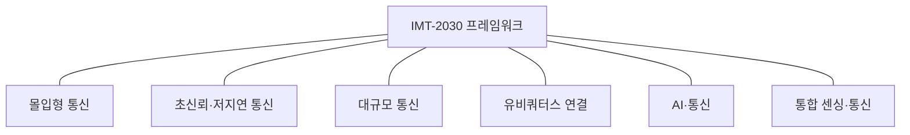

---
sidebar:
  order: 27
  label: "027. 6G 이동통신"
  badge:
    text: "기초"
    variant: note
title: "6G 이동통신"
author: "Codex"
date: "2026-09-24T00:00:00+09:00"
tags:
  - "notes-network"
weight: 27
extra:
  model: "GPT-6"
  keyword_grade: "기초"
  question_no: "027"
---

## 지식 로드맵 내 현재 위치

지식 위치: 네트워크 → 차세대 이동통신 → **6G(IMT-2030)**

## 30초 인출

- 본질: **6G 이동통신(IMT-2030)** : 2030년 이후 이동통신의 사용 시나리오와 성능·기능 목표를 발전시키는 국제 표준화 세대
- 메커니즘: 몰입형 통신·초신뢰 저지연·대규모 통신·유비쿼터스 연결에 AI·센싱 통합 시나리오를 더해 요구 성능·기능을 연구·표준화

핵심 용어

- **IMT-2030(International Mobile Telecommunications-2030)** : ITU-R이 정한 2030년 및 이후 IMT 발전 프레임워크
- **IMT-2020(International Mobile Telecommunications-2020)** : 5G 이동통신 세대의 ITU 명칭
- **ISAC(Integrated Sensing and Communication)** : 통신과 센싱 기능을 함께 다루는 사용 시나리오·기능 영역
- **AI(Artificial Intelligence)** : IMT-2030의 네트워크·서비스 활용을 지원할 수 있는 인공지능 기능
- **NTN(Non-Terrestrial Network)** : 위성·고고도 플랫폼 등 비지상 구성요소를 포함하는 네트워크
- **RIS(Reconfigurable Intelligent Surface)** : 전파 반사 특성을 조정해 무선 환경을 제어하려는 표면 기술 연구 분야
- **피크 데이터율(Peak Data Rate)** : 이상적인 조건에서 단말별 달성 가능한 최대 데이터율
- **사용자 체감 데이터율(User-experienced Data Rate)** : 목표 커버리지에서 사용자가 이용할 수 있는 데이터율

---

## 1교시 예상문제 (10점)

> 6G 이동통신(IMT-2030)의 개념과 주요 사용 시나리오를 설명하시오. (예상·10점)

---

## 1교시 10점 답안

### Ⅰ. 6G 이동통신의 개요

| 구분 | 핵심 |
|---|---|
| 정의 | **6G 이동통신(IMT-2030)** : 2030년 이후 이동통신의 시나리오·성능·기능 발전을 위한 ITU-R 프레임워크 |
| 목적 | 확장된 이동통신 요구와 새로운 사용 시나리오를 지원할 목표·기능 정립 |

### Ⅱ. 사용 시나리오와 기능

- 제언: 시나리오별 요구와 연구 목표를 구분해 6G 서비스를 기획.

---

## 2~4교시 예상문제 (25점)

> 6G 이동통신(IMT-2030)의 프레임워크·사용 시나리오·성능 목표를 설명하고, 연구·상용화 과정의 고려사항을 제시하시오. (예상·25점)

---

## 2~4교시 25점 답안

### Ⅰ. 6G 이동통신의 개요

| 구분 | 핵심 |
|---|---|
| 정의 | **6G 이동통신(IMT-2030)** : 2030년 이후 이동통신의 시나리오·성능·기능 발전을 위한 ITU-R 프레임워크 |
| 목적 | 확장된 이동통신 요구와 새로운 사용 시나리오를 지원할 목표·기능 정립 |

### Ⅱ. IMT-2030 연구 프레임워크

시나리오 상자는 프레임워크가 제시하는 사용 영역으로 연결; 정적 관계이므로 화살표가 아닌 선 사용. ITU-R M.2160은 프레임워크와 발전 목표를 제시하며 무선 인터페이스 세부 규격·최소 요구사항 전체를 확정한 문서로 오해하지 않아야 함.

### Ⅲ. 사용 시나리오

| 시나리오 | 핵심 요구·활용 |
|---|---|
| 몰입형 통신 | XR·원격 다감각 텔레프레즌스 등 고품질 상호작용 |
| 초신뢰·저지연 통신 | 산업 자동화·제어 등 신뢰도·지연 요구가 엄격한 통신 |
| 대규모 통신 | 다수 센서·기기의 연결 |
| 유비쿼터스 연결 | 농촌·원격·미접속 지역의 연결 확대 |
| AI·통신 | AI·분산 컴퓨팅과 이동통신의 연계 |
| 통합 센싱·통신 | 통신 시스템을 이용한 위치·환경·물체 정보 센싱 |

### Ⅳ. 성능 역량 목표의 해석

| 역량 | ITU-R M.2160의 연구 예시 | 해석상 주의 |
|---|---|---|
| 피크 데이터율 | 특정 시나리오의 예시로 50·100·200 Gbit/s | 확정 보장 속도 아님 |
| 사용자 체감 데이터율 | 예시 300·500 Mbit/s | 대상 커버리지·조건에 따라 달라지는 연구 목표 |
| 무선구간 지연 | 예시 범위 0.1–1 ms | 서비스 종단간 지연과 구분 |
| 접속 밀도 | 예시 범위 `10^6–10^8` 기기/km² | 시나리오별 적용·가정 검토 |

ITU는 제시된 값이 연구·조사를 위한 추정 목표이며 모든 역량이 한 시나리오에서 동시에 달성된다는 뜻이 아님을 명시.

### Ⅴ. IMT-2020과 IMT-2030 비교

| 관점 | IMT-2020(5G) | IMT-2030(6G) |
|---|---|---|
| 프레임워크 | eMBB·URLLC·mMTC 중심 | 기존 시나리오 확장과 신규 시나리오 추가 |
| 새 활용 축 | 초광대역·저지연·대규모 기기 연결 | AI·통신, 통합 센싱·통신, 유비쿼터스 연결 등 |
| 규격 상태 | 상용 무선 인터페이스 규격과 배치 생태계 존재 | 프레임워크·연구 목표 기반의 표준화 진행 |

### Ⅵ. 연구·표준화 고려사항

| 고려사항 | 검토 방향 |
|---|---|
| 목표 성능의 실현성 | 주파수·대역폭·전파 환경·배치 시나리오별 평가 |
| 비지상망과의 연동 | ITU 프레임워크와 관련 표준기구의 NTN 규격 범위를 확인 |
| AI·센싱 데이터 보호 | 수집·처리·보유·접근 통제와 통신 품질 요구를 함께 설계 |
| 에너지·비용 영향 | 장비·망 밀도·운영 전력·지속가능성을 포함한 실증 |

### Ⅶ. 기술사적 제언

| 우선 적용 | 추진·확인 |
|---|---|
| 사용 시나리오별로 연구·실증 우선순위 설정 | 성능 목표의 가정·커버리지·비용·상호운용성을 검증하고 단계별 표준화 결과에 맞춰 투자 조정 |

---

## 출제 이력과 검증 출처

- 제130회 2교시: “6G 이동통신의 비전, 주요 성능 지표 및 핵심 기술요소를 설명하시오.”
- [ITU-R Recommendation M.2160-0: IMT-2030 Framework and Overall Objectives](https://www.itu.int/rec/R-REC-M.2160-0-202311-I) — 시나리오·성능 역량 및 예시 목표, 연구 단계 명시
- [ITU: IMT towards 2030 and beyond](https://www.itu.int/en/ITU-R/study-groups/rsg5/rwp5d/imt-2030/pages/default.aspx) — 현재 IMT-2030 표준화 경과

## 연결 토픽

- 연관 토픽: [6G 표준화](./013_6g_standardization.md), [6G 이동통신 기술](./040_6g_mobile_telecommunication_tech.md), [NTN](./006_ntn.md)
