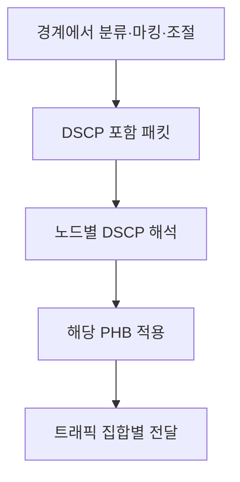

---
sidebar:
  order: 29
  label: "029. DiffServ"
  badge:
    text: "기초"
    variant: note
title: "DiffServ"
author: "Codex"
date: "2026-09-24T00:00:00+09:00"
tags:
  - "notes-network"
weight: 29
extra:
  model: "GPT-6"
  keyword_grade: "기초"
  question_no: "029"
---

## 지식 로드맵 내 현재 위치

지식 위치: 네트워크 → 서비스 품질 제어 → **DiffServ**

## 30초 인출

- 본질: **DiffServ(Differentiated Services)** : 트래픽 집합에 차등 전달 동작을 적용하는 IP QoS 구조
- 메커니즘: 경계에서 트래픽 분류·표시·조절 → DSCP로 PHB 선택 → 도메인 내부에서 집합 단위로 전달

핵심 용어

- **DiffServ(Differentiated Services)** : 집합 단위 차등 서비스 제공을 위한 IP 네트워크 구조
- **DSCP(Differentiated Services Code Point)** : IPv4·IPv6 DS 필드의 6비트 코드점으로 PHB 선택
- **PHB(Per-Hop Behavior)** : 노드가 특정 트래픽 집합에 제공하는 외부 관측 가능한 홉 단위 전달 동작
- **DS 도메인(Differentiated Services Domain)** : 공통 서비스 정책·PHB를 운영하는 관리 범위
- **트래픽 조절(Traffic Conditioning)** : 트래픽 프로파일에 따른 측정·마킹·폴리싱·셰이핑 기능
- **EF(Expedited Forwarding)** : 낮은 손실·지연·지터 서비스의 구성 요소가 되는 PHB
- **AF(Assured Forwarding)** : 트래픽 클래스와 폐기 우선순위를 구분하는 PHB 그룹
- **BE(Best Effort)** : 별도 차등 서비스 처리가 선택되지 않은 트래픽의 기본 전달 동작
- **ECN(Explicit Congestion Notification)** : IP DS 필드의 하위 2비트로 혼잡을 알리는 방식

---

## 1교시 예상문제 (10점)

> DiffServ의 개념과 DSCP·PHB 동작을 설명하시오. (예상·10점)

---

## 1교시 10점 답안

### Ⅰ. DiffServ의 개요

| 구분 | 핵심 |
|---|---|
| 정의 | **DiffServ** : 트래픽 집합에 코드점으로 홉 단위 전달 동작을 선택하는 QoS 구조 |
| 목적 | 흐름별 상태 관리 대신 집합 단위 차등 처리로 서비스 구분 지원 |

### Ⅱ. DSCP에서 PHB까지

- 제언: DSCP 마킹과 도메인 내 PHB 정책을 함께 운영.

---

## 2~4교시 예상문제 (25점)

> DiffServ의 구조와 DSCP·PHB·트래픽 조절 기능을 설명하고, 서비스 품질 편차의 한계 및 대응 방안을 제시하시오. (예상·25점)

---

## 2~4교시 25점 답안

### Ⅰ. DiffServ의 개요

| 구분 | 핵심 |
|---|---|
| 정의 | **DiffServ** : 트래픽 집합에 코드점으로 홉 단위 전달 동작을 선택하는 QoS 구조 |
| 목적 | 흐름별 상태 관리 대신 집합 단위 차등 처리로 서비스 구분 지원 |

### Ⅱ. DSCP에서 PHB까지

IPv4·IPv6 DS 필드 8비트 중 DSCP는 상위 6비트, ECN은 하위 2비트. PHB의 구체적 자원 배분과 관측 품질은 노드 구현·구성·부하에 좌우.

### Ⅲ. 경계 기능과 도메인 내 전달

| 위치 | 기능 | 핵심 처리 |
|---|---|---|
| 도메인 경계 | 분류·미터링 | 정책에 따라 패킷을 트래픽 집합으로 구분·측정 |
| 도메인 경계 | 마킹·폴리싱·셰이핑 | DSCP 부여, 프로파일 초과분 폐기 또는 전송률 조절 |
| 내부 노드 | 분류·PHB 적용 | DSCP를 PHB에 매핑해 큐·스케줄링·폐기 동작 적용 |

DiffServ 코어가 완전히 상태를 보유하지 않는다는 뜻은 아님. 핵심은 흐름별 상태에 의존하지 않고 트래픽 집합을 기준으로 확장성을 높이는 설계.

### Ⅳ. 대표 PHB

| PHB | 기능 요약 | 주의점 |
|---|---|---|
| EF(Expedited Forwarding) | 낮은 손실·지연·지터를 위한 포워딩 동작 구성 | 혼잡 없는 서비스 보장은 프로비저닝·폴리싱·경로 조건에 의존 |
| AF(Assured Forwarding) | 클래스별 자원과 세 단계 폐기 우선순위 제공 | 수신 성능은 도메인 내 정책·부하에 의존 |
| BE(Best Effort) | 기본 전달 동작 | 별도 자원 우선권 없음 |

### Ⅴ. IntServ와 비교

| 관점 | IntServ | DiffServ |
|---|---|---|
| 관리 단위 | 흐름별 예약 상태 | 트래픽 집합 |
| 신호·표시 | RSVP 등 자원 예약 | DSCP 기반 PHB 선택 |
| 확장 특성 | 경로상 상태·수락 제어 요구 | 경계 분류와 집합 단위 전달로 규모 확장에 유리 |
| 품질 표현 | 서비스 모델·자원 승인 조건 | 운영 정책·망 자원·경로 구성에 따른 차등 서비스 |

### Ⅵ. 한계와 대응

| 한계 | 대응 |
|---|---|
| 사업자·도메인 경계에서 DSCP 재매핑 | 도메인 간 트래픽 계약과 코드점 매핑 정책 확인 |
| 과도한 우선 트래픽으로 큐 혼잡 | 경계 폴리싱·셰이핑, 클래스별 용량·우선순위 검증 |
| DSCP만 설정하고 망 내부 PHB 미구성 | 모든 구간의 코드점 매핑·스케줄러·관측 결과 점검 |
| EF 등급에 절대 지연 보장 기대 | 종단 경로·부하·자원 프로비저닝을 포함해 SLA 검증 |

### Ⅶ. 기술사적 제언

| 우선 선택 | 운영·확인 |
|---|---|
| 응용 요구에 맞는 서비스 클래스와 자원 정책 수립 | 경계 마킹부터 도메인 간 매핑·홉별 PHB·종단 품질까지 시험 |

---

## 출제 이력과 검증 출처

- 제125회 1교시: “QoS 보장 기술인 IntServ와 DiffServ를 비교하여 설명하시오.”
- [RFC 2475: An Architecture for Differentiated Services](https://www.rfc-editor.org/rfc/rfc2475)
- [RFC 2474: Definition of the Differentiated Services Field](https://www.rfc-editor.org/rfc/rfc2474)
- [RFC 3246: An Expedited Forwarding PHB](https://www.rfc-editor.org/rfc/rfc3246)
- [RFC 2597: Assured Forwarding PHB Group](https://www.rfc-editor.org/rfc/rfc2597)

## 연결 토픽

- 연관 토픽: [IntServ](./030_intserv.md), [QoS](./032_qos.md)
