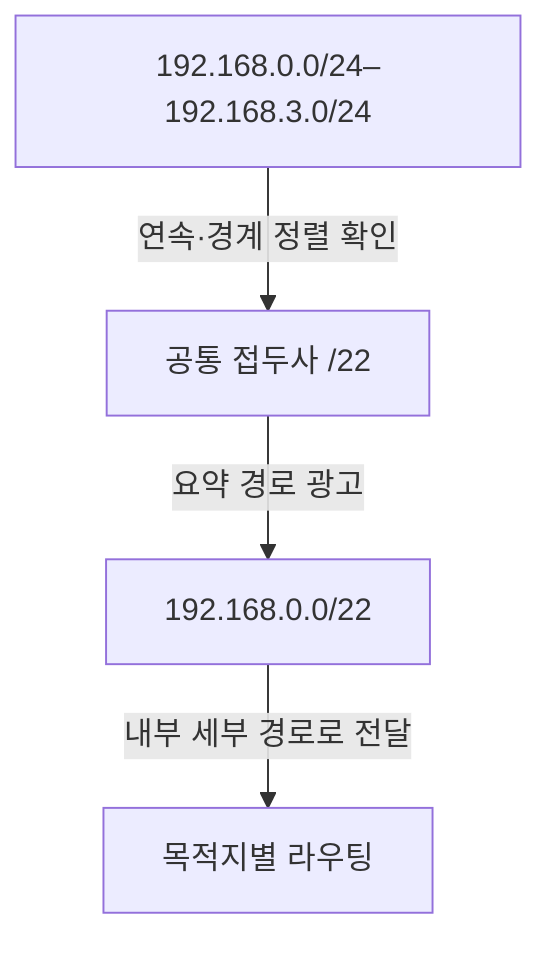
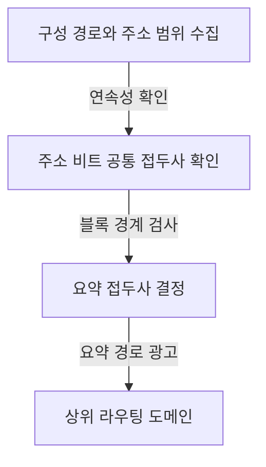
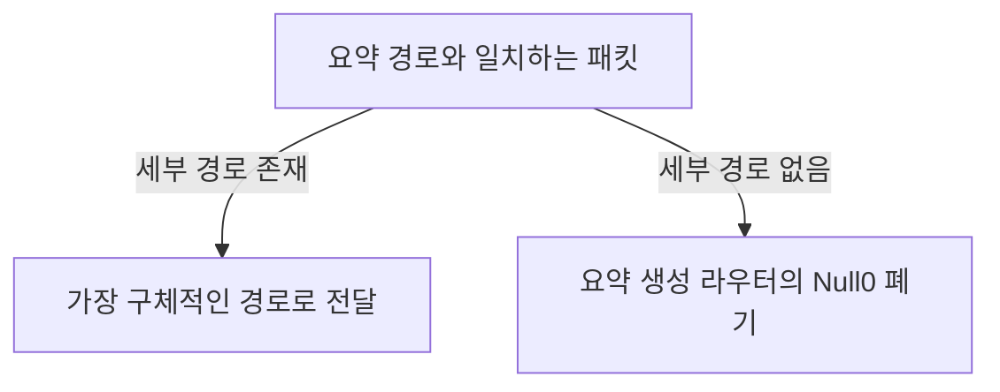

## 지식 로드맵 내 현재 위치

컴퓨터 시스템 및 네트워크 → IP 주소와 라우팅 → CIDR 기반 경로 집약

## 30초 인출

- 본질: **슈퍼네팅 (Supernetting)** 은 연속된 IP 주소 블록의 공통 접두사를 광고해 여러 구체 경로를 하나의 요약 경로로 표현하는 방법
- 메커니즘: 주소 경계 정렬과 도달성 확인 → 요약 경로 광고 → 내부의 더 구체적인 경로로 전달

핵심 용어

- **슈퍼네팅 (Supernetting)** : 연속된 주소 블록을 더 짧은 접두사의 요약 경로로 나타내는 주소·경로 집약 방식.
- **CIDR (Classless Inter-Domain Routing)** : 클래스 구분 대신 접두사 길이로 IPv4 주소 블록을 할당·라우팅하는 체계.
- **경로 집약 (Route Aggregation)** : 여러 도달 가능한 세부 경로를 하나의 상위 접두사 경로로 광고하는 처리.
- **최장 접두사 일치 (Longest Prefix Match)** : 목적지 주소와 일치하는 경로 중 접두사가 가장 긴 경로를 선택하는 포워딩 규칙.
- **Null0 경로** : 요약 범위 안에 실제 도달 경로가 없는 목적지 패킷을 폐기하는 경로.

---

## 1교시 예상문제 (10점)

> 슈퍼네팅의 개념과 목적, 요약 경로를 만드는 조건을 설명하시오. (예상)

---

## 1교시 10점 답안

### Ⅰ. 개요

| 구분 | 핵심 |
|---|---|
| 정의 | **슈퍼네팅 (Supernetting)** 은 연속된 IP 주소 블록의 공통 접두사를 요약 경로로 광고하는 경로 집약 방식 |
| 목적 | 라우팅 상태와 경로 광고량의 감소 |

### Ⅱ. 집약 조건과 예시

같은 길이의 블록 네 개가 연속되고 시작 주소가 집약 경계에 맞는 예. 임의의 인접 경로를 항상 하나로 합칠 수 있는 것은 아님.

제언: 요약 경로를 광고하기 전 포함 주소의 실제 도달성과 경계 정렬 확인

---

## 2~4교시 예상문제 (25점)

> CIDR의 경로 집약 원리와 적용 조건을 설명하고, 요약 범위 안의 미도달 주소 및 다중 연결 환경에서의 운영 방안을 제시하시오. (제130회 2교시 문항을 바탕으로 한 재구성)

---

## 2~4교시 25점 답안

## Ⅰ. 개요

| 구분 | 핵심 |
|---|---|
| 정의 | **슈퍼네팅 (Supernetting)** 은 연속된 IP 주소 블록의 공통 접두사를 요약 경로로 광고하는 경로 집약 방식 |
| 목적 | 라우팅 상태와 경로 광고량의 감소 |

## Ⅱ. 요약 접두사 산출

예: `192.168.0.0/24`부터 `192.168.3.0/24`까지는 네트워크 비트의 공통 접두사 `/22`에 해당. 연속성뿐 아니라 시작 주소의 경계 정렬도 필요.

## Ⅲ. 집약에 따른 전달

| 구분 | 동작 |
|---|---|
| 외부 광고 | 포함된 여러 세부 경로 대신 요약 접두사를 광고 |
| 내부 전달 | 요약 경로를 받은 뒤 목적지와 일치하는 구체 경로 선택 |
| 경로 선택 | 여러 경로가 일치하면 최장 접두사 일치 적용 |

## Ⅳ. 적용 한계와 대응

| 한계 | 대응 |
|---|---|
| 요약 범위에 도달 불가능 주소가 포함되면 해당 목적지로 향한 패킷의 폐기 지점이 불명확 | 요약을 생성하는 라우터에 폐기 경로를 두어 상위 경로로 되돌아가는 루프 방지 |
| 다중 연결 또는 서로 다른 정책 경로는 하나의 집약 경로로 표현되지 않을 수 있음 | 도달성과 정책을 확인하고 필요한 세부 경로를 별도 광고 |

## Ⅴ. 기술사적 제언 — 광고 전 도달성 검증

| 한계 | 해결 방안 |
|---|---|
| 주소만 합쳐 광고하면 실제 도달성·다중 연결 정책과 어긋날 수 있음 | 접두사 경계와 내부 경로 상태를 확인하고, 예외 경로는 구체 경로로 유지한 뒤 변경 영향 시험 |

## 출제 이력과 검증 출처

- 제130회 2교시 문항 원문: CIDR과 슈퍼네팅의 개념·필요성·결합 조건·계산 과정 설명 요구. 위 예상 문항은 요구 범위를 유지한 재구성.
- [RFC 4632, Classless Inter-domain Routing (CIDR)](https://www.rfc-editor.org/rfc/rfc4632.html)

## 연결 토픽

- 연관 토픽: [VLSM](./022_vlsm.md), [라우팅 테이블 룩업](./023_routing_table_lookup.md)
