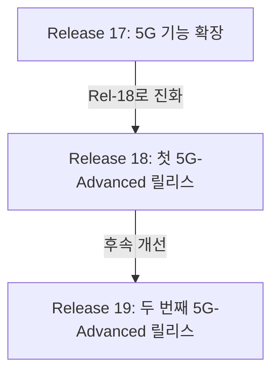
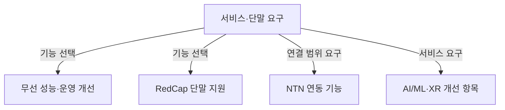

## 지식 로드맵 내 현재 위치

컴퓨터 시스템 및 네트워크 → 이동통신망 진화 → 5G-Advanced

## 30초 인출

- 본질: **5G-Advanced** 는 기존 5G 시스템을 성능·기능 측면에서 확장하는 3GPP의 진화 단계
- 메커니즘: Release 18을 첫 단계로 무선 성능, 단말·IoT, 비지상망 등 기존 기능을 개선하고 Release 19에서 후속 기능 확장

핵심 용어

- **5G-Advanced** : 3GPP Release 18부터 시작된 5G 시스템의 진화 단계.
- **3GPP (3rd Generation Partnership Project)** : 이동통신 기술 규격을 개발하는 표준화 협력체.
- **Release 18 (Rel-18)** : 3GPP의 첫 5G-Advanced 릴리스.
- **Release 19 (Rel-19)** : Rel-18에 이은 두 번째 5G-Advanced 릴리스.
- **RedCap (Reduced Capability)** : 기능·성능 범위를 낮춰 복잡도와 전력 요구를 줄인 5G NR 단말 범주.
- **NTN (Non-Terrestrial Network)** : 위성 등 비지상 노드를 이용하는 이동통신망 구성.
- **AI/ML (Artificial Intelligence / Machine Learning)** : 무선망 데이터·모델을 이용해 성능 최적화 가능성을 다루는 기술 영역.
- **XR (Extended Reality)** : 가상·증강·혼합 현실을 포괄하는 몰입형 서비스 범주.

---

## 1교시 예상문제 (10점)

> 5G-Advanced의 개념과 추진 목적, 주요 진화 방향을 설명하시오. (예상)

---

## 1교시 10점 답안

### Ⅰ. 개요

| 구분 | 핵심 |
|---|---|
| 정의 | **5G-Advanced** 는 3GPP Release 18부터 시작된 5G 시스템의 진화 단계 |
| 목적 | 5G의 성능과 적용 범위를 지속 확장 |

### Ⅱ. 진화 방향

| 방향 | 예 |
|---|---|
| 무선망 성능·운영 | 다중 안테나, 커버리지, 에너지 효율 개선 |
| 단말 범위 | RedCap 등 다양한 단말 요구 반영 |
| 연결 범위 | NTN 지원과 지상망 연동 개선 |
| 지능화·서비스 | AI/ML 적용 연구와 XR 등 서비스 지원 개선 |

Rel-18/19에 포함된 기능과 적용 시점은 세부 규격별로 다름. 기술 항목 전체를 하나의 동시 상용 기능으로 볼 수 없음.

제언: 릴리스 번호가 아닌 실제 규격·단말·망 지원을 기준으로 적용 범위 판단

---

## 2~4교시 예상문제 (25점)

> 5G-Advanced의 개념과 릴리스 진화, 주요 기술 방향 및 적용 시 고려사항을 설명하시오. (예상)

---

## 2~4교시 25점 답안

## Ⅰ. 개요

| 구분 | 핵심 |
|---|---|
| 정의 | **5G-Advanced** 는 3GPP Release 18부터 시작된 5G 시스템의 진화 단계 |
| 목적 | 5G의 성능과 적용 범위를 지속 확장 |

## Ⅱ. 릴리스 진화

3GPP Release 18은 2024년 6월 동결, Release 19는 2025년 12월 동결. 릴리스 동결은 모든 구현·서비스의 같은 시점 상용화를 뜻하지 않음.

## Ⅲ. 주요 진화 방향

| 기술 영역 | 진화 방향 | 적용 시 확인점 |
|---|---|---|
| 무선 성능·운영 | 커버리지·다중 안테나·에너지 효율 개선 | 기지국 기능·단말 조합 |
| 단말·IoT | RedCap 등 요구별 기능 수준 제공 | 주파수·대역폭·단말 등급 |
| 비지상망 | NTN 연동 기능 개선 | 위성 구성·지연·서비스 범위 |
| 지능화·서비스 | AI/ML, XR 등 관련 기능 연구·개선 | 적용 규격과 실제 장비 지원 |

분야 분류도이며 네 기술 영역이 순차 처리된다는 뜻은 아님.

## Ⅳ. 도입 한계와 관리

| 한계 | 관리 방안 |
|---|---|
| 릴리스 표기만으로 실제 지원 기능을 알기 어려움 | 세부 규격 버전·장비 기능·상용 적용 상태 확인 |
| 신규 기능이 단말·기지국·코어 간 상호운용에 의존 | 대상 서비스 구성으로 종단 간 적합성 검증 |
| 성능 개선이 주파수·환경·부하에 따라 달라짐 | 기존 망과 동일 조건에서 계측 후 운영 정책 결정 |

## Ⅴ. 기술사적 제언 — 요구 기능 중심의 도입 순서

| 한계 | 해결 방안 |
|---|---|
| 릴리스의 기능 목록을 일괄 도입하면 서비스 효과와 상호운용 위험을 구분하기 어려움 | 서비스 요구에 직접 연결되는 기능을 우선 선정하고, 단말·기지국 검증 결과에 따라 적용 범위 확대 |

## 출제 이력과 검증 출처

- 관련 기출 미확인으로 예상문제 구성
- [3GPP Releases](https://www.3gpp.org/specifications-technologies/releases)
- [3GPP, Working Group Reports to RAN Plenary #113](https://www.3gpp.org/news-events/3gpp-news/ran113-reports)

## 연결 토픽

- 연관 토픽: [5G 단독모드](./038_5g_sa.md), [6G 이동통신기술](./040_6g_mobile_telecommunication_tech.md)
