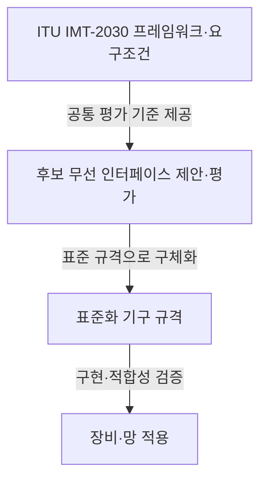
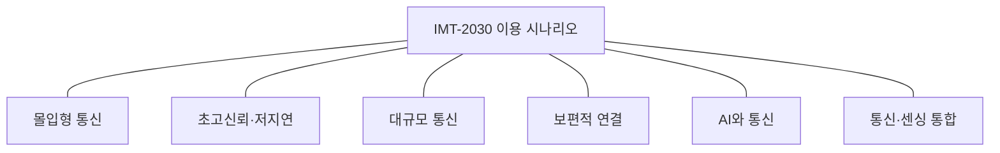

## 지식 로드맵 내 현재 위치

컴퓨터 시스템 및 네트워크 → 차세대 이동통신 → IMT-2030(6G)

## 30초 인출

- 본질: **6G 이동통신 (IMT-2030)** 은 2030년 이후 이동통신의 이용 시나리오와 성능 목표를 정립하는 차세대 국제 표준화 대상
- 메커니즘: ITU의 공통 프레임워크·요구 조건 → 표준화 기구의 무선 인터페이스 제안·평가 → 장비·망의 구현과 검증

핵심 용어

- **IMT-2030 (International Mobile Telecommunications-2030)** : ITU가 정한 차세대 이동통신 시스템의 국제 프레임워크 명칭.
- **ITU (International Telecommunication Union)** : 정보통신 분야 국제 표준·전파 조정을 담당하는 국제기구.
- **RIT (Radio Interface Technology)** : 이동통신 시스템의 무선 접속 기술 제안 단위.
- **ISAC (Integrated Sensing and Communication)** : 통신과 센싱 기능을 연계하는 이용 시나리오·기술 방향.
- **AIAC (Artificial Intelligence and Communication)** : 인공지능과 통신을 함께 고려하는 이용 시나리오.
- **HRLLC (Hyper Reliable and Low-Latency Communication)** : 높은 신뢰성과 낮은 지연이 요구되는 통신 시나리오.
- **NTN (Non-Terrestrial Network)** : 위성 등 비지상 노드를 포함하는 네트워크 구성.

---

## 1교시 예상문제 (10점)

> 6G 이동통신기술의 개념과 추진 목적, 주요 이용 시나리오를 설명하시오. (예상)

---

## 1교시 10점 답안

### Ⅰ. 개요

| 구분 | 핵심 |
|---|---|
| 정의 | **6G 이동통신 (IMT-2030)** 은 2030년 이후 이동통신의 이용 시나리오와 성능 목표를 정립하는 차세대 국제 표준화 대상 |
| 목적 | 기존 이동통신의 기능 확장과 새로운 이용 시나리오 지원 |

### Ⅱ. 주요 이용 시나리오

| 시나리오 | 핵심 요구 |
|---|---|
| 몰입형 통신 | 고품질·상호작용형 미디어 |
| 초고신뢰·저지연 통신 | 시간 민감 산업·제어 통신 |
| 대규모 통신 | 다수 기기·센서 연결 |
| 보편적 연결 | 원격·소외 지역 연결 지원 |
| AI와 통신 | 통신과 AI 기능의 연계 |
| 통신·센싱 통합 | 통신 신호와 환경 인식의 연계 |

이용 시나리오는 목표 프레임워크이며, 특정 장비·기술의 보편적 상용화를 뜻하지 않음.

제언: 시나리오별 요구조건과 표준 상태를 구분해 6G 적용성 판단

---

## 2~4교시 예상문제 (25점)

> 6G 이동통신기술(IMT-2030)의 추진 배경과 표준화 단계, 주요 이용 시나리오 및 기술·정책 고려사항을 설명하시오. (예상)

---

## 2~4교시 25점 답안

## Ⅰ. 개요

| 구분 | 핵심 |
|---|---|
| 정의 | **6G 이동통신 (IMT-2030)** 은 2030년 이후 이동통신의 이용 시나리오와 성능 목표를 정립하는 차세대 국제 표준화 대상 |
| 목적 | 기존 이동통신의 기능 확장과 새로운 이용 시나리오 지원 |

## Ⅱ. 표준화 구조와 현황

표준화 흐름은 목표·평가 기준에서 기술 제안과 규격화를 거쳐 구현으로 이어지는 단계. 2026년 9월 현재 ITU-R의 IMT-2030 프레임워크와 성능 요구 개발이 진행 중이며, 구체 무선 기술을 최종 6G 표준으로 확정한 상태는 아님.

## Ⅲ. 이용 시나리오와 역량

| 시나리오 | 지원 방향 | 연계 고려 |
|---|---|---|
| 몰입형 통신 | 실감형 미디어 상호작용 | 데이터율·동기화·이동성 |
| HRLLC | 신뢰성·지연 민감 통신 | 종단 간 지연·가용성 |
| 대규모 통신 | 다수 센서·기기 연결 | 단말 전력·접속 밀도 |
| 보편적 연결 | 원격 지역·이동체 연결 | 지상·위성 등 접속 연동 |
| AIAC | AI와 통신의 연계 | 데이터·모델·망 자원 관리 |
| ISAC | 센싱과 통신의 결합 | 신호 설계·개인정보·전파 공존 |

ITU-R M.2160의 프레임워크는 시나리오와 역량 목표를 제시하며, 구체 기술 구현을 하나로 지정하지 않음.

정적 분류도이며 시나리오 간 처리 순서를 뜻하지 않음.

## Ⅳ. 적용 고려사항

| 한계 | 검토 항목 |
|---|---|
| 성능 목표를 구현 보장치로 오해할 위험 | 표준 요구와 실제 장비 성능을 구분해 시험 |
| 고주파·신규 무선 기법의 전파·전력·구축 비용 변수 | 주파수·전파 환경·기지국 밀도별 실증 |
| 지상망만으로 연결하기 어려운 지역 | NTN 등 보완 접속의 비용·지연·규제 검토 |
| 센싱·AI 기능 확대에 따른 정보·보안 문제 | 데이터 처리·접근 통제와 보안 요구 정의 |

고주파 대역, RIS, AI 기반 무선 제어 등은 연구·표준화에서 검토되는 기술 방향이며, 모두가 필수 6G 구성 요소로 확정된 것은 아님.

## Ⅴ. 기술사적 제언 — 목표와 구현을 분리한 단계 평가

| 한계 | 해결 방안 |
|---|---|
| 시나리오·성능 목표만으로 투자 우선순위와 실제 서비스 가능성을 결정하기 어려움 | 우선 서비스별 측정 지표를 정하고 후보 기술의 실증 결과와 표준 성숙도를 함께 확인한 뒤 적용 범위 확대 |

## 출제 이력과 검증 출처

- 제135회 2교시의 6G 이동통신기술 문항을 바탕으로 기본 개념·기술 방향·고려사항으로 재구성
- [ITU-R Recommendation M.2160, IMT-2030 Framework](https://www.itu.int/rec/R-REC-M.2160-0-202311-I)
- [ITU, IMT-2030 technical requirements update (2026)](https://www.itu.int/hub/2026/03/imt-2030-technical-requirements-for-the-6g-future/)
- [3GPP, Working Group Reports to RAN Plenary #113](https://www.3gpp.org/news-events/3gpp-news/ran113-reports)

## 연결 토픽

- 연관 토픽: [5G-Advanced](./039_5g_advanced.md), [6G·위성통신 융합](./041_6g_satellite_convergence.md)
