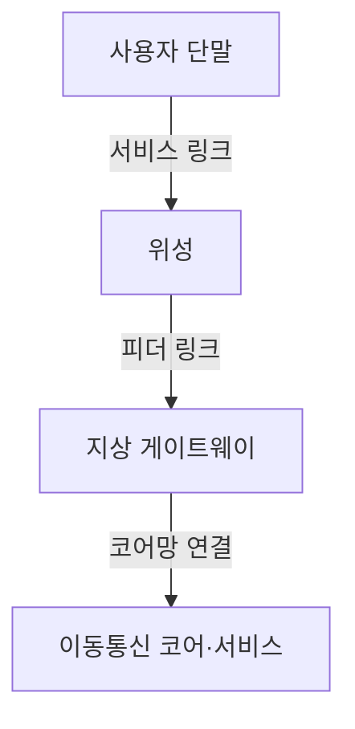
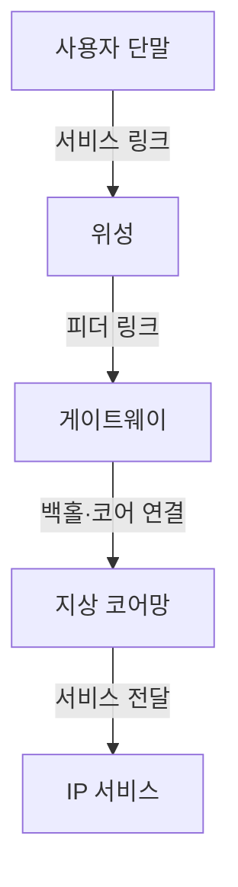
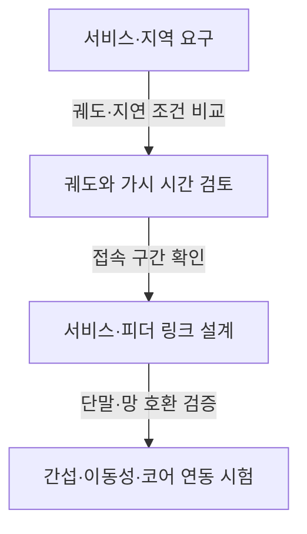

## 지식 로드맵 내 현재 위치

컴퓨터 시스템 및 네트워크 → 차세대 이동통신 → 지상망·비지상망 연동

## 30초 인출

- 본질: **6G·위성통신 융합** 은 지상 이동통신과 위성 등 비지상망의 연동으로 서비스 연결 범위를 확장하려는 차세대 네트워크 방향
- 메커니즘: 단말 → 위성 무선 구간 → 위성 게이트웨이 또는 위성 간 링크 → 지상 코어망·서비스

핵심 용어

- **NTN (Non-Terrestrial Network)** : 위성·고고도 플랫폼 등 비지상 노드를 포함하는 통신망 구성.
- **LEO (Low Earth Orbit)** : 지구 저궤도 위성 운용 영역. 이동에 따른 핸드오버와 도플러 영향 고려.
- **서비스 링크 (Service Link)** : 사용자 단말과 위성 사이의 무선 링크.
- **피더 링크 (Feeder Link)** : 위성과 지상 게이트웨이 사이의 통신 링크.
- **ISL (Inter-Satellite Link)** : 위성 간 트래픽 전달에 사용하는 링크.
- **D2D (Direct-to-Device)** : 별도 전용 단말에 한정하지 않고 사용자 단말이 위성과 직접 연결되는 서비스 방식. 지원 대역·단말·사업자 조건에 의존.
- **투명 페이로드 (Transparent Payload)** : 위성에서 무선 신호를 주로 변환·중계하고 기지국 기능을 지상에 두는 구성.
- **재생 페이로드 (Regenerative Payload)** : 위성 탑재체에서 일부 기지국·패킷 처리 기능을 수행하는 구성.

---

## 1교시 예상문제 (10점)

> 6G·위성통신 융합의 개념과 목적, 기본 연결 구조를 설명하시오. (예상)

---

## 1교시 10점 답안

### Ⅰ. 개요

| 구분 | 핵심 |
|---|---|
| 정의 | **6G·위성통신 융합** 은 지상 이동통신과 위성 등 비지상망을 연동해 서비스 연결 범위를 확장하는 차세대 네트워크 방향 |
| 목적 | 지상 기지국의 도달 범위를 넘어서는 연결 보완 |

### Ⅱ. 기본 연결 구조

위성의 탑재 기능과 궤도에 따라 지연·커버리지·단말 조건이 달라짐. 위성 접속이 일반 단말에서 항상 가능하다는 뜻은 아님.

제언: 서비스 지역·단말·주파수 조건을 확인해 위성 연동 적용 범위 설정

---

## 2~4교시 예상문제 (25점)

> 지상 이동통신과 위성통신의 융합 구조를 설명하고, 탑재체 방식별 차이 및 서비스 적용 시 고려사항을 제시하시오. (예상)

---

## 2~4교시 25점 답안

## Ⅰ. 개요

| 구분 | 핵심 |
|---|---|
| 정의 | **6G·위성통신 융합** 은 지상 이동통신과 위성 등 비지상망을 연동해 서비스 연결 범위를 확장하는 차세대 네트워크 방향 |
| 목적 | 지상 기지국의 도달 범위를 넘어서는 연결 보완 |

## Ⅱ. 기본 네트워크 경로

위성 간 링크가 있는 구성에서는 위성이 트래픽을 중계할 수 있으며, 게이트웨이 수·위치와 위성 탑재 기능은 시스템 설계에 따라 달라짐.

## Ⅲ. 페이로드 구성 방식

| 구분 | 투명 페이로드 | 재생 페이로드 |
|---|---|---|
| 위성 기능 | 신호 변환·중계 중심 | 위성 내 기지국·패킷 처리 기능 일부 수행 |
| 지상 역할 | 기지국 기능을 지상에 배치 | 게이트웨이·코어와 위성 처리 기능 연동 |
| 설계 고려 | 단순 탑재체·지상 처리 부담 | 위성 처리 복잡도·전력·운영 관리 |

## Ⅳ. 적용 한계와 대응

| 한계 | 검토·대응 |
|---|---|
| 위성 이동에 따른 접속 변경과 도플러 영향 | 궤도·단말 속도·주파수 조건으로 이동성·동기 절차 검증 |
| 전파 지연과 가시 시간의 차이 | 서비스 지연 요구와 위성·게이트웨이 구성을 함께 평가 |
| 대역 공유·규제·사업자 조건의 제약 | 주파수 이용 조건과 지상망 간섭·공존 검토 |
| 전용 위성망과 일반 단말 직접 연결의 차이 | 단말 RF 지원·사업자 연동·서비스 지역을 별도 확인 |

3GPP NR-NTN은 5G Release 17부터 표준화가 진행된 영역. 이를 6G의 확정 구조나 모든 단말의 직접 위성 접속으로 단정할 수 없음.

## Ⅴ. 기술사적 제언 — 요구 서비스에 맞는 위성 구성 선택

| 한계 | 해결 방안 |
|---|---|
| 모든 지역·서비스에 동일한 궤도와 탑재체 구성을 적용하면 지연·비용·단말 지원의 편차를 반영하기 어려움 | 긴급·원격 연결 등 우선 서비스를 정하고 지역별 지연·가용성·단말 조건으로 궤도와 페이로드 구성을 선택 |

## 출제 이력과 검증 출처

- 관련 기출 미확인으로 예상문제 구성
- [ITU-R Recommendation M.2160, IMT-2030 Framework](https://www.itu.int/rec/R-REC-M.2160-0-202311-I)
- [3GPP TS 38.300, NR and NG-RAN Overall Description](https://www.3gpp.org/dynareport/38300.htm)
- [3GPP TR 38.821, Solutions for NR to Support Non-Terrestrial Networks](https://www.3gpp.org/dynareport/38821.htm)

## 연결 토픽

- 연관 토픽: [6G 이동통신기술](./040_6g_mobile_telecommunication_tech.md), [5G-Advanced](./039_5g_advanced.md)
