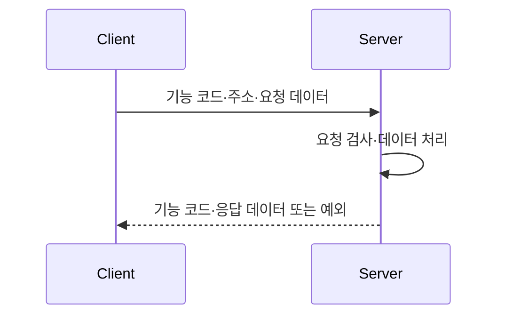
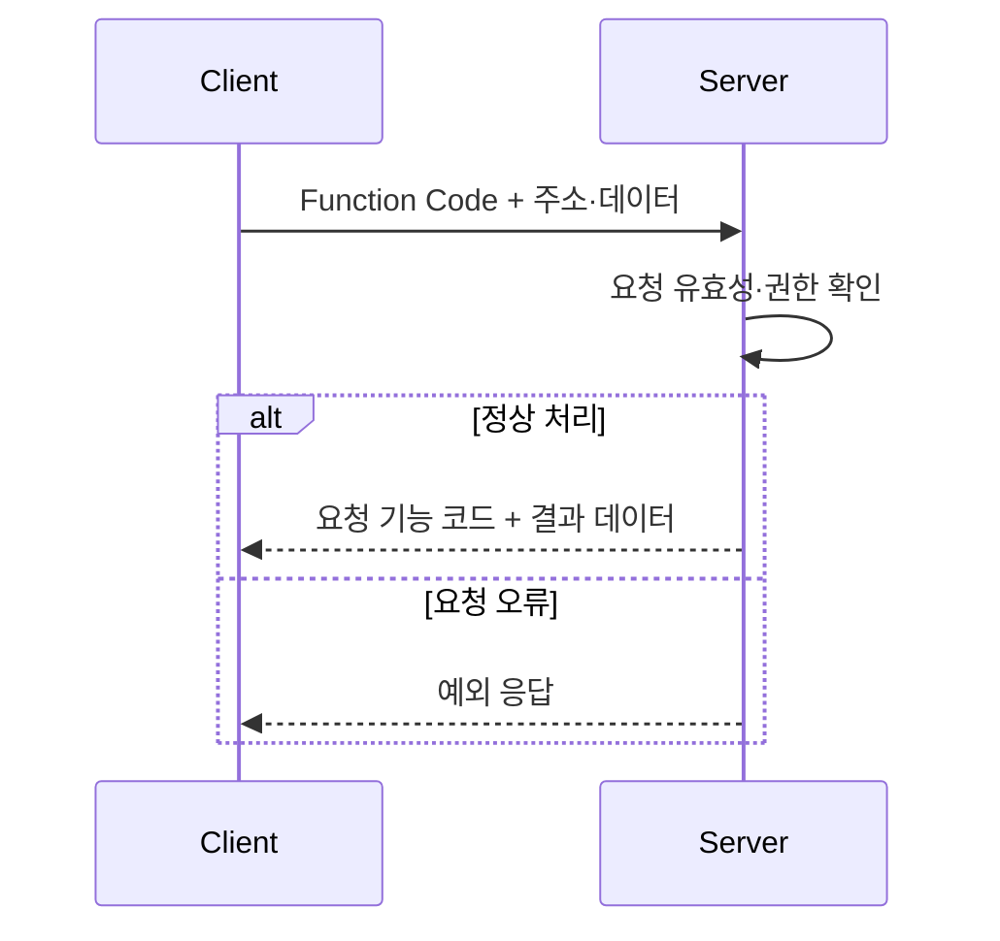
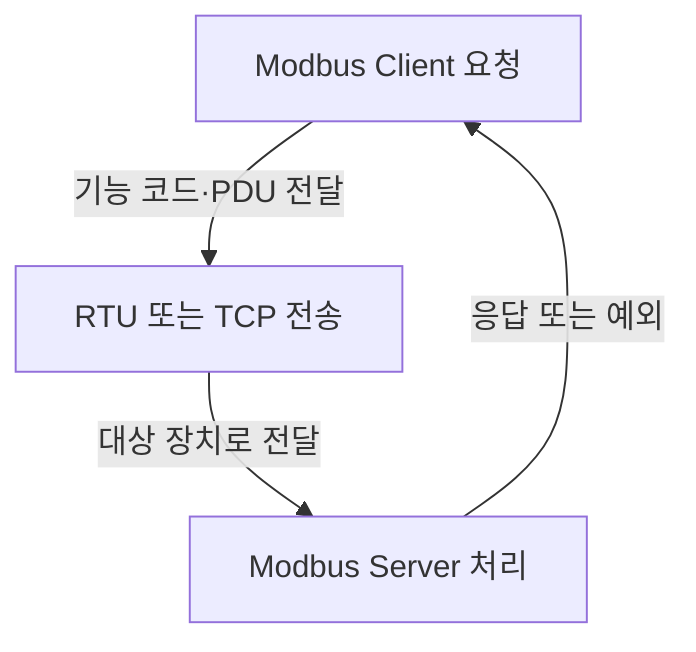

## 지식 로드맵 내 현재 위치

컴퓨터 시스템 및 네트워크 → 산업 통신 프로토콜 → MODBUS

## 30초 인출

- 본질: **MODBUS** 는 산업 장치가 기능 코드와 데이터 주소를 사용해 요청·응답 메시지를 주고받는 응용 계층 프로토콜
- 메커니즘: Client 요청의 기능 코드·주소·데이터 → Server의 처리·응답 → 전송 방식별 프레임으로 전달

핵심 용어

- **MODBUS** : 산업 장치 사이에서 기능 코드로 읽기·쓰기 요청과 응답을 교환하는 응용 계층 프로토콜.
- **Client / Server** : 요청을 시작하는 장치와 요청을 처리해 응답하는 장치.
- **PDU (Protocol Data Unit)** : 기능 코드와 기능별 데이터를 담는 MODBUS 프로토콜 데이터 단위.
- **Coil** : 1비트 단위의 읽기·쓰기 데이터 항목.
- **Discrete Input** : 1비트 단위의 읽기 전용 데이터 항목.
- **Input Register** : 16비트 단위의 읽기 전용 데이터 항목.
- **Holding Register** : 16비트 단위의 읽기·쓰기 데이터 항목.
- **MBAP (Modbus Application Protocol) Header** : Modbus TCP에서 트랜잭션·길이·장치 식별 정보를 PDU 앞에 담는 헤더.
- **Modbus Security** : TLS와 X.509 인증서를 이용해 Modbus 통신을 보호하는 프로토콜.
- **TLS (Transport Layer Security)** : 통신 구간의 인증·기밀성·무결성을 지원하는 보안 프로토콜.

---

## 1교시 예상문제 (10점)

> MODBUS의 개념과 데이터 모델, 요청·응답 구조를 설명하시오. (예상)

---

## 1교시 10점 답안

### Ⅰ. 개요

| 구분 | 핵심 |
|---|---|
| 정의 | **MODBUS** 는 기능 코드와 데이터 주소를 사용해 산업 장치 간 요청·응답 메시지를 교환하는 응용 계층 프로토콜 |
| 목적 | 장치 간 공통 메시지 형식과 데이터 접근 방식 제공 |

### Ⅱ. 데이터 모델

| 데이터 항목 | 크기 | 접근 |
|---|---:|---|
| Coil | 1비트 | 읽기·쓰기 |
| Discrete Input | 1비트 | 읽기 |
| Holding Register | 16비트 | 읽기·쓰기 |
| Input Register | 16비트 | 읽기 |

### Ⅲ. 요청·응답

제언: 데이터 항목의 읽기·쓰기 권한을 장치 역할과 제어 요구에 맞춰 설정

---

## 2~4교시 예상문제 (25점)

> MODBUS의 데이터 모델과 요청·응답 동작을 설명하고, RTU·TCP 전송 구조 및 산업망 보안 고려사항을 비교하시오. (제137회 1교시 3번 문항을 확장한 재구성)

---

## 2~4교시 25점 답안

## Ⅰ. 개요

| 구분 | 핵심 |
|---|---|
| 정의 | **MODBUS** 는 기능 코드와 데이터 주소를 사용해 산업 장치 간 요청·응답 메시지를 교환하는 응용 계층 프로토콜 |
| 목적 | 장치 간 공통 메시지 형식과 데이터 접근 방식 제공 |

## Ⅱ. 데이터 모델과 기능 코드

| 항목 | 형식·권한 | 예시 동작 |
|---|---|---|
| Coil | 1비트, 읽기·쓰기 | 디지털 출력 상태 |
| Discrete Input | 1비트, 읽기 전용 | 디지털 입력 상태 |
| Holding Register | 16비트, 읽기·쓰기 | 설정값·장치 데이터 |
| Input Register | 16비트, 읽기 전용 | 측정값 등 입력 데이터 |

기능 코드는 읽기·쓰기 등 요청 종류를 지정. 실제 주소 의미와 데이터 표현은 장치 매핑에 따름.

## Ⅲ. 요청·응답 처리

요청과 응답은 동일한 기능 코드 맥락으로 연결되며 오류 시 예외 응답. 세부 기능 동작은 기능 코드별 규격에 따름.

## Ⅳ. 전송 방식과 보안

| 구분 | Modbus RTU | Modbus TCP |
|---|---|---|
| 전달망 | 시리얼 링크 | TCP/IP 네트워크 |
| 프레임 | 주소·기능 코드·데이터·오류 검출 필드 | MBAP Header와 PDU |
| 메시지 식별 | 시리얼 주소·프레임 구분 | 트랜잭션 식별자·Unit Identifier 등 |
| 보안 고려 | 망 분리·물리 접근·게이트웨이 통제 | 접근 제어·망 분리 또는 Modbus Security 검토 |

전통 Modbus 자체는 사용자 인증·암호화 기능을 제공하지 않음. Modbus Security는 TLS와 인증서를 이용하며, 기존 TCP형 Modbus와 동일한 포트·보안 특성으로 혼동하지 않도록 별도 구성 확인.

요청이 전송 방식을 거쳐 장치에 처리된 뒤 응답으로 돌아오는 관계.

## Ⅴ. 기술사적 제언 — 제어 권한과 전송 보안의 동시 설계

| 한계 | 해결 방안 |
|---|---|
| 평문 Modbus를 업무망과 제어망 경계 없이 연결하면 비인가 요청이 설비 동작에 영향을 줄 수 있음 | 망 분리·접근제어·기능 코드 허용 정책을 적용하고, 원격 연계가 필요한 구간은 Modbus Security 지원 여부와 장치 호환성을 검증 |

## 출제 이력과 검증 출처

- 제137회 1교시 3번: “MODBUS 프로토콜을 설명하시오.” 원문 기록. 위 25점 문항은 데이터 모델·전송 방식·보안 범위를 확장한 재구성.
- [Modbus Application Protocol Specification V1.1b3](https://www.modbus.org/docs/Modbus_Application_Protocol_V1_1b3.pdf)
- [Modbus Organization, Specifications and Implementation Guides](https://www.modbus.org/modbus-specifications)
- [Modbus Security Protocol](https://www.modbus.org/news/modbus-security-new-protocol-to-improve-control-system-security)

## 연결 토픽

- 연관 토픽: [스마트팩토리 보안](../06-security/031_smart_factory_security.md)
