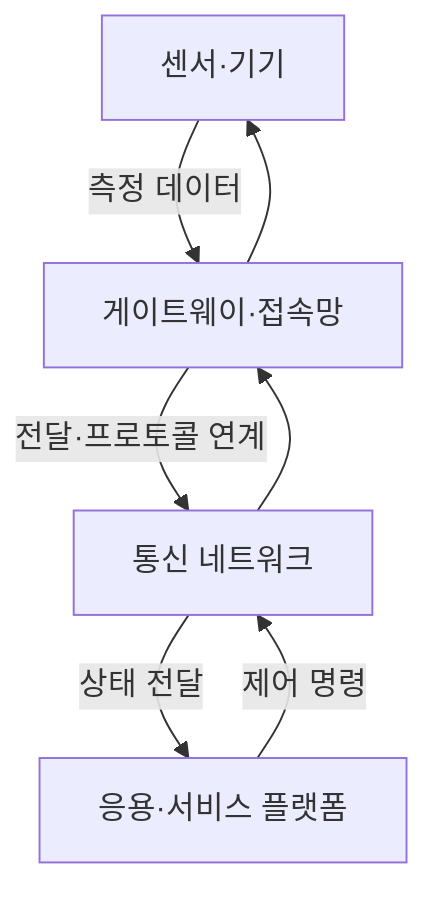
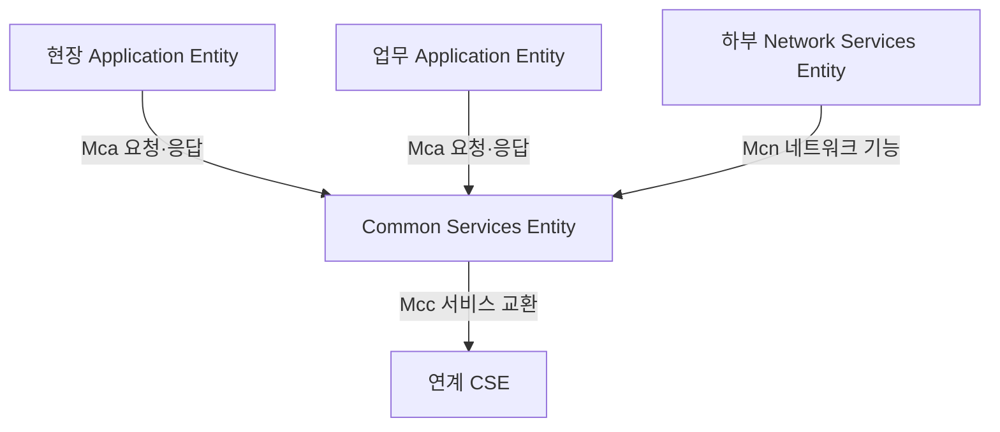
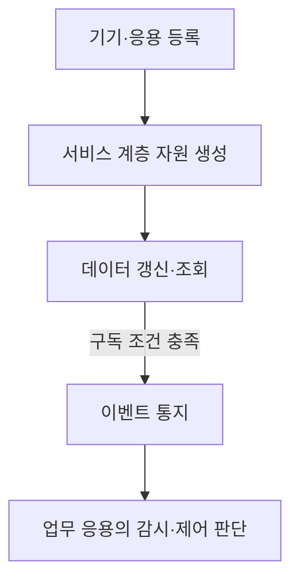

## 지식 로드맵 내 현재 위치

네트워크 → 사물 간 통신 → M2M 통신

## 30초 인출

- 본질: **M2M(Machine-to-Machine) 통신**은 기계·단말이 사람의 매번 개입 없이 상태 정보를 교환하는 통신
- 메커니즘: 기기·게이트웨이·네트워크·응용이 데이터를 전달하고, 응용의 정책에 따라 원격 상태 감시나 제어 수행

핵심 용어

- **M2M(Machine-to-Machine) 통신:** 기계·단말 사이의 데이터 교환으로 원격 감시·제어를 지원하는 통신
- **oneM2M:** 응용과 하부 네트워크 사이에 공통 서비스 계층을 정의하는 표준화 협력체
- **AE(Application Entity):** 응용 서비스 로직을 수행하고 CSE의 공통 기능을 이용하는 논리 엔티티
- **CSE(Common Services Entity):** 데이터 관리·장치 관리 등 공통 서비스 기능을 제공하는 엔티티
- **NSE(Network Services Entity):** CSE에 하부 네트워크 서비스를 제공하는 엔티티
- **Mca(M2M Communication with Application):** AE와 CSE 사이의 통신 참조점
- **Mcc(M2M Communication with CSE):** CSE 간 통신 참조점
- **Mcn(M2M Communication with Network):** CSE와 NSE 사이의 네트워크 서비스 참조점

---

## 1교시 예상문제 (10점)

> M2M(Machine-to-Machine) 통신의 개념과 구성요소를 설명하시오. (예상)

---

## 1교시 10점 답안

## Ⅰ. M2M 통신 개요

| 구분 | 핵심 |
|---|---|
| 정의 | **M2M(Machine-to-Machine) 통신:** 기계·단말 사이에 데이터를 교환해 감시·제어를 지원하는 통신 방식 |
| 목적 | 원격 상태 파악과 기기 간 자동 정보 교환 |

## Ⅱ. 기본 구성과 정보 흐름

| 구성 | 역할 |
|---|---|
| 기기·센서 | 현장 상태 측정과 제어 대상 동작 |
| 게이트웨이·네트워크 | 접속·전달, 필요한 프로토콜 연계 |
| 응용·서비스 플랫폼 | 기기 데이터 관리와 업무 규칙에 따른 감시·제어 |

제언: 현장 기기부터 응용까지 데이터 흐름과 제어 권한을 함께 설계

---

## 2~4교시 예상문제 (25점)

> M2M 통신의 구성과 동작을 설명하고, 이기종 기기 연계 및 운영 시 고려사항을 제시하시오. (예상)

---

## 2~4교시 25점 답안

## Ⅰ. M2M 통신 개요

| 구분 | 핵심 |
|---|---|
| 정의 | **M2M(Machine-to-Machine) 통신:** 기계·단말 사이에 데이터를 교환해 감시·제어를 지원하는 통신 방식 |
| 목적 | 원격 상태 파악과 기기 간 자동 정보 교환 |

## Ⅱ. 구성 엔티티와 공통 서비스 계층

| 엔티티 | 역할 |
|---|---|
| AE(Application Entity) | 응용 로직과 기기·서비스별 기능 수행 |
| CSE(Common Services Entity) | 공통 서비스 기능을 응용에 제공 |
| NSE(Network Services Entity) | 통신·이동통신망이 제공하는 네트워크 기능 연계 |

oneM2M은 특정 무선 접속 기술 자체가 아니라 응용·공통 서비스·네트워크 사이의 기능 및 참조점을 정의하는 서비스 계층 표준

## Ⅲ. 데이터 교환과 관리 기능

| 동작 | 설명 |
|---|---|
| 등록·발견 | 응용·기기를 서비스 계층에 식별·등록하고 필요한 자원을 탐색 |
| 데이터 관리 | 기기 데이터를 저장·조회하고 접근 정책 적용 |
| 구독·통지 | 조건에 맞는 데이터 변경을 구독 응용에 통지 |
| 장치 관리 | 기기 설정·상태 관리 등 공통 기능 연계 |

## Ⅳ. 이기종 연계와 운영 한계

| 한계 | 대응 |
|---|---|
| 제조사·망별 데이터 모델 차이 | 공통 자원 모델과 명시적인 변환 어댑터 적용 |
| 제약 기기의 전력·메모리·연결 한계 | 메시지 크기·보고 주기·재전송 정책을 기기 능력에 맞게 설정 |
| 무인 단말의 인증정보·펌웨어 관리 | 기기별 식별·인증, 키 수명주기와 서명된 업데이트 절차 적용 |
| 대량 이벤트의 운영 복잡성 | 등록·상태·오류를 자원 식별자와 관측 이력에 연결 |

## Ⅴ. 기술사적 제언

| 한계 | 해결 방안 |
|---|---|
| 기기·통신 기술에 맞춘 수직 연계는 신규 기기와 응용을 붙일 때 중복 개발과 보안 공백을 만듦 | 공통 서비스 계층과 검증된 인터워킹 어댑터를 우선 두고, 기기 인증·자원 모델·업데이트 책임을 수명주기 기준으로 함께 관리 |

## 출제 이력과 검증 출처

- 제102회 1교시: `M2M(Machine-to-Machine)의 개념, 구성요소, 주요 기술을 설명하시오.`
- [oneM2M Technical Specifications — TS-0001 Functional Architecture](https://specifications.onem2m.org/ts/)
- [oneM2M — Using oneM2M](https://www.onem2m.org/using-onem2m/developers/basics)
- [oneM2M TS-0002 — Overall System Requirements](https://specifications.onem2m.org/ts/ts-0002/latest/6.1/)
- [Q-Net 정보관리기술사 출제문제](https://www.q-net.or.kr/cst006.do?id=cst00601&gSite=Q&gId=)

## 연결 토픽

- [MQTT](./070_mqtt/) · [CoAP](./069_coap/) · [무선 센서 네트워크](./072_wsn/)
