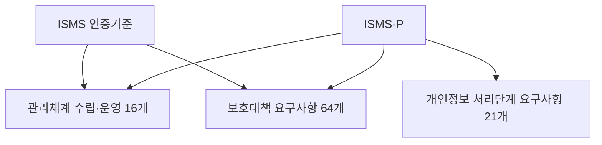
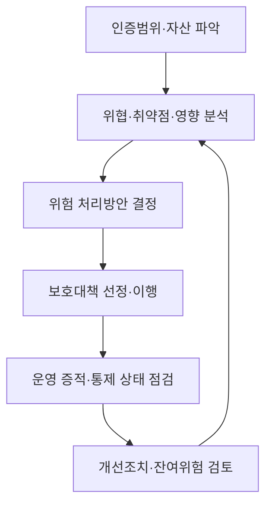

## 30초 인출

- **본질:** ISMS는 조직이 위험에 맞는 정보보호 조치를 운영하고 점검·개선하는 관리체계다.
- **메커니즘:** 범위와 자산을 정하고 위험을 평가해 통제를 이행한 뒤, 운영 증적을 점검하고 개선한다.
- **구분:** ISMS 기준은 관리체계 16개와 보호대책 64개로 구성된다. ISMS-P는 여기에 개인정보 처리단계 요구사항 21개를 더한다.

핵심 용어

- **ISMS:** 조직의 정보보호 관리체계가 인증기준에 맞게 수립·운영되는지 심사하는 제도다.
- **ISMS-P:** ISMS에 개인정보 처리단계 보호 요구사항을 더해 함께 인증하는 제도다.
- **위험평가:** 자산에 대한 위협·취약점과 영향을 분석해 위험의 크기와 처리 우선순위를 정하는 절차다.
- **인증범위:** 인증심사에서 관리체계와 통제의 적용 여부를 확인하는 조직·서비스·자산의 경계다.

---
## 1교시 예상문제 (10점)

> ISMS의 정의와 목적, 인증기준의 구성을 설명하시오. *(예상문제)*

---
## 1교시 10점 답안

### 1. 정의·목적

- **정의:** ISMS는 조직이 정보보호 보호조치를 수립·운영하고 그 적합성을 인증기준에 따라 심사받는 관리체계다.
- **목적:** 조직의 정보자산 위험을 줄이도록 보호조치를 지속 운영·점검·개선한다.

### 2. 인증기준 구성과 관리 흐름

| 기준 영역 | 항목 수 | 핵심 역할 |
|---|---:|---|
| 관리체계 수립·운영 | 16 | 범위·정책·위험·운영·점검·개선 관리 |
| 보호대책 요구사항 | 64 | 조직·인력·물리·기술 보호통제 적용 |
| ISMS-P 개인정보 처리단계 요구사항 | 21 | 개인정보 생명주기 보호통제 추가 |

**제언:** 인증범위 안의 위험, 실제 통제 운영 증적, 개선조치가 연결되는지 경영진이 주기적으로 확인한다.

---
## 2~4교시 예상문제 (25점)

> 정보보호 관리체계(ISMS)의 인증기준과 관리과정을 설명하고 ISMS-P와 비교한 후, 인증의 실효성을 높일 방안을 제시하시오. *(25점 예상문제)*

---
## 2~4교시 25점 답안

### Ⅰ. ISMS의 개념과 운영 목적

ISMS는 조직이 관리적·기술적·물리적 정보보호 조치를 수립하고 운영하는 관리체계이며, 인증은 정해진 기준에 따라 그 적합성을 심사하는 제도다. 인증서는 위험관리와 통제 운영을 대신하지 않으므로 인증범위와 실제 운영을 함께 확인해야 한다.

| 구성 | 하는 일 |
|---|---|
| 경영진 책임 | 정책·자원·위험수용 기준을 승인하고 관리체계를 검토 |
| 정보보호 조직 | 자산·위험을 파악하고 통제를 운영·기록 |
| 인증심사 | 범위와 기준에 비추어 통제의 적합성 및 운영 증적 확인 |

### Ⅱ. 인증기준 구조

ISMS 인증기준은 관리체계 수립·운영 16개와 보호대책 요구사항 64개로 구성된다. ISMS-P는 개인정보 처리단계 요구사항 21개를 추가한다.

| 관리체계 16개 | 보호대책 64개 | 개인정보 처리단계 21개 |
|---|---|---|
| 기반 마련·위험 관리·운영·점검 및 개선 | 정책·조직·인력·외부자·물리·접근·암호·개발·운영·사고·복구 등 | 수집·보유·이용·제공·파기 등 처리 단계의 보호 요구사항 |

### Ⅲ. 위험관리와 지속개선 과정

관리체계는 범위와 자산 파악에서 시작해 위험을 평가하고 통제를 선택·이행한다. 점검 결과와 변화된 위험을 다음 평가에 반영한다.

| 단계 | 핵심 기록 |
|---|---|
| 자산·범위 | 서비스, 조직, 시스템, 책임과 경계 |
| 위험평가·처리 | 평가 근거, 처리 결정, 잔여위험 승인 |
| 통제 운영 | 절차, 접근·변경·사고·교육 기록 |
| 점검·개선 | 부적합, 원인, 조치 책임자와 완료 확인 |

### Ⅳ. ISMS와 ISMS-P의 차이 및 법적 기반

두 제도는 관리체계와 정보보호 보호대책을 공통으로 심사한다. ISMS-P는 개인정보 처리 전반에 관한 추가 인증기준을 포함한다. 정보통신망법 제47조는 ISMS 인증의 근거와 의무대상·심사·사후관리 등을 정하고, 개인정보 보호법 제32조의2는 개인정보 보호 인증의 법적 근거를 둔다.

| 구분 | ISMS | ISMS-P |
|---|---|---|
| 공통 기준 | 관리체계 16개 + 보호대책 64개 | 관리체계 16개 + 보호대책 64개 |
| 추가 기준 | 없음 | 개인정보 처리단계 21개 |
| 주된 확인 범위 | 정보보호 관리체계와 정보자산 보호 | 공통 정보보호 통제와 개인정보 처리·보호 |
| 법적 근거 | 정보통신망법 제47조 및 관련 고시 | 정보통신망법 제47조, 개인정보 보호법 제32조의2 및 관련 고시 |

### Ⅴ. 기술사적 제언

| 문제 | 해결 방안 |
|---|---|
| 심사 직전 문서만 정리해 평소 운영과 증적이 어긋남 | 접근·변경·사고·교육 등 통제 기록을 운영 과정에서 남기고 정기 표본점검 |
| 클라우드·외부자·신규 서비스가 자산 및 인증범위에서 빠짐 | 변경관리와 자산목록을 연결하고 범위·위험평가를 변경 시 재검토 |
| 인증 후 지적사항이 위험관리로 환류되지 않음 | 시정조치의 책임자·기한·잔여위험을 추적하고 경영진 검토에서 미해결 항목 승인 |
| 개인정보 통제가 공통 보안통제에 묻힘 | ISMS-P 적용 시 개인정보 처리흐름별 근거·접근·보유·파기 통제를 별도로 추적 |

---
## 출제 이력 및 참고자료

- **기출 이력:** 제138회 정보관리기술사 3교시 6번 「ISMS 인증 영역·법적 근거·관리과정, ISMS-P 간편인증과 강화방안」.
- [ISMS-P 공식 누리집: 인증제도와 기준](https://isms.kisa.or.kr/sysm/intro/selectSysmCertDetail.do)
- [국가법령정보센터: 정보통신망법 제47조](https://www.law.go.kr/LSW/lsLinkCommonInfo.do?lsJoLnkSeq=1032645985)
- [국가법령정보센터: 개인정보 보호법 제32조의2](https://www.law.go.kr/LSW/lsSc.do?eventGubun=060101&menuId=1&query=%EA%B0%9C%EC%9D%B8%EC%A0%95%EB%B3%B4%EB%B3%B4%ED%98%B8%EB%B2%95&subMenuId=15&tabMenuId=81)

## 연결 토픽

- [ISMS-P](./011_isms_p/) · [NIST CSF 2.0](./039_nist_csf_2_0_govern/) · [CISO](./027_ciso/) · [정보보호 관리체계 인증 실효성](./067_information_security_compliance/)
