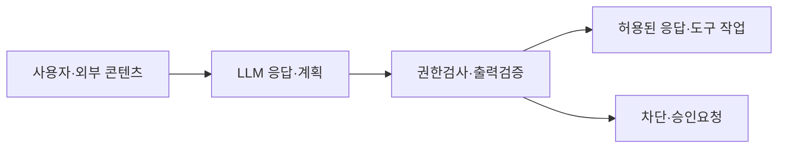
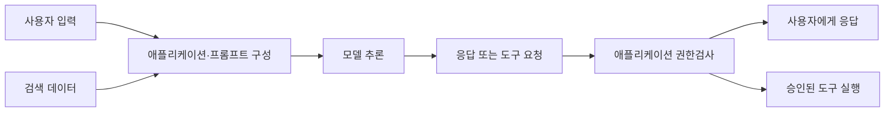
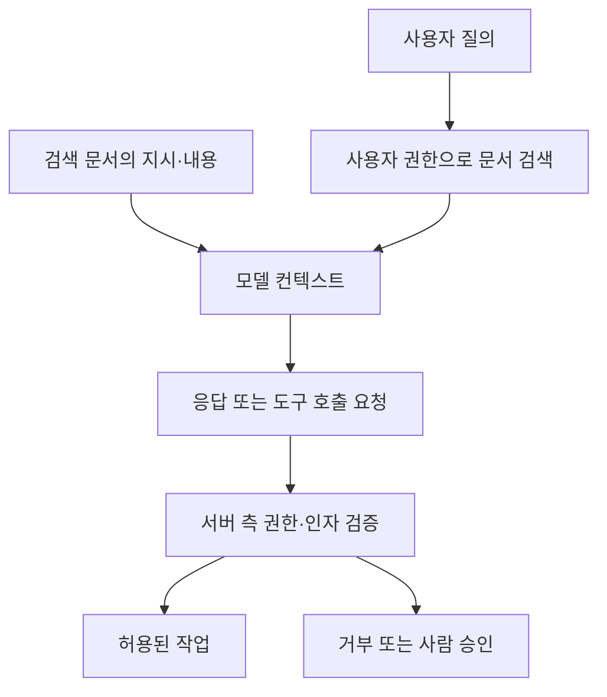

## 30초 인출

- **본질:** LLM 애플리케이션 보안은 모델과 이를 둘러싼 데이터·도구·사용자 권한을 함께 보호하는 일이다.
- **메커니즘:** 공격 입력이나 오염된 외부자료가 모델의 응답·검색·도구 호출에 영향을 줄 수 있으므로 입력만이 아니라 검색 권한, 실행 권한, 출력 처리도 통제한다.
- **핵심 대응:** 프롬프트 주입은 완전히 막을 수 있다고 가정하지 말고, 최소권한·서버 측 권한검사·도구 승인·민감정보 보호·출력 검증을 겹쳐 적용한다.

핵심 용어

- **프롬프트 주입:** 공격자가 입력이나 외부 콘텐츠에 지시를 넣어 모델의 응답·행동을 의도와 다르게 유도하는 공격이다.
- **간접 프롬프트 주입:** 검색 결과나 문서에 포함된 지시가 모델 컨텍스트에 들어가 응답이나 연결 기능에 영향을 주는 공격이다.
- **과도한 에이전시:** LLM 기반 애플리케이션에 필요 이상의 도구·데이터 권한이나 실행 자율성을 부여한 상태다.
- **RAG:** 외부 문서를 검색해 모델 입력에 제공하는 생성 방식이며, 검색 결과에 접근통제를 적용해야 한다.

---
## 1교시 예상문제 (10점)

> LLM 애플리케이션의 주요 보안위협과 핵심 방어 원칙을 설명하시오. *(예상문제)*

---
## 1교시 10점 답안

### 1. 정의·목적

- **정의:** LLM 애플리케이션 보안은 모델, 프롬프트, 학습·검색 데이터, 연결 도구와 운영환경을 위협으로부터 보호하는 활동이다.
- **목적:** 비인가 정보 노출과 도구의 오용을 줄이고, 출력이 업무에 쓰일 때 권한과 안전성을 확인한다.

### 2. 위협과 통제

| 접점 | 위협 | 통제 원칙 |
|---|---|---|
| 입력·외부 문서 | 직접·간접 프롬프트 주입 | 외부 콘텐츠를 신뢰된 지시와 구분하고 출력·행동을 검증 |
| 검색·데이터 | 민감정보 노출, 권한 없는 검색 | 검색 전에 사용자 권한을 서버 측에서 확인 |
| 도구 호출 | 과도한 권한, 비인가 실행 | 최소권한, 허용목록, 중요 작업 승인 |

**제언:** 프롬프트 검증에만 의존하지 않고 데이터 접근권한과 도구 실행권한을 모델 바깥에서 강제한다.

---
## 2~4교시 예상문제 (25점)

> LLM 도입 시 주요 보안위협을 OWASP LLM 애플리케이션 보안 위험 관점에서 분류하고, 데이터·도구 연동을 포함한 대응방안을 제시하시오. *(25점 예상문제)*

---
## 2~4교시 25점 답안

### Ⅰ. 모델과 애플리케이션 경계의 보안

LLM 보안은 모델 자체뿐 아니라 프롬프트를 구성하는 데이터, 모델이 호출하는 도구, 결과를 처리하는 애플리케이션을 함께 다룬다. 모델 응답은 입력과 컨텍스트에 따라 달라질 수 있으므로, 모델 내부 가드레일만으로 권한통제를 대신해서는 안 된다.

### Ⅱ. 위협의 주요 분류

OWASP의 2025 Top 10은 LLM·생성형 AI 애플리케이션의 위험을 개발·배포·운영 생애주기 관점에서 정리한다. 아래 항목은 이번 문항과 직접 관련된 대표 위험이다.

| 위험 | 발생 지점·결과 |
|---|---|
| 프롬프트 주입 | 사용자 입력·검색 문서가 모델 응답이나 작업을 조작 |
| 민감정보 노출 | 모델 또는 애플리케이션이 보호 대상 정보를 출력 |
| 데이터·모델 오염 | 사전학습·미세조정·임베딩 데이터의 오염이 모델 동작에 영향 |
| 부적절한 출력 처리 | 신뢰하지 않은 출력이 후속 코드·쿼리·화면에서 안전하지 않게 사용 |
| 과도한 에이전시 | 부여된 도구 권한·자율성으로 의도하지 않은 작업 수행 |
| 시스템 프롬프트 유출 | 숨겨진 프롬프트가 노출되어 설계정보나 내부 지시가 알려짐 |
| 벡터·임베딩 취약점 | RAG 저장·검색 과정의 접근통제 또는 데이터 무결성 약화 |
| 무제한 자원소비 | 요청·토큰·추론 비용의 남용으로 서비스 비용·가용성에 영향 |

### Ⅲ. 간접 주입과 RAG·도구 호출

검색된 문서는 모델의 컨텍스트가 되지만, 그 안의 텍스트를 신뢰된 지시로 취급해서는 안 된다. 문서 권한은 검색 단계에서 확인하고, 모델이 반환한 도구 요청은 애플리케이션이 별도로 검증한다.

| 통제 지점 | 확인 사항 |
|---|---|
| RAG 검색 | 사용자 권한과 문서 ACL을 검색 시점에 적용하고 문서 출처·범위를 유지 |
| 외부 콘텐츠 | 문서 내용을 지시로 신뢰하지 않고 필요한 정보만 컨텍스트에 포함 |
| 도구 호출 | 서버에서 사용자 권한·인자·대상 리소스를 검사하고 위험 작업은 별도 승인 |

### Ⅳ. 생애주기 통제

보안 통제는 모델 선택·데이터 준비에서 배포와 운영까지 이어져야 한다. OWASP 항목은 위험 분류 참고이며, 제품별 위협모델과 실제 통제 검증을 대신하지 않는다.

| 단계 | 핵심 통제 | 검증 근거 |
|---|---|---|
| 데이터·모델 도입 | 데이터 출처·라이선스·무결성, 모델·구성요소 공급망 확인 | 출처목록, 취약점·무결성 점검 |
| 개발 | 민감정보 최소화, 프롬프트·출력·도구 경계 시험 | 공격 시나리오 테스트, 코드 검토 |
| 배포 | 도구·검색 권한 최소화, 비밀정보 분리·보호, 사용량 제한 | 정책 설정, 권한·부하 시험 |
| 운영 | 로그·오류·비용 관측, 사고대응 및 모델·데이터 변경관리 | 경보, 사고기록, 재평가 결과 |

### Ⅴ. 기술사적 제언

| 문제 | 해결 방안 |
|---|---|
| 프롬프트 주입을 정규식이나 모델 가드레일만으로 완전 차단한다고 가정 | 주입이 성공해도 피해를 제한하도록 서버 측 접근통제와 실행권한 분리 |
| RAG 문서에 사용자 권한 필터가 적용되지 않음 | 검색 단계에서 ACL을 적용하고 권한 없는 문서는 모델 컨텍스트에 넣지 않음 |
| 모델이 생성한 도구 호출을 그대로 실행 | 허용목록·인자 검증·사용자 권한검사와 중요 작업 승인 적용 |
| 통제 변경 후 실제 위험을 재검증하지 않음 | 공격 시나리오와 운영 로그를 이용해 회귀시험·위험평가를 반복 |

---
## 출제 이력 및 참고자료

- **기출 이력:** 제136회 2교시 3번 「LLM 도입 시 보안 위험 3가지 및 대응」, 제136회 4교시 5번 「OWASP LLM Top 10」.
- OWASP Gen AI Security Project, [2025 Top 10 for LLM and GenAI](https://genai.owasp.org/llm-top-10/).
- NIST, [AI Risk Management Framework: Generative AI Profile (NIST AI 600-1)](https://doi.org/10.6028/NIST.AI.600-1).
