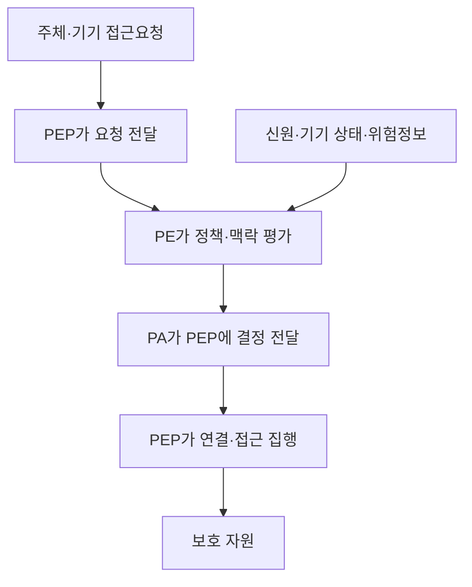
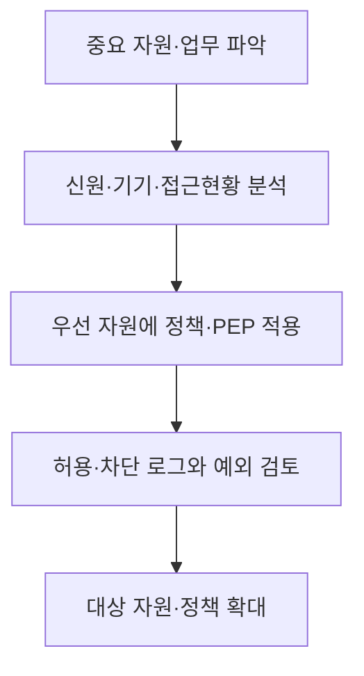

## 30초 인출

- **본질:** 제로트러스트는 네트워크 위치나 소유관계만으로 사용자·기기·자원을 신뢰하지 않는 보안 접근 방식이다.
- **메커니즘:** 자원 접근 전에 주체와 기기를 인증·인가하고, 정책결정 기능이 접근을 판단해 집행점에 허용·차단 지시를 내린다.
- **운영:** 최소권한을 적용하고 접근·행동을 관측해 위험 변화에 대응한다. 기존 네트워크 보호를 모두 없애는 개념은 아니다.

핵심 용어

- **제로트러스트 아키텍처(ZTA):** 사용자·기기·자원의 위치만으로 신뢰하지 않고 자원 단위로 접근을 결정하는 아키텍처다.
- **정책결정점(PDP):** 접근 요청과 정책·맥락 정보를 평가해 허용 여부를 결정하는 논리 기능이다.
- **정책집행점(PEP):** PDP의 결정을 연결 설정·차단 등으로 집행하는 지점이다.
- **정책 엔진(PE):** 접근 결정을 평가하는 PDP의 핵심 기능이다.
- **정책 관리자(PA):** 결정된 접근을 설정·집행하도록 PEP에 지시하는 PDP 기능이다.

---
## 1교시 예상문제 (10점)

> 제로트러스트의 정의와 핵심 원칙, PE·PA·PEP의 접근결정 구조를 설명하시오. *(예상문제)*

---
## 1교시 10점 답안

### 1. 정의·목적

- **정의:** 제로트러스트는 네트워크 위치나 소유관계만으로 신뢰를 부여하지 않고 자원 접근을 주체·기기 중심으로 통제하는 보안 접근 방식이다.
- **목적:** 침해된 계정이나 기기가 다른 자원으로 이동하는 위험을 줄이고 필요한 권한만 부여한다.

### 2. 원칙과 결정구조

| 원칙 | 적용 |
|---|---|
| 명시적 검증 | 접근 전에 주체·기기·요청 자원을 평가 |
| 최소권한 | 업무에 필요한 자원과 권한만 부여 |
| 침해 가정 | 접근을 관측하고 영향 범위를 제한 |

**제언:** 중요 자원부터 접근정책과 기기 상태를 연동하고 실제 로그로 허용·차단 결과를 점검한다.

---
## 2~4교시 예상문제 (25점)

> 제로트러스트의 개념과 원칙, PE·PA·PEP 중심의 접근결정 절차를 설명하고 경계형 보안과 비교한 후 단계적 도입방안을 제시하시오. *(25점 예상문제)*

---
## 2~4교시 25점 답안

### Ⅰ. 자원 중심 보안 접근

제로트러스트는 내부 네트워크에 있다는 이유만으로 계정이나 기기를 신뢰하지 않는다. NIST SP 800-207은 보호 초점을 네트워크 구간보다 사용자·자산·자원에 두고, 세션을 만들기 전에 주체와 기기를 인증·인가하는 접근을 설명한다.

| 통제 초점 | 경계 중심 접근 | 제로트러스트 접근 |
|---|---|---|
| 주요 보호대상 | 네트워크 경계·구간 | 데이터·서비스·워크플로·계정 등 자원 |
| 접근 근거 | 내부망 위치가 신뢰 신호가 될 수 있음 | 위치만으로 암묵적 신뢰를 부여하지 않음 |
| 통제 적용 | 경계 통과 뒤 내부 통신 | 자원 접근별 정책과 인증·인가 |

### Ⅱ. 정책결정·집행 구성요소

PE와 PA는 PDP를 이루는 기능이며, PEP는 자원에 대한 접근을 실제로 집행한다.

| 구성요소 | 기능 |
|---|---|
| 정책 엔진(PE) | 정책과 요청 맥락을 평가해 접근 결정을 산출 |
| 정책 관리자(PA) | 결정에 따라 PEP를 설정·지시 |
| 정책집행점(PEP) | 접근을 허용·차단하고 결정된 연결을 집행 |
| 정보 입력원 | 신원·기기 상태·위험 등 정책 판단에 필요한 정보를 제공 |

### Ⅲ. 접근결정에 반영할 원칙

접근정책은 자원과 업무 위험에 따라 달라진다. 신원 확인만으로 충분하다고 가정하지 않고 기기 상태와 요청 맥락을 정책에 반영한다.

| 원칙 | 설계·운영 방식 |
|---|---|
| 명시적 검증 | 자원 접근 전에 사용자와 기기를 인증·인가 |
| 최소권한 | 역할·업무·시간에 필요한 범위만 허용 |
| 침해 가정 | 인증된 계정도 지속 관측하고 이상행위에 대응 |
| 데이터·자원 중심 | 네트워크 세그먼트만으로 보호 수준을 판단하지 않음 |

### Ⅳ. 경계형 보안과의 관계 및 도입

제로트러스트는 방화벽·네트워크 분할을 대체하는 단일 제품이 아니라 정책과 접근통제를 설계하는 아키텍처 관점이다. 기존 통제와 함께 적용할 수 있다.

| 경계형 보안의 역할 | 제로트러스트 도입 시 보완 |
|---|---|
| 네트워크 필터링·분할 | 자원 단위 사용자·기기 정책과 결합 |
| VPN·원격접속 통제 | 연결 후에도 자원 접근 권한을 별도 평가 |
| 네트워크 경계 로그 | 신원·기기·자원 접근 로그와 상관분석 |

### Ⅴ. 기술사적 제언

| 문제 | 해결 방안 |
|---|---|
| 기존 경계 통제를 한 번에 폐기해 업무 연속성 저하 | 핵심 자원과 사용자군을 정해 단계 적용하고 기존 통제와 병행 검증 |
| 로그인 성공을 모든 자원 접근 허가로 간주 | 자원별 정책·최소권한을 적용하고 고위험 요청은 추가 검증 |
| 단일 제품 도입을 제로트러스트 완성으로 오해 | 목표 아키텍처·정책·운영 책임·로그 활용을 함께 정의하고 성숙도를 점검 |

---
## 출제 이력 및 참고자료

- [NIST SP 800-207: Zero Trust Architecture](https://csrc.nist.gov/pubs/sp/800/207/final).
- [NIST SP 800-207A: Cloud-Native Multi-Cloud Zero Trust Architecture](https://csrc.nist.gov/pubs/sp/800/207/a/final).
