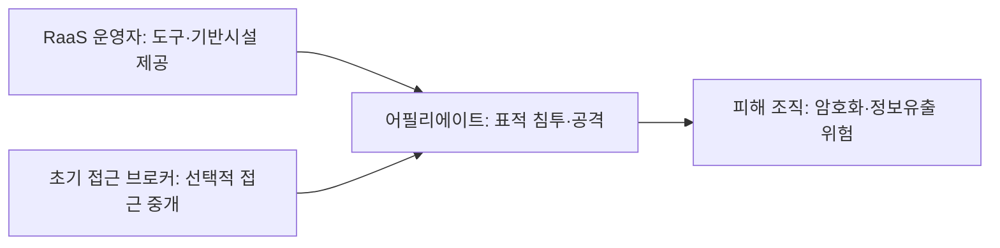
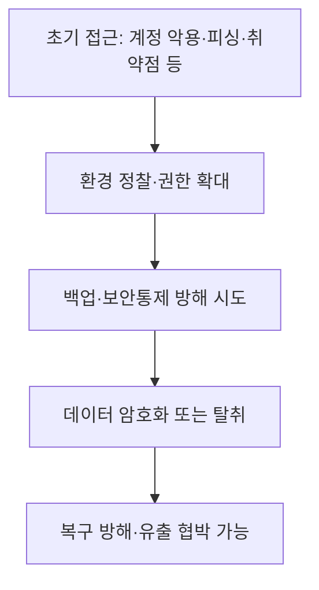

## 30초 인출

- **본질:** RaaS는 랜섬웨어 개발·운영자가 도구와 기반시설을 제공하고, 제휴 공격자가 침투와 공격을 수행하는 범죄 사업모델이다.
- **메커니즘:** 역할과 수익 배분은 조직마다 다르며, 초기 접근은 탈취 계정·취약점 악용 등 여러 경로로 이뤄질 수 있다.
- **대응:** 다중인증·취약점 관리·최소권한·행위 탐지·격리 가능한 백업으로 침투 가능성과 복구 영향을 함께 줄인다.

핵심 용어

- **RaaS 운영자:** 랜섬웨어 기능이나 운영 기반시설을 제공하고 제휴 공격자를 지원하는 범죄조직 구성원이다.
- **어필리에이트:** RaaS 도구·기반시설을 이용해 표적 침투와 랜섬웨어 공격을 수행하는 제휴 공격자다.
- **초기 접근 브로커(IAB):** 침해된 계정이나 네트워크 접근을 다른 공격자에게 판매·중개하는 범죄자다. 모든 RaaS 공격이 IAB를 거치는 것은 아니다.
- **이중 갈취:** 데이터를 암호화하는 데 더해 탈취한 데이터를 공개하겠다고 협박하는 방식이다.

---
## 1교시 예상문제 (10점)

> RaaS의 개념과 참여자별 역할, 공격 흐름을 설명하시오. *(예상문제)*

---
## 1교시 10점 답안

### 1. 정의·목적

- **정의:** RaaS는 랜섬웨어 운영자가 공격 도구·인프라를 제공하고 제휴 공격자가 공격을 수행하는 서비스형 범죄 모델이다.
- **목적:** 개발·운영과 침투 역할을 나누어 공격을 조직화하고 수익을 배분한다.

### 2. 역할과 흐름

| 역할 | 활동 |
|---|---|
| 운영자 | 랜섬웨어 기능·기반시설·지원 제공 |
| 어필리에이트 | 초기 침투, 측면 이동, 데이터 암호화·탈취 등 공격 수행 |
| 초기 접근 브로커 | 일부 공격에서 침해된 계정·접근권을 판매·중개 |

**제언:** 원격접속·관리자 계정의 MFA와 최소권한을 적용하고 복구 가능한 백업을 정기 검증한다.

---
## 2~4교시 예상문제 (25점)

> RaaS의 분업 구조와 공격 단계를 설명하고, 조직의 예방·탐지·복구 통제를 제시하시오. *(25점 예상문제)*

---
## 2~4교시 25점 답안

### Ⅰ. RaaS의 범위와 성격

RaaS는 랜섬웨어 운영자가 악성코드 기능과 운영기반을 마련하고 어필리에이트가 표적 공격을 수행하는 모델이다. CISA·FBI 등은 LockBit을 RaaS 사례로 설명하며, 보수는 선불·구독·수익 배분 등으로 다양할 수 있다고 안내한다. 세부 구조는 조직마다 다르므로 모든 공격이 같은 절차를 따른다고 일반화하지 않는다.

| 역할 | 주된 기능 |
|---|---|
| 운영자 | 랜섬웨어 기능과 운영기반 관리, 제휴자 지원 |
| 어필리에이트 | 표적 선정·침투·내부 이동·암호화 등 공격 실행 |
| IAB 등 외부 범죄자 | 일부 사건에서 초기 접근이나 자격증명을 중개 |

### Ⅱ. 공격 전개와 피해

공격자는 원격접속 계정 악용, 피싱, 외부 공개 서비스 취약점 등으로 최초 침투할 수 있다. 이후 환경을 정찰하고 접근을 확대해 데이터를 암호화하거나 탈취할 수 있다. 실제 단계와 순서는 사건별로 달라진다.

| 피해 유형 | 조직 영향 |
|---|---|
| 서비스·파일 암호화 | 업무 중단, 복구 비용 |
| 정보 탈취·유출 협박 | 개인정보·기밀 노출, 계약·법적 영향 |
| 백업 훼손 | 복구 지연과 서비스 지속성 저하 |

### Ⅲ. 예방 통제

초기 침투와 권한 확대를 어렵게 하도록 계정·원격접속·취약점·네트워크 경계를 함께 관리한다.

| 통제 | 적용 내용 |
|---|---|
| 인증·권한 | 원격접속·관리자 계정에 MFA, 최소권한, 불필요한 계정 비활성화 |
| 취약점 관리 | 외부 공개 시스템 식별, 보안패치 우선순위화, 불필요한 서비스 차단 |
| 네트워크 통제 | 중요 시스템 분리, 원격 관리 경로 제한, 접근기록 수집 |
| 사용자·공급망 | 피싱 대응 훈련, 외부 사업자 접근권한과 계정 관리 |

### Ⅳ. 탐지·대응·복구

복구 계획은 공격이 발생했다고 가정하고 실제 복원 가능성을 시험해야 한다. CISA의 랜섬웨어 대응 안내는 분리·보호된 백업과 사고대응 준비를 권고한다.

| 단계 | 실행 항목 |
|---|---|
| 탐지 | 대량 파일 변경, 비정상 원격접속, 백업·보안도구 변경 관찰 |
| 대응 | 영향 범위를 격리하고 자격증명·증거·신고 절차를 관리 |
| 복구 | 격리된 백업을 복원하고 업무 데이터의 무결성 확인 |
| 개선 | 근본원인과 통제 공백을 위험평가·대응계획에 반영 |

### Ⅴ. 기술사적 제언

| 문제 | 해결 방안 |
|---|---|
| 원격접속 자격증명 탈취로 초기 침투 | 인터넷 노출을 줄이고 MFA·조건부 접근·비정상 로그인 탐지 적용 |
| 암호화와 함께 데이터 탈취·유출 협박 | 중요 데이터 접근을 최소화하고 외부전송·대량 조회를 탐지 |
| 백업까지 암호화·삭제되어 복구 불가 | 운영망과 분리된 백업 사본을 보유하고 정기 복원 시험 |
| RaaS라는 이름만으로 동일 전술·절차라고 가정 | 조직별 위협정보와 사고 증거를 바탕으로 대응을 조정하고 가정은 검증 |

---
## 출제 이력 및 참고자료

- **기출 이력:** 제138회 4교시 5번 「랜섬웨어 피해와 RaaS 등장에 따른 변화」, 제128회 1교시 12번 「랜섬웨어와 RaaS」.
- CISA·FBI·MS-ISAC 등, [Understanding Ransomware Threat Actors: LockBit](https://www.cisa.gov/news-events/cybersecurity-advisories/aa23-165a).
- CISA, [#StopRansomware Guide](https://www.cisa.gov/stopransomware/ransomware-guide).
