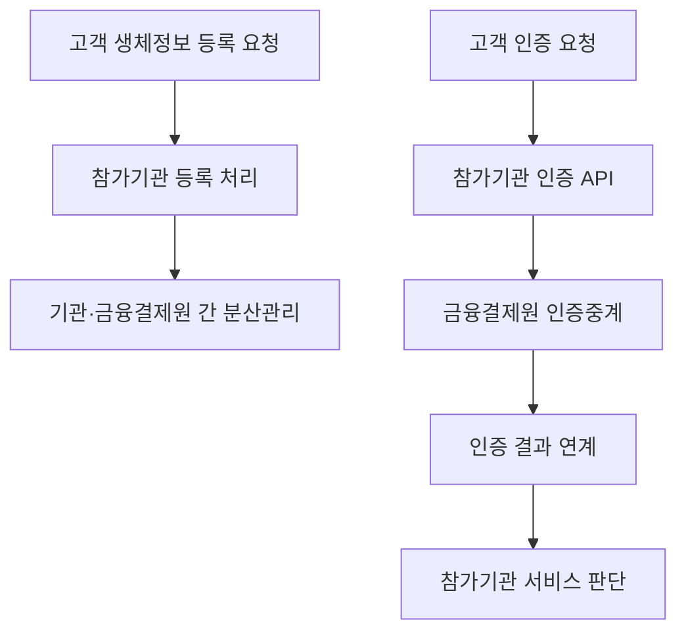

## 30초 인출

- **본질:** 바이오정보 분산관리는 생체정보를 금융기관과 금융결제원 사이에 나누어 관리하는 본인확인 서비스 구조다.
- **메커니즘:** 고객은 참가기관에서 생체정보를 등록·인증하고, 참가기관과 인증중계센터가 분산관리 API와 연계해 처리를 수행한다.
- **보호 관점:** 분산관리는 한 곳에 집중되는 위험을 줄이는 통제다. 분산만으로 안전성이 보장되지는 않으므로 접근권한·암호화·인증·폐기 절차를 함께 관리한다.

핵심 용어

- **바이오정보 분산관리:** 금융기관과 금융결제원이 생체정보를 나누어 관리해 비대면 본인확인을 지원하는 서비스다.
- **참가기관:** 분산관리 시스템을 이용해 생체인증 금융서비스를 제공하는 금융기관이다.
- **인증중계센터:** 참가기관 공동의 바이오정보 분산관리 시스템을 구축·운영하는 금융결제원 역할이다.
- **FIDO 사용자 검증:** FIDO 방식에서 기기가 지문·얼굴 등으로 사용자를 확인하고 원격 서비스에는 인증 결과에 대응하는 암호학적 메시지를 제공하는 구조다.

---
## 1교시 예상문제 (10점)

> 바이오정보 분산관리의 목적과 구성주체, 등록·인증 흐름을 설명하시오. *(예상문제)*

---
## 1교시 10점 답안

### 1. 정의·목적

- **정의:** 바이오정보 분산관리는 등록된 생체정보를 기관과 금융결제원 사이에 분산해 관리하고, 비대면 생체 본인확인을 지원하는 서비스다.
- **목적:** 생체정보를 한 기관에 집중하는 위험을 줄이면서 금융·연계기관의 인증 서비스를 제공한다.

### 2. 구성주체와 처리

| 주체 | 역할 |
|---|---|
| 고객 | 생체인증 서비스에 등록·인증 요청 |
| 참가기관 | 생체정보 분할·금융서비스 제공 |
| 금융결제원 | 공동 분산관리 시스템과 인증중계 운영 |
| 이용기관 | 금융결제원과 계약해 생체정보 활용 서비스 제공 |

**제언:** 분산된 저장정보의 접근 주체와 인증·관리 API 권한을 분리하고 변경·조회 이력을 점검한다.

---
## 2~4교시 예상문제 (25점)

> 바이오정보 분산관리의 구성과 인증 흐름을 설명하고 중앙집중 저장 및 FIDO 방식과 비교한 후 안전한 적용방안을 제시하시오. *(25점 예상문제)*

---
## 2~4교시 25점 답안

### Ⅰ. 분산관리의 목적과 보안 범위

바이오정보 분산관리는 고객의 생체정보를 금융기관과 금융결제원 사이에 분산해 관리하고 본인확인 서비스를 제공하는 구조다. 생체정보는 비밀번호처럼 바꾸기 어려우므로 수집·저장·인증 단계에서 접근을 제한해야 한다. 분산 저장 자체가 유출 방지나 복구를 보장하지는 않는다.

| 설계 목표 | 보호 관점 |
|---|---|
| 분산 보관 | 한 저장 주체에 정보가 집중되는 위험 완화 |
| 인증 연계 | 등록·인증 요청과 결과 전달의 주체·권한 통제 |
| 정보 최소화 | 업무에 필요한 정보만 수집·이용하고 보유기간 관리 |

### Ⅱ. 서비스 구성주체

금융결제원 안내에 따르면 참가기관은 금융서비스를 제공하며, 금융결제원은 공동 분산관리 시스템의 인증중계센터 역할을 한다. 이용기관은 별도 이용계약을 맺고 생체정보 활용 서비스를 제공한다.

| 구성주체 | 책임 |
|---|---|
| 고객 | 서비스 등록과 본인확인 요청 |
| 참가기관 | 생체정보 분할, 금융서비스 제공, 고객·서비스 관리 |
| 금융결제원 | 분산관리 시스템과 인증중계 운영 |
| 이용기관 | 계약된 범위에서 본인확인 서비스 이용 |

### Ⅲ. 등록·인증 처리 흐름

금융결제원은 등록 API, 인증 API, 관리 API, 연계인증 API를 제공한다. 공개 안내는 기관 간 분산관리 구조와 API 종류를 설명하지만, 특정 비밀분산 알고리즘이나 인증 시 원본 템플릿을 재구성하는 상세 절차까지 명시하지 않으므로 여기서는 이를 단정하지 않는다.

| 단계 | 공개된 역할·유의점 |
|---|---|
| 등록 | 참가기관이 분산관리 시스템을 이용해 생체정보를 등록 |
| 인증 | 인증 API를 통해 생체 본인확인 요청을 연계 |
| 결과 | 참가기관이 결과를 서비스 정책에 따라 판단 |
| 관리 | 권한·변경·보유기간·폐기 등 운영 절차를 별도 관리 |

### Ⅳ. 중앙집중 저장 및 FIDO 방식과 비교

중앙집중 방식은 생체정보를 한 서비스 주체가 보관한다. 바이오정보 분산관리는 기관 간 관리 지점을 나누고, FIDO는 생체정보를 기기 안에서 사용자를 확인하는 데 사용하며 원격 서비스에는 생체정보 자체를 전송하지 않는 방식을 정의한다.

| 구분 | 중앙집중 저장 | 바이오정보 분산관리 | FIDO 인증 |
|---|---|---|---|
| 생체정보 처리 위치 | 한 서비스 주체가 중앙 저장 | 참가기관과 인증중계 시스템 간 분산 관리 | 사용자 기기에서 로컬 사용자 검증 |
| 원격 서비스에 전달 | 저장·인증 설계에 따라 생체정보 처리 | 인증 연계 과정에서 서비스 결과 전달 | 생체정보가 아닌 공개키 기반 인증 메시지 |
| 핵심 고려사항 | 집중 저장소 접근·유출 영향 | 기관 간 연계·권한·분산정보 보호 | 기기·인증기 분실, 복구·등록 정책 |

### Ⅴ. 기술사적 제언

| 문제 | 해결 방안 |
|---|---|
| 분산 저장을 정보유출 불가능으로 오해 | 기관별 위협모델·접근권한·암호화·로그·사고대응을 별도 검증 |
| 기관 간 API 오용이나 인증결과 위변조 | 상호인증·전송보호·요청 무결성·권한 검증과 연계 로그 적용 |
| 생체정보 보유기간과 폐기 기준이 불명확 | 목적·법적 근거·보유기간을 정하고 보유 종료 시 안전하게 폐기 |
| 원본 생체정보가 불필요하게 원격으로 이동 | 가능한 경우 기기 내 사용자 검증과 공개키 기반 FIDO 인증을 검토 |

---
## 출제 이력 및 참고자료

- **기출 이력:** 제138회 1교시 5번 「안면인식 결제 서비스와 바이오정보 분산관리」, 제120회 2교시 1번 「바이오정보 분산관리 기술 가이드라인」.
- 금융결제원, [바이오정보 분산관리 서비스 안내](https://openapi.kftc.or.kr/service/bio).
- FIDO Alliance, [FIDO User Authentication Specifications](https://fidoalliance.org/specifications/).
