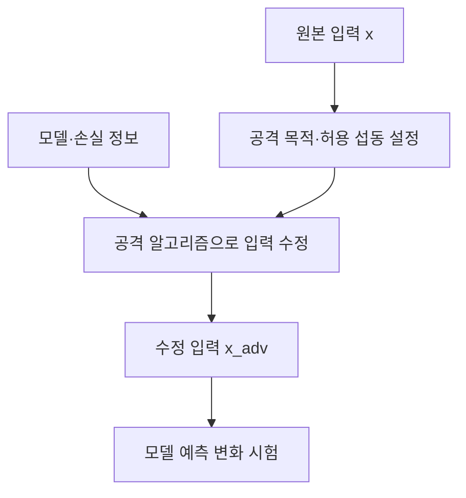

## 30초 인출

- **본질:** 적대적 공격은 공격자가 만든 입력이나 학습데이터로 머신러닝 시스템의 동작을 의도와 다르게 유도하는 공격이다.
- **메커니즘:** 추론 단계에는 제한된 섭동을 더해 오분류를 시도할 수 있고, 학습 단계에는 데이터를 오염시킬 수 있다.
- **대응:** 위협모델에 맞춰 적대적 훈련·강건성 시험·데이터 검증·운영 감시를 적용한다. 입력 변환 하나만으로 방어가 보장되지는 않는다.

핵심 용어

- **적대적 예제:** 특정 모델의 예측을 바꾸도록 의도적으로 변형한 입력이다.
- **섭동:** 원본 입력에 더하는 공격 변경량으로, 크기와 허용 범위는 공격 위협모델에서 정한다.
- **전이성:** 한 모델에서 만든 적대적 예제가 다른 모델에도 영향을 미칠 수 있는 현상이다.
- **적대적 훈련:** 훈련 과정에서 적대적 예제를 사용해 특정 공격 조건에서의 강건성을 높이는 방법이다.
- **데이터 중독:** 학습데이터나 학습과정을 조작해 모델의 동작을 변경하는 공격이다.

---
## 1교시 예상문제 (10점)

> 적대적 공격의 원리와 대표 유형, 방어방안을 설명하시오. *(예상문제)*

---
## 1교시 10점 답안

### 1. 정의·목적

- **정의:** 적대적 공격은 입력이나 학습데이터를 의도적으로 조작해 머신러닝 모델의 예측·동작을 바꾸려는 공격이다.
- **목적:** 오분류를 유도하거나 모델의 신뢰성과 서비스 무결성을 훼손한다.

### 2. 유형과 방어

| 유형 | 예 | 대응 방향 |
|---|---|---|
| 추론 시 입력 조작 | 화이트박스 FGSM·PGD, 블랙박스 질의·전이 공격 | 위협모델별 강건성 시험·적대적 훈련 |
| 물리적 입력 조작 | 표지판·센서 입력에 대한 패치 등 | 실제 환경과 센서 조건을 포함한 시험 |
| 학습단계 조작 | 데이터 중독 | 데이터 출처·무결성·학습 파이프라인 검증 |

**제언:** 정확도만 보지 말고 실제 공격 가정과 입력조건에서 강건성을 시험한 뒤 배포한다.

---
## 2~4교시 예상문제 (25점)

> 적대적 공격의 생성 원리와 공격 유형을 설명하고, 입력·학습·운영 단계에서 모델 강건성을 높이는 방안을 제시하시오. *(25점 예상문제)*

---
## 2~4교시 25점 답안

### Ⅰ. 적대적 머신러닝 공격의 의미

적대적 머신러닝 공격은 공격자가 학습이나 추론 과정의 약점을 이용해 AI 시스템의 성능·보안 속성을 훼손하는 공격이다. 적대적 예제는 선택된 입력 공간과 크기 제약에서 모델 예측을 바꾸도록 만든 입력이며, 모든 사례에서 사람에게 보이지 않는다고 단정할 수 없다.

| 구분 | 추론단계 적대적 예제 | 학습단계 데이터 중독 |
|---|---|---|
| 공격 시점 | 훈련된 모델에 입력할 때 | 학습데이터·학습과정에 영향을 줄 때 |
| 공격대상 | 예측·분류·결정 | 학습된 모델의 동작·성능 |
| 대표 목표 | 오분류·회피 | 성능 저하·특정 조건의 잘못된 동작 |

### Ⅱ. 입력 섭동 생성 원리

공격자는 정의된 손실함수와 입력 제약을 이용해 모델 출력이 바뀌도록 입력을 수정한다. FGSM은 손실의 입력 기울기 부호를 사용하는 한 단계 방법이고, PGD는 반복적으로 입력을 갱신하면서 허용 영역에 사영하는 방식이다. C&W는 최적화 문제를 구성하는 별도 공격 계열이다.

### Ⅲ. 공격자 지식과 공격 유형

공격은 모델 지식, 접근 권한, 공격 목표, 생애주기 단계 등으로 분류한다. NIST AI 100-2e2025도 시스템 유형·ML 생애주기·공격자 목표·능력·지식 등을 기준으로 적대적 머신러닝 공격을 정리한다.

| 관점 | 유형 | 설명 |
|---|---|---|
| 모델 지식 | 화이트박스 | 모델·기울기 등 내부 정보를 활용 |
| 모델 지식 | 블랙박스 | 내부 구조를 모르거나 제한적으로 질의해 공격 |
| 입력 환경 | 디지털·물리적 | 파일 입력 또는 현실 센서·환경을 통한 입력 조작 |
| 생애주기 | 회피·중독 | 추론 입력을 조작하거나 학습데이터·과정을 오염 |

### Ⅳ. 방어 및 평가

방어는 지정된 위협모델에 따라 설계하고, 공격 강도·허용 섭동·환경을 공개한 재현 가능한 시험으로 평가한다. 입력 전처리는 보조 수단이며, 단독 방어로 일반화하지 않는다.

| 방어 | 역할 | 한계·검증 |
|---|---|---|
| 적대적 훈련 | 정의한 공격 예제를 훈련에 포함 | 계산비용과 자연 입력 성능을 함께 평가 |
| 강건성 시험 | 지정된 공격·제약에서 모델 반응 측정 | 공격 설정에 따라 결과가 달라질 수 있음 |
| 데이터 검증 | 출처·라벨·변경 이력 및 학습경로 통제 | 공급자·외부 데이터도 검토 |
| 운영 통제 | 입력 감시, 사람 검토, 안전장치와 대체 절차 | 위험도 높은 결정은 모델 출력만으로 확정하지 않음 |

### Ⅴ. 기술사적 제언

| 문제 | 해결 방안 |
|---|---|
| 훈련 데이터 정확도만으로 강건성을 판단 | 공격 조건·물리환경·운영입력을 반영한 독립 시험을 수행 |
| 이미지 블러·압축 등 한 가지 필터를 완전한 방어로 간주 | 필터는 보조수단으로 쓰고 적대적 훈련·탐지·사람 검토를 조합 |
| 적대적 훈련으로 모든 공격이 해결된다고 가정 | 공격 표면과 모델 변경을 추적하고 잔여위험을 재평가 |
| 학습 데이터 출처·변경을 추적하지 않음 | 데이터 계보·무결성 확인과 승인된 학습 파이프라인 적용 |

---
## 출제 이력 및 참고자료

- **기출 이력:** 제130회 1교시 12번 「적대적 공격 유형 및 방어기법」, 제124회 3교시 4번 「적대적 예제와 모델 강건성」.
- NIST, [AI 100-2e2025: Adversarial Machine Learning Taxonomy and Terminology](https://nvlpubs.nist.gov/nistpubs/ai/NIST.AI.100-2e2025.pdf).
- Goodfellow, Shlens, Szegedy, [Explaining and Harnessing Adversarial Examples](https://arxiv.org/abs/1412.6572).
