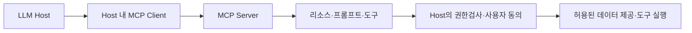
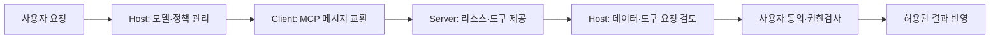
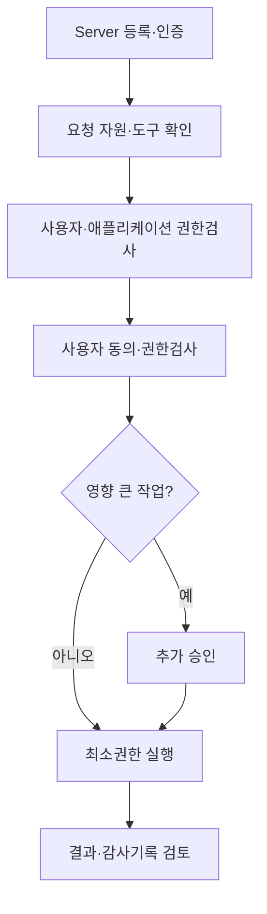

## 30초 인출

- **본질:** MCP는 LLM 애플리케이션을 외부 데이터와 도구에 연결하는 개방형 프로토콜이다.
- **구조:** Host 애플리케이션이 Client 연결부를 통해 Server의 리소스·프롬프트·도구를 사용한다.
- **핵심 통제:** 프로토콜 연결만으로 안전한 실행이 보장되지 않는다. 서버와 도구를 신뢰경계로 다루고, 사용자 동의·서버 측 권한검사·비밀정보 보호·도구별 최소권한을 적용한다.

핵심 용어

- **MCP Host:** MCP 연결을 시작하고 사용자·모델 인터랙션을 관리하는 LLM 애플리케이션이다.
- **MCP Client:** Host 안에서 MCP Server와 프로토콜 메시지를 주고받는 연결 기능이다.
- **MCP Server:** Host·Client에 리소스, 프롬프트, 도구 등 기능을 제공하는 서비스다.
- **Tool:** MCP Server가 제공하고 모델이 실행을 요청할 수 있는 기능이다. 안전성 검토와 사용 권한 통제가 필요하다.
- **프롬프트 주입:** 외부 입력이나 리소스의 악성 지시가 모델 출력을 조작하는 공격이다.

---
## 1교시 예상문제 (10점)

> MCP의 구성요소와 도구 연동 과정에서 발생하는 주요 보안위험, 통제 원칙을 설명하시오. *(예상문제)*

---
## 1교시 10점 답안

### 1. 정의·목적

- **정의:** MCP는 LLM 애플리케이션이 외부 데이터와 도구를 표준 방식으로 연결하도록 하는 프로토콜이다.
- **목적:** 서로 다른 애플리케이션·서비스 간 컨텍스트와 기능 연동을 지원한다.

### 2. 구성·위험·통제

| 구성·위협 | 위험 | 통제 |
|---|---|---|
| Host·Client·Server 연결 | 악성 또는 잘못 설정된 Server | 출처·권한 검토, 격리, 변경관리 |
| 리소스·프롬프트 | 간접 프롬프트 주입, 민감정보 노출 | 외부 데이터를 신뢰된 지시와 분리하고 권한별 접근제어 |
| Tool 실행 | 과도한 권한·의도치 않은 작업 | 도구별 최소권한, 사용자 동의·승인, 인자 검증 |

**제언:** MCP 서버 등록과 도구 호출을 검토·승인 대상으로 관리하고, 실행 권한과 사용자 동의를 Host에서 집행한다.

---
## 2~4교시 예상문제 (25점)

> MCP의 Host·Client·Server 구조와 주요 보안위협을 설명하고, 인증·권한·리소스·도구 호출 통제방안을 제시하시오. *(25점 예상문제)*

---
## 2~4교시 25점 답안

### Ⅰ. MCP의 역할과 보안 경계

MCP는 LLM 애플리케이션과 외부 데이터·도구 사이의 연결을 표준화한다. 현행 사양은 JSON-RPC 2.0 메시지를 사용하며 Host, Client, Server의 역할을 구분한다. 사양은 연결 규약이지 자체적으로 모든 사용자 권한·운영 통제를 강제하는 보안 경계는 아니다.

| 구성요소 | 역할 | 주요 보안 책임 |
|---|---|---|
| Host | LLM 애플리케이션과 사용자 상호작용 관리 | 사용자 동의, 도구 선택, 데이터 노출 통제 |
| Client | Host와 Server 간 요청·응답 처리 | 연결대상·인증정보·응답 검증 |
| Server | 리소스·프롬프트·도구 제공 | 사용자별 권한·데이터 최소화·안전한 실행 |

### Ⅱ. 연결 구조와 신뢰 경계

리소스 응답과 도구 설명은 모델의 컨텍스트에 들어갈 수 있다. Server와 그 콘텐츠를 무조건 신뢰하면 안 되며, 실행 결정은 Host가 명시한 권한·사용자 동의 정책을 거쳐야 한다.

### Ⅲ. 주요 보안위협

위협은 MCP 메시지 자체뿐 아니라 연결된 데이터와 도구의 권한·실행환경에서도 발생한다.

| 위협 | 발생 원인·영향 |
|---|---|
| 악성 Server·도구 | 신뢰하지 않은 실행파일·서비스가 데이터에 접근하거나 예상 밖 기능을 수행 |
| 간접 프롬프트 주입 | 리소스의 악성 지시가 모델의 응답·도구 사용을 유도 |
| 과도한 도구 권한 | 최소권한이 없어 모델 요청 하나가 넓은 데이터·시스템에 영향 |
| 자격증명 오용 | 인증 토큰이 잘못된 Server나 다른 자원에 전달·재사용 |
| 사용자 데이터 노출 | 불필요한 리소스가 원격 Server나 로그에 전송·저장 |

### Ⅳ. 인증·권한·도구 통제

Host와 Server 운영자는 연결 버전과 인증 방식을 확인하고 데이터를 최소화한다. 2026-07-28 사양은 권한부여를 보강했으며, 구현자는 사용 중인 사양 버전과 상호운용성을 확인해야 한다. 도구 설명이나 응답만으로 실행을 신뢰하지 않는다.

| 통제영역 | 적용 원칙 |
|---|---|
| 서버 신뢰 | 승인된 출처·버전만 등록하고 변경·설치 전 검토 |
| 인증정보 | 발급자·대상 Server에 맞는 토큰만 사용하고 다른 Server에 전달하지 않음 |
| 데이터 접근 | 요청 사용자 권한으로 리소스를 조회하고 불필요한 데이터를 공유하지 않음 |
| 도구 실행 | 도구별 최소권한·인자 검증·사용자 동의·고위험 작업 승인 |
| 로컬 실행 | 별도 계정·샌드박스·파일 및 네트워크 접근 제한 적용 |

### Ⅴ. 기술사적 제언

| 문제 | 해결 방안 |
|---|---|
| 악성 Server가 신뢰된 도구처럼 등록됨 | 서버 레지스트리·출처검증·변경승인과 정기 검토 적용 |
| 외부 문서 지시가 도구 호출로 이어짐 | 리소스를 비신뢰 입력으로 다루고 Host 정책·사용자 동의를 실행 전 검사 |
| MCP Server가 호스트 전체 권한으로 실행 | 전용 계정·격리환경·필요한 파일과 네트워크만 허용 |
| 토큰 재사용·대상 혼동으로 다른 서비스에 권한 전달 | 발급자·대상에 바인딩된 인증정보를 검증하고 Server 간 자격증명 전달 금지 |

---
## 출제 이력 및 참고자료

- **기출 이력:** 제136회 1교시 13번 「MCP 개념과 구조」, 제137회 2교시 3번 「MCP 보안 취약점 및 대응 방안」.
- Model Context Protocol, [2026-07-28 Specification: architecture and security principles](https://modelcontextprotocol.io/specification/2026-07-28).
- Model Context Protocol, [2026-07-28 specification release notes: authorization changes](https://blog.modelcontextprotocol.io/posts/2026-07-28/).
