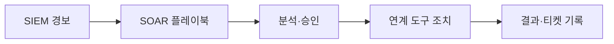
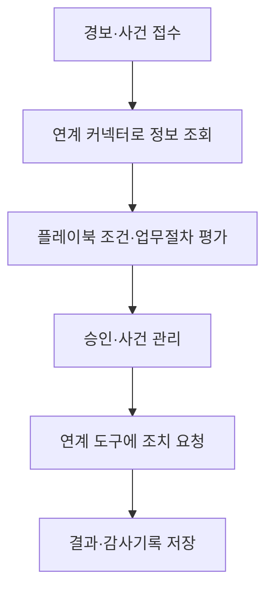

## 30초 인출

- **본질:** SOAR는 보안 도구와 대응절차를 연계해 반복적인 사고대응을 플레이북으로 지원·자동화하는 보안운영 방식 또는 플랫폼이다.
- **메커니즘:** SIEM 등에서 받은 경보를 보강·분류하고, 분석 결과에 따라 티켓·조회·격리·차단 등 조치를 연결한다.
- **운영:** 오탐과 서비스 영향이 큰 조치는 승인·복구 절차를 두고, 플레이북을 시험·변경관리한다.

핵심 용어

- **SOAR:** 보안 도구·절차·담당자를 연결해 대응 워크플로를 조정하고 자동화하는 보안운영 역량 또는 플랫폼이다.
- **오케스트레이션:** 서로 다른 보안 도구와 업무 절차 사이의 작업을 연결하는 기능이다.
- **플레이북:** 특정 경보·사고에 대한 분석·승인·조치·기록 순서를 정의한 대응 절차다.
- **SIEM:** 로그를 수집·분석해 보안 이벤트와 경보를 식별하는 시스템이다.

---
## 1교시 예상문제 (10점)

> SOAR의 정의와 주요 기능, SIEM과의 역할 차이를 설명하시오. *(예상문제)*

---
## 1교시 10점 답안

### 1. 정의·목적

- **정의:** SOAR는 여러 보안 도구와 대응절차를 연결해 경보 처리와 사고대응을 관리·자동화하는 운영 역량 또는 플랫폼이다.
- **목적:** 반복 작업의 일관성을 높이고 분석자가 조사·대응에 집중하도록 지원한다.

### 2. 구성과 역할 구분

| 기능 | 내용 |
|---|---|
| 오케스트레이션 | 보안도구·정보·업무시스템 간 작업 연결 |
| 자동화 | 조건에 따라 조회·티켓·승인·조치 실행 |
| 대응 관리 | 상태·담당자·결과와 감사기록 추적 |

**제언:** 서비스 영향이 큰 조치는 사람의 승인과 롤백 절차를 포함해 단계적으로 자동화한다.

---
## 2~4교시 예상문제 (25점)

> SOAR의 구성과 경보 처리 절차를 설명하고 SIEM과 비교한 후 도입·운영 시 고려사항을 제시하시오. *(25점 예상문제)*

---
## 2~4교시 25점 답안

### Ⅰ. 보안운영 자동화의 목적

SOAR는 보안운영 절차와 이기종 도구를 연결해 경보 조사와 대응을 관리·자동화한다. 자동화 수준은 위험과 오탐 영향에 따라 정하며, 제품 자체가 정확한 판단이나 빠른 복구를 보장하지는 않는다.

| 운영 문제 | SOAR가 지원하는 일 |
|---|---|
| 여러 콘솔에 분산된 경보·정보 | 관련 경보·자산·위협정보 조회 연계 |
| 반복되는 수동 처리 | 승인된 절차의 일정 단계 자동 수행 |
| 대응 과정 추적 어려움 | 사건·담당자·결정·조치 기록 관리 |

### Ⅱ. 구성 기능

플랫폼은 연계 커넥터, 플레이북 실행, 사건·티켓 관리 기능 등으로 구성될 수 있다. 실제 구성과 기능은 제품과 조직의 운영설계에 따라 다르다.

### Ⅲ. SIEM과 SOAR의 차이

SIEM과 SOAR는 대체관계가 아니다. SIEM은 주로 로그 수집·분석과 경보 생성에, SOAR는 경보 이후의 조사·업무흐름·조치 연결에 쓰인다.

| 비교 | SIEM | SOAR |
|---|---|---|
| 주요 입력 | 로그·이벤트 | 경보·사건·위협정보 |
| 주요 기능 | 수집, 상관분석, 탐지·경보 | 도구 연계, 플레이북, 사건 대응 관리 |
| 결과 | 경보·분석 결과 | 조회·승인·조치·사건기록 |
| 관계 | 탐지 정보를 생성·전달할 수 있음 | SIEM 경보를 받아 후속 대응을 지원할 수 있음 |

### Ⅳ. 플레이북 운영과 안전장치

플레이북은 탐지 규칙과 실행결과를 바탕으로 조치를 선택한다. 차단·계정정지처럼 영향이 큰 작업은 사전 정책에 따라 사람 승인을 받거나 자동화 범위를 제한한다.

| 플레이북 단계 | 확인 내용 |
|---|---|
| 입력 검증 | 경보의 출처·자산·위험 맥락 확인 |
| 보강·분류 | 위협정보·내부 자산정보 조회, 중복·오탐 검토 |
| 조치 | 허용된 조회·격리·차단·계정조치 실행 |
| 검증·복구 | 조치 결과 확인, 오탐 시 롤백·복구 |
| 기록·개선 | 승인·실행·결과와 플레이북 변경 이력 저장 |

### Ⅴ. 기술사적 제언

| 문제 | 해결 방안 |
|---|---|
| 오탐 경보가 자동 차단으로 이어져 업무에 영향 | 위험기반 승인 단계, 예외목록 검토, 차단 해제·롤백 절차를 설계 |
| 연계 API나 업무절차가 바뀌어 플레이북이 오작동 | 커넥터·플레이북 버전관리, 변경 전 시험, 장애 시 수동 절차 유지 |
| 자동화 목표를 조치 수나 시간 단축만으로 평가 | 오탐률·재작업·서비스 영향·사건 처리 품질을 함께 점검 |
| 표준화 없이 도구별 연결이 누적 | 연계 데이터·명령·감사 요건을 정의하고 필요한 경우 OASIS OpenC2 등 표준을 검토 |

---
## 출제 이력 및 참고자료

- **기출 이력:** 제135회 1교시 5번 「SIEM과 SOAR 비교」, 제127회 4교시 6번 「보안관제 고도화와 SOAR 도입」.
- CISA, [Federal Government Cybersecurity Incident and Vulnerability Response Playbooks](https://www.cisa.gov/sites/default/files/publications/Cybersecurity_Incident_Vulnerability_Response_Playbooks_508C.pdf).
- OASIS, [OpenC2 Technical Committee](https://www.oasis-open.org/committees/tc_home.php?wg_abbrev=openc2).
