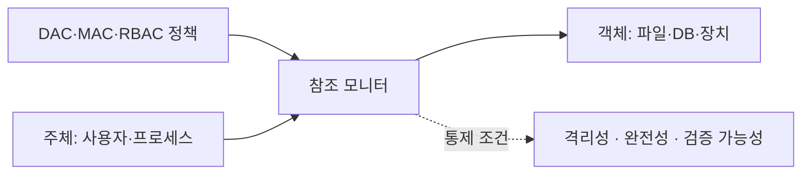

핵심 용어

- **참조 모니터(Reference Monitor)**: 주체의 객체 접근 요청을 가로채 접근통제 정책에 따라 허용 여부를 결정하는 운영체제의 핵심 보안 커널 추상화 개념
- **역할 폭발(Role Explosion)**: RBAC 환경에서 조직 규모가 커지고 세부 업무 예외가 증가함에 따라 생성되는 역할(Role)의 수가 사용자 수보다 많아져 관리가 불가능해지는 현상

## 30초 인출

- 본질: 접근통제는 주체의 자원 접근을 정책에 따라 허용하거나 거부하는 보안 통제다.
- 메커니즘: 식별·인증 후 권한을 판정하고 행위를 기록해 최소 권한을 유지한다.

---

## 1교시 예상문제 (10점)

> DAC, MAC, RBAC 접근통제 모델의 차이를 설명하시오. (예상)

---

## 1교시 10점 답안

### 1. 정의·목적

| 항목 | 답안 |
|---|---|
| 정의 | 접근통제는 주체가 객체에 접근할 수 있는지를 보안정책에 따라 결정하는 통제다. |
| 목적 | 비인가 접근을 줄이고 최소 권한과 직무 분리를 적용한다. |

### 2. 모델 비교

| 모델 | 권한 결정 기준 | 특징 |
|---|---|---|
| DAC | 객체 소유자의 설정 | 유연하지만 권한이 전파될 수 있음 |
| MAC | 중앙 정책과 보안 등급 | 강제적이고 일관된 통제 |
| RBAC | 사용자에게 부여된 역할 | 직무 기반 관리, 역할 폭발 가능 |
| ABAC | 주체·객체·환경 속성 | 상황 속성을 정책에 반영 |

제안: 역할 수와 예외 권한을 주기적으로 검토하고 필요 시 속성 조건을 결합한다.

---

## 2~4교시 예상문제 (25점)

> 접근통제의 목적과 DAC·MAC·RBAC 모델을 비교하고 참조 모니터의 역할 및 운영상 유의점을 설명하시오. (예상)

---

## 2~4교시 25점 답안

### Ⅰ. 접근통제 구조

| 모델 | 권한 부여 기준 |
|---|---|
| DAC | 객체 소유자가 권한 설정 |
| MAC | 보안 등급·인가 라벨 비교 |
| RBAC | 역할에 권한을 주고 사용자를 역할에 연결 |

### Ⅱ. 정책 모델의 차이

| 모델 | 결정 기준 | 운영상 고려 |
|---|---|---|
| DAC | 객체 소유자가 설정한 권한 | 권한 위임·공유를 관리한다. |
| MAC | 주체·객체의 보안 등급과 인가 규칙 | 라벨과 등급 정책을 일관되게 유지한다. |
| RBAC | 사용자에게 부여된 역할 | 역할 수와 예외 권한을 주기적으로 검토한다. |

### Ⅲ. RBAC와 ABAC 비교

| 모델 | 권한 결정 기준 |
|---|---|
| RBAC | 사용자의 역할과 그 역할에 연결된 권한 |
| ABAC | 주체·객체·행위·환경 속성에 대한 정책 평가 |

### Ⅳ. 권한 관리 통제

| 문제 | 원인 | 통제 방향 |
|---|---|---|
| 예외 역할이 누적되어 권한 검토가 어려워짐 | 직무·업무 예외를 역할만으로 처리 | 역할을 정리하고 필요한 환경 조건은 속성 기반 정책으로 보완한다. |
| 계정 회수 누락 | 수작업 절차에서 담당자·처리가 빠질 수 있음 | HR 인사 정보와 IdP를 연계해 계정 비활성화를 자동화한다. |

### Ⅴ. 기술사적 제언

| 문제 | 해결 방안 |
|---|---|
| 공용 관리자 계정은 행위자를 구분하기 어렵게 한다. | 개인 식별 계정을 사용하고, 필요할 때만 시간 제한 특권을 부여해 기록한다. |

## 출제 이력
- 제133회 4교시 3번: 접근통제의 개념·정책·절차·구현 메커니즘.
- 제129회 2교시 2번: 접근통제 정책과 LDAP 인증 흐름.
