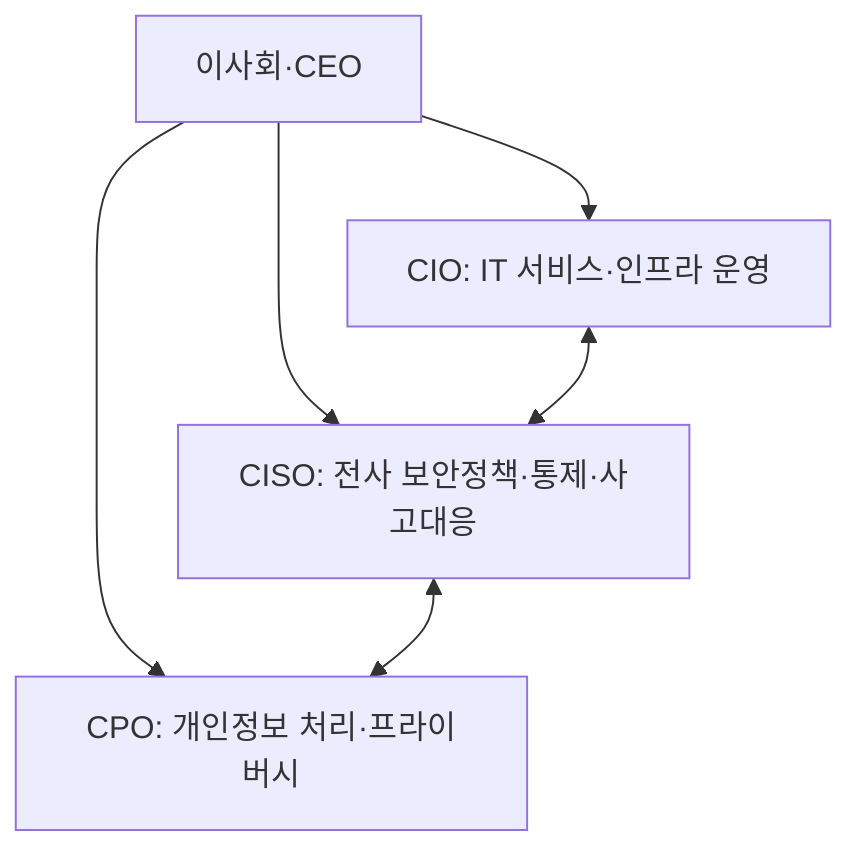

핵심 용어

- **겸직 제한**: 법령이 정한 기준에 해당하는 정보통신서비스 제공자 또는 금융회사 등의 CISO에게 다른 업무 겸직을 제한하는 제도이며, 대상·예외는 적용 법령과 시행령으로 확인한다.

## 30초 인출

- 본질: CISO는 조직의 정보보호 업무를 총괄하는 책임자다.
- 메커니즘: 보호 계획과 위험 대책을 수립·점검하고 법령상 지정·신고와 겸직 요건을 따른다.

---

## 1교시 예상문제 (10점)

> CISO의 역할과 독립적 보안 거버넌스상 고려사항을 설명하시오. (예상)

---

## 1교시 10점 답안

### 1. 정의·목적

| 항목 | 답안 |
|---|---|
| 정의 | CISO는 조직의 정보보호 정책과 위험 대응을 총괄하는 정보보호최고책임자다. |
| 목적 | 경영 의사결정에 보안을 반영하고 전사 정보자산 보호를 조정한다. |

### 2. 역할 구분

| 역할 | 주된 책임 |
|---|---|
| CISO | 정보보호 정책·통제·사고 대응 |
| CIO | IT 서비스와 정보기술 운영 |
| CPO | 개인정보 보호와 정보주체 권리 |

제안: CISO에게 경영진 보고 경로와 역할 수행에 필요한 권한·자원을 보장한다.

---

## 2~4교시 예상문제 (25점)

> CISO의 역할과 거버넌스 체계를 설명하고 CIO·CPO와의 역할 구분 및 운영 시 유의사항을 제시하시오. (예상)

---

## 2~4교시 25점 답안

### Ⅰ. 전사 거버넌스 내 CISO

### Ⅱ. 역할과 법적 적용

| 항목 | 핵심 내용 |
|---|---|
| 업무 분담 | CIO는 IT 운영을, CISO는 정보보호 위험과 통제를 맡으며 협업한다. |
| 지정·신고 | 의무 대상과 요건은 사업자 유형·법령 기준에 따라 확인한다. |
| 겸직·책임 | 겸직 제한과 법정 책임을 일률적으로 일반화하지 말고 해당 조문·대상을 점검한다. |

### Ⅲ. CISO와 CPO 비교

| 직책 | 중심 책임 |
|---|---|
| CISO | 조직 정보보호 정책·위험관리·보안 통제 |
| CPO | 개인정보 처리와 정보주체 권리 보호 |

### Ⅳ. 책임 수행을 위한 통제

| 문제 | 원인 | 통제 방향 |
|---|---|---|
| 보안 요구가 사업·개발 의사결정에 반영되지 않음 | 역할·보고 경로·의사결정 권한이 불분명 | 경영진 보고 경로, 책임, 필요한 자원을 명확히 한다. |
| 이행 여부를 사후 확인하기 어려움 | 계획·점검·개선 기록이 분산됨 | 법정 업무와 내부 통제의 이행 기록을 관리한다. |

### Ⅴ. 기술사적 제언

| 문제 | 해결 방안 |
|---|---|
| 직책만 지정하고 권한·자원을 주지 않으면 위험관리와 개선이 형식에 그칠 수 있다. | 책임·권한·자원을 정하고 보안 과제와 이행 결과를 경영진이 정기적으로 검토한다. |

## 공식 참고
- [정보통신망법 제45조의3](https://www.law.go.kr/LSW/lsLinkCommonInfo.do?chrClsCd=010202&lsJoLnkSeq=1032646007)
- [전자금융거래법 제21조의2](https://www.law.go.kr/LSW/lsSideInfoP.do?docCls=jo&joBrNo=02&joNo=0021&lsiSeq=280277&urlMode=lsScJoRltInfoR)

## 출제 이력
- 제132회 4교시 6번: 기업의 정보보안 부서 신설과 CISO 역할·거버넌스.
- 제121회 1교시: CISO 지정·신고 의무와 겸직 제한 기준.
