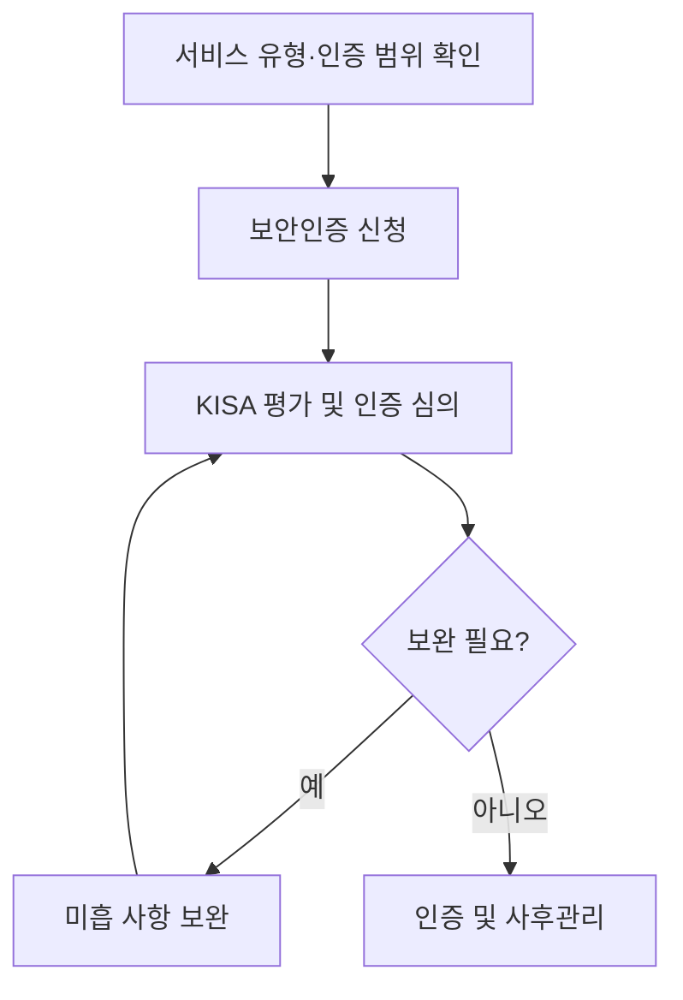

핵심 용어

- **물리적 망분리(Physical Separation)**: 네트워크·장비를 물리적으로 분리하는 통제 방식
- **논리적 망분리(Logical Separation)**: 가상화 등 논리적 통제를 이용해 네트워크·자원 접근을 분리하는 방식

## 30초 인출

- 본질: CSAP는 클라우드 서비스가 정보보호 기준을 따르는지 평가·인증하는 제도다.
- 메커니즘: 서비스 범위와 유형을 확인해 평가·보완·인증을 거치고 운영 요건을 유지한다.

---

## 1교시 예상문제 (10점)

> CSAP의 목적과 인증·평가 체계를 설명하시오. (예상)

---

## 1교시 10점 답안

### 1. 정의·목적

| 항목 | 답안 |
|---|---|
| 정의 | CSAP는 클라우드 서비스의 보안 수준을 평가해 인증하는 제도다. |
| 목적 | 공공기관이 클라우드 서비스를 이용할 때 필요한 보안 요건을 확인한다. |

### 2. 인증 흐름

| 단계 | 핵심 활동 |
|---|---|
| 신청·범위 설정 | 서비스 유형과 인증 범위 확인 |
| 평가 | 보안 통제와 증적 점검 |
| 보완·인증 | 미흡 사항을 보완하고 인증 결과 확정 |
| 사후관리 | 인증 범위의 보안 상태를 지속 확인 |

제안: 신청 전 최신 고시와 KISA 안내서에서 해당 서비스의 유형별 요건을 확인한다.

---

## 2~4교시 예상문제 (25점)

> CSAP의 도입 목적과 인증 절차를 설명하고 서비스 유형·등급별 요건 확인 및 운영상 고려사항을 제시하시오. (예상)

---

## 2~4교시 25점 답안

### Ⅰ. 인증 절차

### Ⅱ. 인증 범위와 적용 기준

| 확인 항목 | 적용 방법 |
|---|---|
| 서비스 유형·범위 | 신청 서비스와 구성요소를 특정하고 포함 범위를 확인한다. |
| 보안 기준 | 유형·등급에 적용되는 기준을 최신 안내서와 고시에서 확인한다. |
| 운영 상태 | 인증 범위에 포함된 구성과 실제 운영 환경을 일치시킨다. |

### Ⅲ. CSAP와 FedRAMP 비교

| 제도 | 적용 맥락 |
|---|---|
| CSAP | 대한민국 공공부문 클라우드 서비스 보안 인증 |
| FedRAMP | 미국 연방기관의 클라우드 보안 평가·인증 프로그램 |

### Ⅳ. 인증 준비 통제

| 문제 | 원인 | 통제 방향 |
|---|---|---|
| 평가 준비의 누락·재작업 | 인증 유형·범위별 요구사항을 늦게 확인 | 최신 기준으로 서비스 경계·증적·책임자를 사전에 정리한다. |
| 책임·운영 범위 불명확 | CSP와 이용기관 간 역할·계약 범위 미정 | 계약과 운영 절차에 보안 책임·사고통지·자료보호를 명시한다. |

### Ⅴ. 기술사적 제언

| 문제 | 해결 방안 |
|---|---|
| 인증을 받은 사실만으로 인증 범위 밖의 위험과 운영 책임까지 해소됐다고 오해할 수 있다. | 인증 범위와 이용기관 책임을 함께 확인하고 운영 중 설정·접근권한·사고대응을 점검한다. |

## 공식 참고
- [KISA 클라우드보안인증제 자료실](https://isms.kisa.or.kr/main/csap/notice/): 인증 유형·등급 및 평가 기준은 최신 안내서와 고시를 확인한다.

## 출제 이력
- 제128회 1교시: 공공 클라우드 CSAP 인증제 개편 배경·등급별 기준.
- 제120회 1교시: CSAP 평가 영역·인증 절차.
