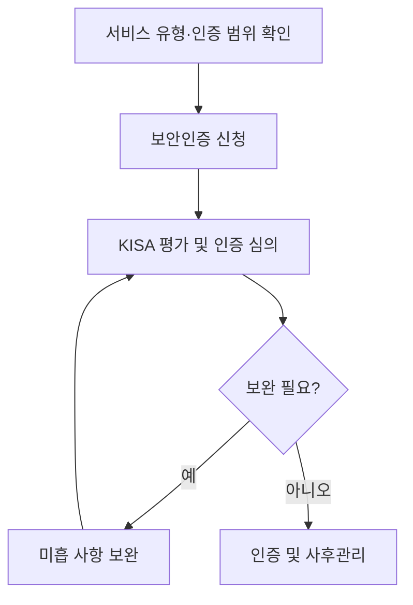

## 1교시 예상문제 (10점)

> CSAP의 목적과 인증·평가 체계를 설명하시오. (예상)

---

## 1교시 10점 답안

### 1. 정의·목적

정의: CSAP는 클라우드 서비스의 보안 수준을 평가해 인증하는 제도다.
목적: 공공기관이 클라우드 서비스를 이용할 때 필요한 보안 요건을 확인한다.

### 2. 인증 흐름

| 단계 | 핵심 활동 |
|---|---|
| 신청·범위 설정 | 서비스 유형과 인증 범위 확인 |
| 평가 | 보안 통제와 증적 점검 |
| 보완·인증 | 미흡 사항을 보완하고 인증 결과 확정 |
| 사후관리 | 인증 범위의 보안 상태를 지속 확인 |

제안: 신청 전 최신 고시와 KISA 안내서에서 해당 서비스의 유형별 요건을 확인한다.

---

## 2~4교시 예상문제 (25점)

> CSAP의 도입 목적과 인증 절차를 설명하고 서비스 유형·등급별 요건 확인 및 운영상 고려사항을 제시하시오. (예상)

---

## 2~4교시 25점 답안
```text
[CSAP] ◀━━ 머리: Ⅶ 내 의견 (서비스 범위와 인증 기준 명확화 + 운영 중 보안 책임 지속 점검)
 ┃
 ┣━ Ⅰ 개요 ───── 공공기관의 민간 클라우드 도입 확대 vs 국가 데이터 보안 우려 → 안전성·신뢰성 검증 법정 제도
 ┣━ Ⅱ 특징 ───── 공공 클라우드 이용 시 활용되는 보안인증 · 서비스 유형별 기준 · 인증 후 사후관리 · 등급·유형별 적용 범위
 ┣━ Ⅲ 구조 ───── 인증 체계(정책: 과기정통부, 평가·인증: KISA 및 지정 기관) · 서비스 유형별 보안 기준과 평가 절차
 ┣━ Ⅳ 흐름 ───── ① 신청 및 계약 → ② 사전 점검 및 취약점 진단 → ③ 서면/현장 평가 → ④ 보완 조치 → ⑤ 인증서 발급
 ┣━ Ⅴ 비교 ───── 서비스 유형·인증 범위에 따른 적용 기준 구분 (등급·세부 요건은 최신 안내서 확인)
 ┗━ Ⅵ 실무 ───── 인증 범위와 운영 책임 확인 / 증적·보완 관리 / 인증 후 보안 상태 유지
```
- 필수 키워드: 클라우드 보안인증 · CSAP · 인증 범위 · 평가 기준 · 사후관리 · KISA
- 기출: 128회 1교시 `공공 클라우드 CSAP 인증제도 개편` → Ⅰ·Ⅴ / 120회 1교시 `CSAP 인증 기준 및 평가 항목` → Ⅲ·Ⅳ

## 한 줄 본질
- 클라우드서비스가 정해진 정보보호 기준을 따르는지 평가·인증하는 제도 → 공공기관이 보안성이 검증된 민간 클라우드 서비스를 이용하도록 지원

## 핵심 그림


## 핵심 용어
- 물리적 망분리(Physical Separation): 네트워크·장비를 물리적으로 분리하는 통제 방식
- 논리적 망분리(Logical Separation): 가상화 등 논리적 통제를 이용해 네트워크·자원 접근을 분리하는 방식

## 핵심 통찰
- CSAP는 클라우드 서비스에 정보보호 기준을 적용해 보안 수준을 평가·인증하는 제도이며, KISA가 인증체계 운영에 참여함
- 서비스 유형과 등급에 따라 적용 기준 및 신청 절차가 다를 수 있으므로, 도입 시 최신 제도 안내서와 고시를 확인해야 함

## 이웃 토픽과 구분
- CSAP vs FedRAMP: CSAP = 대한민국의 공공 클라우드 보안 인증 / FedRAMP = 미국의 연방정부 클라우드 조달을 위한 보안 인증 프로그램(Low/Moderate/High)

## 문제·원인·대책
- 적용 상황: CSAP 인증을 준비하는 클라우드 사업자가 서비스 범위와 증적 요건을 정확히 정하지 못해 평가 준비가 지연될 수 있음
| 문제 | 원인 | 대책 | 효과 |
|---|---|---|---|
| 인증 준비 범위 파악의 어려움 | 서비스 유형과 인증 범위에 따라 적용 기준이 달라질 수 있음 | 최신 안내서로 인증 범위와 증적 요구를 확인 | 준비 누락 및 재작업 감소 |
| 책임·운영 범위 불명확 | CSP와 이용기관 간 역할·계약 범위 미정 | 계약과 운영 절차에 보안 책임, 사고통지, 자료보호 항목 명시 | 운영 책임의 확인 가능성 향상 |

## 이렇게 출제된다
- 제128회 1교시: "공공부문 클라우드 서비스 보안인증(CSAP) 등급제(상·중·하)의 도입 배경과 등급별 기준을 설명하시오." → 요구 포인트: 등급별 적용 기준과 인증 범위(세부 기준은 현행 안내서 확인)
- 제120회 1교시: "클라우드 서비스 보안인증(CSAP)의 평가 영역과 인증 절차를 설명하시오." → 요구 포인트: Ⅲ 관리적·물리적·기술적 기준 + Ⅳ 절차

## 내 의견
- [인증 범위와 운영 책임의 불일치] 인증 취득만으로 서비스 운영의 모든 보안 위험이 해소되는 것은 아님 → 인증 범위와 이용기관 책임을 함께 검토하고, 운영 중 설정·접근권한·사고대응 절차를 점검

## 공식 참고
- [KISA 클라우드보안인증제 자료실](https://isms.kisa.or.kr/main/csap/notice/): 인증 유형·등급 및 평가 기준은 최신 안내서와 고시를 확인한다.
